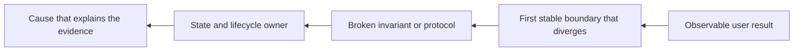
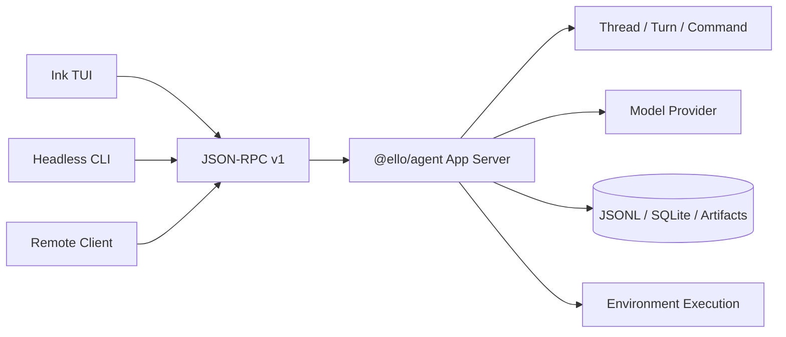
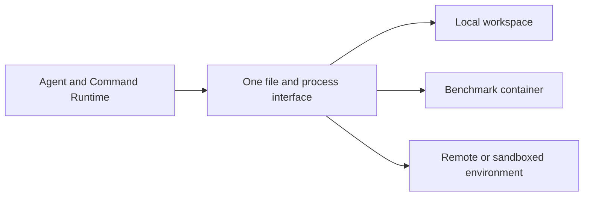

# Ello

<p align="center"><a href="README.md">简体中文</a> | <strong>English</strong></p>

**Ello is a Coding Agent runtime for long-horizon software engineering.** Instead of forcing the model through a call-one-tool-and-wait loop, Ello uses one compilable, schedulable, resumable `command_run` surface for environment execution and Agent capabilities. More of the model budget can go to root-cause investigation, implementation, and verification.

> Full 113-task DeepSWE v1.1 run: Ello Rapid passes **46/104 (44.2%)** and Claude Code passes **48/107 (44.9%)**, a near-tie in verifier outcomes. On paired tasks with evidence on both sides, Rapid uses 12.1% less elapsed time, 22.8% fewer model rounds, 29.2% fewer normalized Command/Tool calls, and 35.4% fewer input tokens at the median.

## Runtime Demo

### Video

<!-- Runtime video placeholder. Replace this block with the final hosted video or docs/assets/ello-runtime-demo.mp4. -->

> Reserved for a full runtime recording from task submission through investigation, editing, and verification.

### Screenshot


> The current image remains as a static interface reference and will be refreshed with the video.

## Benchmark

### Current result

The latest comparison fixes DeepSeek V4 Flash 0731, High reasoning effort, the full 113-task DeepSWE v1.1 suite, and the same Docker images, resource limits, and verifiers. Five configurations produced 520 scored jobs out of 565 planned; 45 jobs were infrastructure-invalid.

| Configuration            | Valid jobs | Passed | Pass rate | Invalid |
| ------------------------ | ---------: | -----: | --------: | ------: |
| Ello Rapid               |        104 |     46 |     44.2% |       9 |
| Ello Rapid + Subagent    |        103 |     43 |     41.7% |      10 |
| Ello Thorough            |        103 |     44 |     42.7% |      10 |
| Ello Thorough + Subagent |        103 |     41 |     39.8% |      10 |
| Claude Code              |        107 |     48 |     44.9% |       6 |

Ello Rapid is **18 wins, 66 ties, and 20 losses** against Claude Code across 104 valid pairs, for a **-1.9 percentage-point** paired pass-rate difference. Their verifier outcomes are close, while Rapid uses fewer runtime resources.

### Resource efficiency

Each reduction below is computed per task where both sides have evidence: first calculate `Ello / Claude Code`, then take the median. Parentheses show the measured pair count; missing usage is never replaced with zero.

| vs Claude Code           |       Elapsed |  Model rounds | Command / Tool calls |  Input / output tokens |
| ------------------------ | ------------: | ------------: | -------------------: | ---------------------: |
| Ello Rapid               | ↓12.1% (n=94) | ↓22.8% (n=94) |        ↓29.2% (n=94) | ↓35.4% / ↓13.4% (n=85) |
| Ello Rapid + Subagent    | ↓14.1% (n=93) | ↓20.6% (n=93) |        ↓32.5% (n=93) | ↓36.3% / ↓13.0% (n=79) |
| Ello Thorough            |  ↓1.4% (n=93) |  ↓4.4% (n=93) |        ↓13.1% (n=93) |   ↓9.4% / ↓8.7% (n=81) |
| Ello Thorough + Subagent |  ↑1.2% (n=93) |  ↓6.3% (n=93) |        ↓13.3% (n=93) |   ↓9.4% / ↓1.6% (n=75) |

### Isolated, auditable execution

The benchmark uses the product Client-Server path instead of a benchmark-only Ello executor:

1. Each job extracts a clean workspace from a pinned image and runs a baseline preflight.
2. The runner starts an isolated App Server process with its own state root, config, SQLite database, recorder, and provider environment.
3. The ordinary headless CLI connects over Unix JSON-RPC; the job's Container Environment executes Agent filesystem and process operations.
4. The runner captures `model.patch`, applies it in a fresh container using the same image, and runs the verifier.
5. EngineEvents, model usage, Commands, patch identity, verifier assertions, and retry lineage remain auditable.

The raw validator passes across 855 attempts: 520 completed and 335 invalid attempt records, with report consistency confirmed. Git publishes aggregate reports, suite/agent/comparison JSON, and charts; per-task patches, large logs, and deep diagnostic evidence stay in ignored raw storage.

- [Current evidence record](docs/benchmark/current-task-set-record.md)
- [Generated report](docs/benchmark/results/report.md)
- [Structured suite result](docs/benchmark/results/suite-report.json)
- [Benchmark methodology](docs/benchmark/benchmark-methodology.md)

## Why Commands Replace Tools

### Structural cost of ordinary tool calling

Most Coding Agents register reads, searches, edits, shells, MCP, memory, and task management as separate provider Tools. That is easy to understand, but long tasks repeatedly pay for provider latency, replayed context, model-side scheduling, and fragmented recovery.

| Problem                               | Long-task effect                                                                      |
| ------------------------------------- | ------------------------------------------------------------------------------------- |
| One model round per small action      | Search, read, edit, build, and test repeatedly wait for the provider                  |
| Replayed context                      | Every call carries the system prompt, tool schemas, and growing history again         |
| The model becomes a process scheduler | It must decide read concurrency, mutation ordering, and safe failure continuation     |
| Recovery is split across tools        | Approvals, user input, processes, and external capabilities can replay completed work |

As the tool set grows, the provider-visible schema changes more often, prompt-cache stability falls, and the model must select among many similar names. The core problem is not merely verbose JSON. Expensive model turns are being used for deterministic local orchestration.

### Ello Command Run

The provider sees one stable Tool:

```text
{ command_run }
```

A call contains 1 to 32 Command Frames using only `step`, `command`, `args`, `body`, `input`, and `onFailure`. The dynamic Command Catalog resolves each name into a typed capability.

```text
Model
  -> command_run
  -> compile all Frames
  -> group by step
  -> schedule through Environment Gate
  -> permission / approval
  -> execute
  -> project bounded observations
  -> one outer result
```

Command Run is not a renamed shell. It owns batch compilation, effect-aware scheduling, permissions, failure barriers, checkpoints, resume, events, and separate audit/model projections:

- Any invalid Frame rejects the batch before side effects.
- `step` expresses dependencies; the runtime decides safe shared reads and exclusive mutations.
- Core features and MCP extend the internal Command Catalog without expanding the provider Tool set.
- Approval and deferred interaction resume from compiled checkpoints without replaying completed prefixes.
- Provider history remains one legal outer `command_run` call/result pair.
- Full output stays in artifacts and audit state while the model receives bounded observations.

There is a hard boundary: a later Command cannot depend on output the model has not seen. Unknown dependencies require another model turn. Ello batches known execution; it does not speculate about unknown results.

A configuration update makes the difference between the two execution models concrete. Scattered calls divide one path into several provider round trips:

| Round trip | Agent action                                         | Result awaited             |
| ---------: | ---------------------------------------------------- | -------------------------- |
|          1 | Locate `initial_mode` and `bypass_enabled`           | Configuration entry points |
|          2 | Inspect the documentation and submit `apply_patch`   | Successful mutation        |
|          3 | Run `pnpm --filter @ello/agent test -- tests/config` | Focused test result        |
|          4 | Run `pnpm typecheck`                                 | Type-check result          |
|          5 | Run `pnpm lint`                                      | Static-analysis result     |

Ello compiles actions with known inputs into one execution pipeline. The provider still sees only `command_run`, while the runtime validates Frames, schedules independent work, evaluates permissions, handles failures, and resumes deferred interactions.

_**Ello execution pipeline:**_

```json
{
  "name": "command_run",
  "arguments": {
    "commands": [
      {
        "step": 1,
        "command": "bash",
        "body": "rg -n \"initial_mode|bypass_enabled\" packages/ello-agent/src docs/config"
      },
      {
        "step": 1,
        "command": "bash",
        "body": "sed -n '1,180p' docs/config/README.md"
      },
      {
        "step": 2,
        "command": "apply_patch",
        "body": "*** Begin Patch\n*** Update File: docs/config/README.md\n@@\n-initial_mode: ask-before-changes\n+initial_mode: plan\n*** End Patch"
      },
      {
        "step": 3,
        "command": "bash",
        "body": "pnpm --filter @ello/agent test -- tests/config"
      },
      {
        "step": 4,
        "command": "bash",
        "body": "pnpm typecheck"
      },
      {
        "step": 4,
        "command": "bash",
        "body": "pnpm lint"
      }
    ]
  }
}
```

This is not a long shell script hidden in JSON. Every Frame keeps its own type, effects, permission decision, and audit record. `step` expresses dependencies; the runtime retains control over concurrency and exclusive mutations.

See [Agent loop](docs/agent/agent-loop.md), [Command scheduling](docs/tools/tool-scheduler.md), and [Command Catalog](docs/tools/command-search-and-invoke.md).

## Backward Reasoning

LLMs tend to continue implementation patterns that are common in their training data, but common does not mean compatible with this repository's contracts. An error location, issue description, or suggested fix is a clue. The required observable result and the invariants preserved on the way are the actual constraints.

An ordinary Agent usually advances from the current state toward the prompted goal. Here, $s_1$ is the current state and $s_n$ is the result requested by the user:

$$
s_1 \rightarrow s_2 \rightarrow s_3 \rightarrow \cdots \rightarrow s_n
$$

Ello instead starts from $s_n$, derives the state $s_{n-1}$ that must hold immediately before it, and continues from $s_{n-1}$ to $s_{n-2}$. Each backward step must be supported by evidence in the repository before the chain reaches the current state:

$$
s_n \rightarrow s_{n-1} \rightarrow s_{n-2} \rightarrow \cdots \rightarrow s_1
$$

Ello then states how completion can be observed and traces the corresponding data and control flow. It does not treat the reported line as the edit location; it asks which contract failed, who owns it, and where the incorrect state originated:



The investigation revolves around three questions: what proves the task is complete, where behavior first diverges at a stable boundary, and which owner explains all available evidence. For example, if a command still uses the old permission mode after a mode switch, repainting the TUI label cannot fix it. Backward reasoning checks SessionMode ownership, child inheritance, the permission session, and resume events, placing the correction at the Server's live-state boundary.

The same method applies to data correctness. An unexpected cache-hit rate should be traced through acceptance metrics, stable cache-key fields, key producers, persistence format, and readers rather than compensated for in the reporting layer.

Rapid and Thorough share the same runtime and Command protocol. Rapid stops at the smallest evidence-supported cause and uses focused validation. Thorough continues across ownership, persistence, recovery, compatibility, and downstream contracts before widening validation.

Backward Reasoning is a real prompt policy, not a hidden planner or separate runtime mode.

## Core Features

These mechanisms operate at different time scales and cannot replace each other.

| Feature                | Problem solved                                              | Lifetime and boundary                                                                |
| ---------------------- | ----------------------------------------------------------- | ------------------------------------------------------------------------------------ |
| **Memory**             | Reuse user preferences and project context across Threads   | Durable private/team Markdown topics; only an index is injected by default           |
| **Goal**               | Preserve one long-running objective and budget across Turns | Thread-bound lifecycle state and accumulated token usage                             |
| **Skills**             | Load reusable specialist procedures on demand               | Global/project catalog; activated `SKILL.md` applies to the current run              |
| **Subagents**          | Delegate bounded work to independent execution contexts     | Child task, prompt, model role, tools, transcript, usage, and cancellation           |
| **Context Compaction** | Compress one Thread's provider history                      | Full Thread log remains durable; only provider-context projection is replaced        |
| **MCP**                | Connect external systems and remote capabilities            | MCP tools become internal Commands under the same schema, permission, and audit path |
| **Task**               | Track work-item state, owners, and dependencies             | SQLite Task board supports durable progress across Turns                             |
| **Plan Mode**          | Investigate and review a plan before modification           | Persists and hashes the plan before acceptance and execution                         |
| **Session Mode**       | Select the Thread's execution and approval posture          | `plan`, `ask-before-changes`, `accept-edits`, and optional `bypass`                  |
| **Permissions**        | Allow, approve, or deny each Command                        | Server policy combines mode, capability, path, and scoped rules                      |

## Architecture

### Client-Server



`@ello/agent` owns credentials, models, Commands, permissions, Threads, persistence, and resource lifecycles. `@ello/tui` owns the CLI, terminal interaction, typed Client, and transports. stdio, WebSocket, and Unix sockets share one protocol.

The separation provides explicit security ownership, execution independent of UI lifetime, reconnectable snapshots and durable interactions, multiple clients over one kernel, and independent UI/Server evolution.

### Dependency-inverted Environment execution

Ello can work directly in a local project or inside an isolated benchmark container. Files and processes go through one Environment interface so the Agent does not need to know where the code is actually running:



Each run receives a specific working directory and a permission ceiling. Commands can read files, write content, and start processes only inside that boundary; a model request cannot enlarge it.

- **One Agent path:** Search, edit, test, and approval use the same Commands locally and in containers.
- **Explicit isolation:** The Agent sees workspace files and controlled processes rather than host internals or raw process IDs.
- **Owned resources:** The Environment bounds output, background processes, and runtime, then closes related resources together.
- **Runtime scheduling:** The model declares dependencies; the Environment runs safe reads concurrently and orders mutations.

Production connects this interface to the local workspace. Benchmarks connect the same Agent to `/app` in a task container. A future remote workspace or sandbox can replace the execution backend without rewriting Commands, permissions, Threads, or the model loop.

## Packages

- [`@ello/agent`](packages/ello-agent/README-en.md): App Server, Agent/Command runtime, features, protocol, persistence, and Environment contracts.
- [`@ello/tui`](packages/ello-tui/README-en.md): CLI, Ink TUI, typed JSON-RPC Client, and local/remote transports.
- [`@ello/bench`](packages/ello-bench/README-en.md): Docker benchmark execution, adapters, evidence, verifiers, recovery, statistics, and reports.

## Quick Start

Requirements: Node.js 24+, pnpm 11.11.0.

```bash
pnpm install
pnpm build
pnpm --filter @ello/tui run ello
```

Run one prompt without the TUI:

```bash
pnpm --filter @ello/tui run ello --no-tui run \
  "Explain the recent changes in this repository"
```

## Documentation and Validation

Start from the [technical documentation index](docs/README.md), [Agent runtime](docs/agent/README.md), [Command scheduling](docs/tools/tool-scheduler.md), [context compaction](docs/compact/README.md), [tasks](docs/task/README.md), [Plan Mode](docs/plan/README.md), [permissions](docs/permission/README.md), and the [TUI guide](docs/tui/README.md).

```bash
pnpm typecheck
pnpm test
pnpm lint
```
