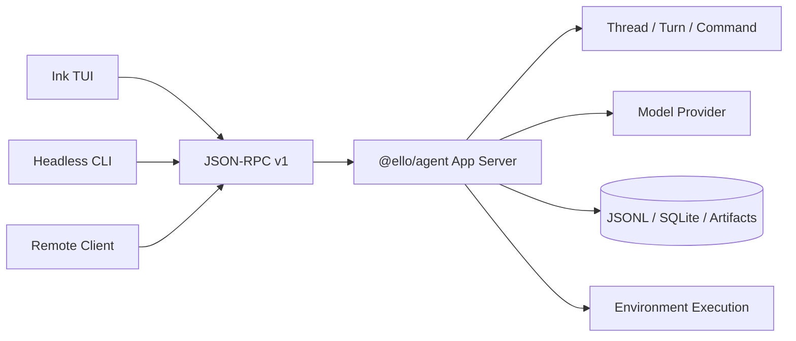
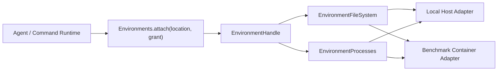

# Ello

<p align="center"><a href="README.md">简体中文</a> | <strong>English</strong></p>

**Ello is a Coding Agent runtime for long-horizon software engineering.** Instead of forcing the model through a call-one-tool-and-wait loop, Ello uses one compilable, schedulable, resumable `command_run` surface for environment execution and Agent capabilities. More of the model budget can go to root-cause investigation, implementation, and verification.

> DeepSWE v1.1: Ello Rapid and Thorough both pass **13/20 (65%)**, while Claude Code passes **9/20 (45%)**. On paired tasks with evidence on both sides, Rapid uses 68.3% fewer model rounds, 70.7% fewer normalized Command/Tool calls, and 74.5% fewer input tokens at the median.

## Runtime Demo

### Video

<!-- Runtime video placeholder. Replace this block with the final hosted video or docs/assets/ello-runtime-demo.mp4. -->

> Reserved for a full runtime recording from task submission through investigation, editing, and verification.

### Screenshot


> The current image remains as a static interface reference and will be refreshed with the video.

## Benchmark

### Current result

The latest comparison fixes DeepSeek V4 Flash 0731, High reasoning effort, the same 20 DeepSWE v1.1 tasks, and the same Docker images, resource limits, and verifiers.

| Configuration | Valid tasks | Passed | Pass rate | Delta vs Claude Code |
| ------------- | ----------: | -----: | --------: | -------------------: |
| Ello Rapid    |          20 |     13 | **65.0%** |         **+20.0 pp** |
| Ello Thorough |          20 |     13 | **65.0%** |         **+20.0 pp** |
| Claude Code   |          20 |      9 |     45.0% |             baseline |

Both Ello configurations are **6 wins, 12 ties, and 2 losses** against Claude Code. All 60 jobs completed with a verifier score.

### Resource efficiency

Each reduction below is computed per task where both sides have evidence: first calculate `Ello / Claude Code`, then take the median. Parentheses show the measured pair count; missing usage is never replaced with zero.

| vs Claude Code |       Elapsed |  Model rounds | Command / Tool calls | Input / output tokens |
| -------------- | ------------: | ------------: | -------------------: | --------------------: |
| Ello Rapid     | ↓69.0% (n=17) | ↓68.3% (n=17) |        ↓70.7% (n=17) | ↓74.5% / ↓73.2% (n=7) |
| Ello Thorough  | ↓58.9% (n=17) | ↓65.3% (n=17) |        ↓66.8% (n=17) | ↓60.1% / ↓62.2% (n=6) |

Round and tool events are normalized by different Agent adapters, so they are descriptive signals rather than identical atomic units. Strict `publishable` remains false because historical usage and tool-audit coverage do not reach 60/60, even though the verifier matrix is complete.

### Change from the previous record

The previous DeepSWE record in this repository reported Ello at 6/20 (30%); the current run is 13/20 (65%), an observed increase of **35 percentage points**. This is not a controlled regression comparison: the model, task-set hash, Docker boundary, and Agent implementation changed. It is a longitudinal project result, not an attribution to any single feature.

The current same-model, same-task, same-verifier comparison is the stronger external claim: Ello is **20 percentage points** above Claude Code.

### Isolated, auditable execution

The benchmark uses the product Client-Server path instead of a benchmark-only Ello executor:

1. Each job extracts a clean workspace from a pinned image and runs a baseline preflight.
2. The runner starts an isolated App Server process with its own state root, config, SQLite database, recorder, and provider environment.
3. The ordinary headless CLI connects over Unix JSON-RPC; the job's Container Environment executes Agent filesystem and process operations.
4. The runner captures `model.patch`, applies it in a fresh container using the same image, and runs the verifier.
5. EngineEvents, model usage, Commands, patch identity, verifier assertions, and retry lineage remain auditable.

The raw run passes lineage, artifact-checksum, and report-consistency validation across 136 attempts. Git publishes aggregate reports and a minimal per-task evidence set; large logs and deep diagnostic evidence stay in ignored raw storage.

- [Current evidence record](docs/benchmark/current-task-set-record.md)
- [Generated report](docs/benchmark/results/report.md)
- [Per-task patches and verifier summaries](docs/benchmark/results/tasks/deep-swe/)
- [Benchmark methodology](docs/benchmark/benchmark-methodology.md)

This is still a system-level Agent comparison. Prompt policy, Command protocol, context strategy, and runtime all change together; the run is not a single-feature ablation.

## Why Commands Replace Tools

### Structural cost of ordinary tool calling

Most Coding Agents register reads, searches, edits, shells, MCP, memory, and task management as separate provider Tools. That is easy to understand, but long tasks repeatedly pay for provider latency, replayed context, model-side scheduling, and fragmented recovery.

| Problem                               | Long-task effect                                                                      |
| ------------------------------------- | ------------------------------------------------------------------------------------- |
| One model round per small action      | Search, read, edit, build, and test repeatedly wait for the provider                  |
| Replayed context                      | Every call carries the system prompt, tool schemas, and growing history again         |
| The model becomes a process scheduler | It must decide read concurrency, mutation ordering, and safe failure continuation     |
| Recovery is split across tools        | Approvals, user input, processes, and external capabilities can replay completed work |

As the tool set grows, the provider-visible schema changes more often, prompt-cache stability falls, and the model must select among many similar names. The core problem is not merely verbose JSON. Expensive model turns are being used for deterministic local orchestration.

### Ello Command Run

The provider sees one stable Tool:

```text
{ command_run }
```

A call contains 1 to 32 Command Frames using only `step`, `command`, `args`, `body`, `input`, and `onFailure`. The dynamic Command Catalog resolves each name into a typed capability.

```text
Model
  -> command_run
  -> compile all Frames
  -> group by step
  -> schedule through Environment Gate
  -> permission / approval
  -> execute
  -> project bounded observations
  -> one outer result
```

Known work can put independent discovery in step 1, a patch in step 2, and focused tests/typecheck/diff checks in step 3.

Command Run is not a renamed shell. It owns batch compilation, effect-aware scheduling, permissions, failure barriers, checkpoints, resume, events, and separate audit/model projections:

- Any invalid Frame rejects the batch before side effects.
- `step` expresses dependencies; the runtime decides safe shared reads and exclusive mutations.
- Core features and MCP extend the internal Command Catalog without expanding the provider Tool set.
- Approval and deferred interaction resume from compiled checkpoints without replaying completed prefixes.
- Provider history remains one legal outer `command_run` call/result pair.
- Full output stays in artifacts and audit state while the model receives bounded observations.

There is a hard boundary: a later Command cannot depend on output the model has not seen. Unknown dependencies require another model turn. Ello batches known execution; it does not speculate about unknown results.

See [Agent loop](docs/agent/agent-loop.md), [Command scheduling](docs/tools/tool-scheduler.md), and [Command Catalog](docs/tools/command-search-and-invoke.md).

## Backward Reasoning

Issue descriptions, stack traces, current code, and proposed fixes are evidence about a problem, not proof of its cause. Forward implementation from a suggested patch often adds branches at the symptom, duplicates state, or repairs only one side of a protocol.

Ello reasons backward from the required observable result:

```text
acceptance result
  <- stable invariant
  <- observation boundary
  <- producer / consumer call paths
  <- state owner / persistence / protocol
  <- smallest cause that explains the evidence
```

The active policy asks the model to:

1. identify the real goal and acceptance criteria;
2. separate required constraints from implementation suggestions;
3. identify stable invariants;
4. find the boundary where incorrect behavior first becomes observable;
5. trace relevant calls, state transitions, persistence, and protocol ownership backward;
6. find the smallest cause that explains the evidence;
7. change that cause and verify the observable behavior at a stable boundary.

For a “pending approval disappears after refresh” bug, a forward patch might cache the approval in the TUI. Backward reasoning starts from the invariant that unresolved Server Requests survive reconnect, then traces Client projection, JSON-RPC identity, Thread records, and Server ownership. The fix belongs in durable state, not temporary UI memory.

Rapid and Thorough share the same runtime and Command protocol. Rapid stops at the smallest evidence-supported cause and uses focused validation. Thorough continues across ownership, persistence, recovery, compatibility, and downstream contracts before widening validation.

Backward Reasoning is a real prompt policy, not a hidden planner or separate runtime mode. Benchmark results are system-level associations, not a causal ablation of this policy.

## Core Features

These mechanisms operate at different time scales and cannot replace each other.

| Feature                | Problem solved                                              | Lifetime and boundary                                                                |
| ---------------------- | ----------------------------------------------------------- | ------------------------------------------------------------------------------------ |
| **Memory**             | Reuse user preferences and project context across Threads   | Durable private/team Markdown topics; only an index is injected by default           |
| **Goal**               | Preserve one long-running objective and budget across Turns | Thread-bound lifecycle state and accumulated token usage                             |
| **Skills**             | Load reusable specialist procedures on demand               | Global/project catalog; activated `SKILL.md` applies to the current run              |
| **Subagents**          | Delegate bounded work to independent execution contexts     | Child task, prompt, model role, tools, transcript, usage, and cancellation           |
| **Context Checkpoint** | Bound one Thread's provider history                         | Full Thread log remains durable; only provider-context projection is replaced        |
| **MCP**                | Connect external systems and remote capabilities            | MCP tools become internal Commands under the same schema, permission, and audit path |

Memory is durable knowledge, Goal is current Thread direction, Skills are reusable procedures, Subagents create new execution contexts, and Context Checkpoints compact only current provider history.

## Architecture

### Client-Server



`@ello/agent` owns credentials, models, Commands, permissions, Threads, persistence, and resource lifecycles. `@ello/tui` owns the CLI, terminal interaction, typed Client, and transports. stdio, WebSocket, and Unix sockets share one protocol.

The separation provides explicit security ownership, execution independent of UI lifetime, reconnectable snapshots and durable interactions, multiple clients over one kernel, and independent UI/Server evolution.

### Dependency-inverted Environment execution

The Agent and Command layers do not import Node `fs`, `child_process`, or Docker. They depend on an Environment contract:



An `ExecutionLocation` selects an Environment reference and working directory. The attached Handle binds a generation, immutable grant, path space, filesystem capability, opaque process references, bounded stdout/stderr, process-tree lifecycle, runtime instructions, and close ownership. A generation-level execution gate coordinates shared reads and exclusive mutations.

Production composes the Local Host adapter. Benchmarks compose a Container adapter through the same public `@ello/agent/runtime` contract, so files and processes run under `/app` without copying the Agent loop, Command runtime, permissions, or Thread system.

## Packages

- [`@ello/agent`](packages/ello-agent/README-en.md): App Server, Agent/Command runtime, features, protocol, persistence, and Environment contracts.
- [`@ello/tui`](packages/ello-tui/README-en.md): CLI, Ink TUI, typed JSON-RPC Client, and local/remote transports.
- [`@ello/bench`](packages/ello-bench/README-en.md): Docker benchmark execution, adapters, evidence, verifiers, recovery, statistics, and reports.

## Quick Start

Requirements: Node.js 24+, pnpm 11.11.0.

```bash
pnpm install
pnpm build
pnpm --filter @ello/tui run ello
```

Run one prompt without the TUI:

```bash
pnpm --filter @ello/tui run ello --no-tui run \
  "Explain the recent changes in this repository"
```

## Documentation and Validation

Start from the [technical documentation index](docs/README.md), [Agent runtime](docs/agent/README.md), [Command scheduling](docs/tools/tool-scheduler.md), [context checkpoints](docs/compact/README.md), and [TUI guide](docs/tui/README.md).

```bash
pnpm typecheck
pnpm test
pnpm lint
```
