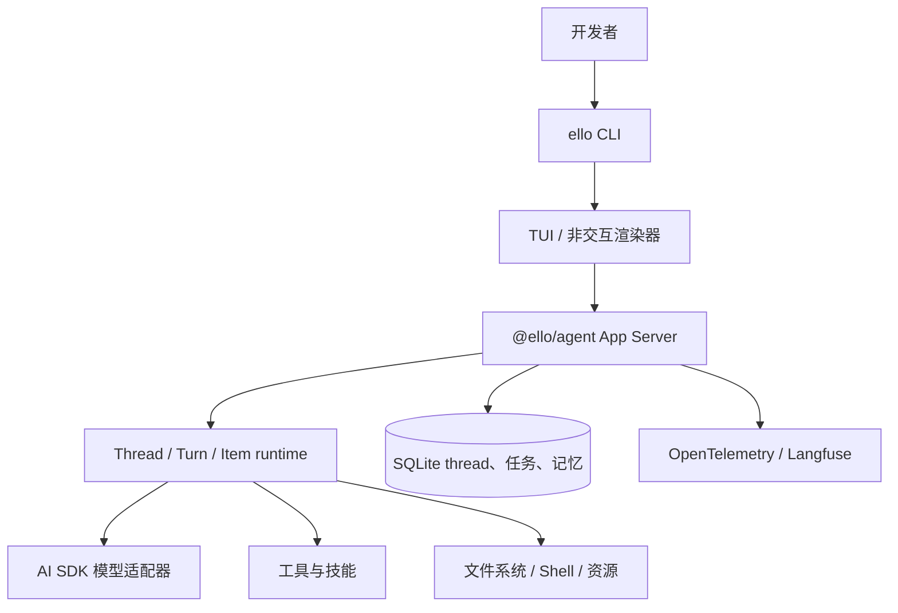

# ello


ello 是一个进程隔离的 coding agent TypeScript workspace。`@ello/agent` 拥有 App Server，`@ello/tui` 拥有 JSON-RPC Client、CLI 和终端界面。

## 包结构

- [`@ello/agent`](packages/ello-agent/README-zh.md) —— Server：模型执行、工具、权限、存储、工作区、技能、记忆和协议。
- [`@ello/tui`](packages/ello-tui/README.md) —— Client：CLI、Ink TUI、本地 stdio、WebSocket 和 Unix transport。

## 架构



## 快速开始

环境要求：Node.js 22+、pnpm 10+。

```bash
pnpm install
pnpm build
pnpm --filter @ello/tui run ello --help
pnpm --filter @ello/tui run ello
```

不启动 TUI，直接执行一次提示词：

```bash
pnpm --filter @ello/tui run ello --no-tui run "解释这个仓库最近的改动"
```

开发时如需全局使用本地 `ello`：

```bash
pnpm --filter @ello/tui build
cd packages/ello-tui
pnpm add -g .
```

完成后，只要 pnpm 的 global bin 目录已加入 `PATH`，就可以直接运行 `ello --help`。

## 文档

- [功能设计与模块契约](docs/functional-design.md)
- [中文技术文档](docs/README.md)
- [测试设计与契约矩阵](docs/test-design.md)
- [重构代码审查报告](docs/code-review.md)
- [Coding Agent TUI 设计](docs/tui/ello-tui-design.md)

## 开发

```bash
pnpm typecheck
pnpm contract:check
pnpm test
pnpm lint
```

测试按业务能力统一放在 `packages/*/tests/<功能模块>/`。任何功能变更都必须在同一
变更中更新功能设计、测试矩阵和对应的行为契约测试。

英文文档见 [`README.md`](README.md)。
