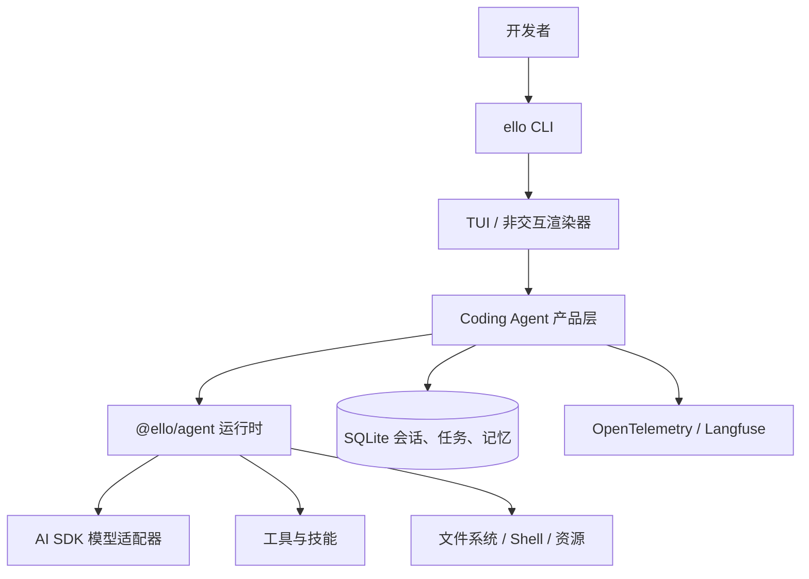

# ello


ello 是一个用于构建可靠、可扩展 AI Agent 的 TypeScript workspace。项目分为与 provider 无关的 Agent 运行时，以及开箱即用、带终端界面（TUI）的 coding-agent 产品层。

## 包结构

- [`@ello/agent`](packages/ello-agent/README-zh.md) —— Agent SDK：运行、流式输出、工具、环境、会话、观察器和模型适配器。
- [`@ello/coding-agent`](packages/ello-coding-agent/README-zh.md) —— coding-agent 产品：CLI/TUI、权限、工作区、技能、子代理、目标、记忆、持久化和可观测性。

## 架构



## 快速开始

环境要求：Node.js 22+、pnpm 10+。

```bash
pnpm install
pnpm build
pnpm --filter @ello/coding-agent run ello --help
pnpm --filter @ello/coding-agent run ello
```

不启动 TUI，直接执行一次提示词：

```bash
pnpm --filter @ello/coding-agent run ello --no-tui run "解释这个仓库最近的改动"
```

开发时如需全局使用本地 `ello`：

```bash
pnpm --filter @ello/coding-agent build
cd packages/ello-coding-agent
pnpm link --global
```

完成后，只要 pnpm 的 global bin 目录已加入 `PATH`，就可以直接运行 `ello --help`。

## 开发

```bash
pnpm typecheck
pnpm test
pnpm lint
```

英文文档见 [`README.md`](README.md)。
