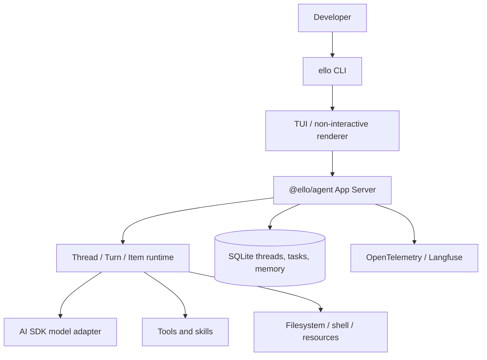

# ello


ello is a TypeScript workspace for a process-isolated coding agent. `@ello/agent` owns the App Server and `@ello/tui` owns the JSON-RPC client, CLI, and terminal UI.

## Packages

- [`@ello/agent`](packages/ello-agent/README.md) — Server: model execution, tools, permissions, storage, workspace, skills, memory, and protocol.
- [`@ello/tui`](packages/ello-tui/README.md) — Client: CLI, Ink TUI, local stdio launcher, WebSocket, and Unix transports.

## Architecture



## Quick start

Requirements: Node.js 22+, pnpm 10+.

```bash
pnpm install
pnpm build
pnpm --filter @ello/tui run ello --help
pnpm --filter @ello/tui run ello
```

Run one prompt without the TUI:

```bash
pnpm --filter @ello/tui run ello --no-tui run "Explain the changes in this repository"
```

To expose the local `ello` binary globally while developing:

```bash
pnpm --filter @ello/tui build
cd packages/ello-tui
pnpm add -g .
```

After that, `ello --help` is available from shells where pnpm's global bin directory is on `PATH`.

## Documentation

- [Chinese technical documentation](docs/README.md)
- [Functional design and module contracts](docs/functional-design.md)
- [Test design and contract matrix](docs/test-design.md)
- [Refactor code review (Chinese)](docs/code-review.md)
- [Coding Agent TUI design](docs/ello-coding-agent-tui-design.md)

## Development

```bash
pnpm typecheck
pnpm contract:check
pnpm test
pnpm lint
```

Tests are grouped by business capability under `packages/*/tests/<module>/`.
Every behavior change must update the functional design, test matrix, and its
observable contract tests in the same change.

See [`README-zh.md`](README-zh.md) for the Chinese documentation.
