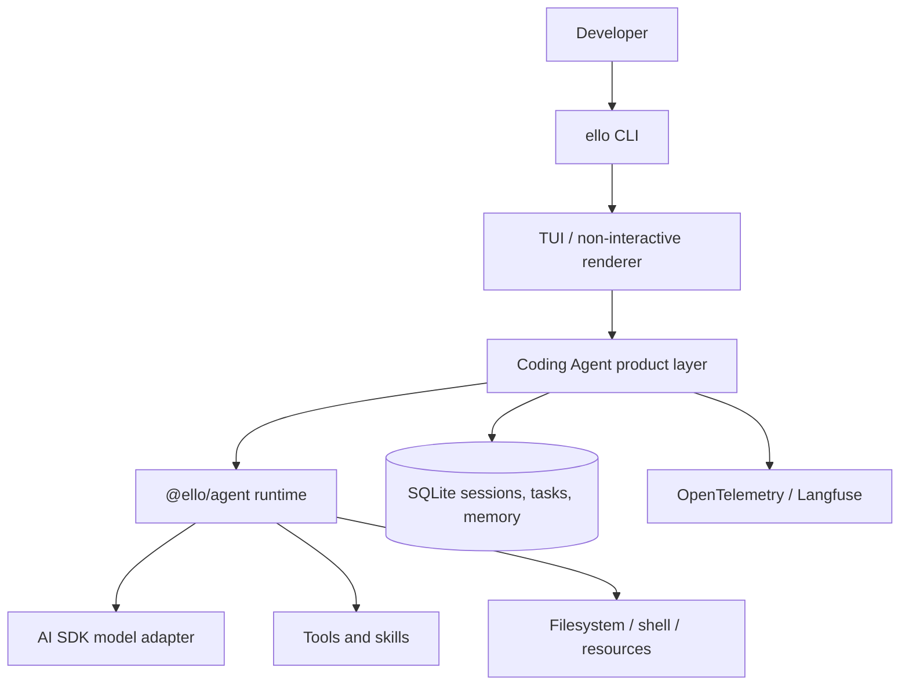

# ello


ello is a TypeScript workspace for building reliable, extensible AI agents. It is split into a provider-agnostic agent runtime and a batteries-included coding-agent product with a terminal UI (TUI).

## Packages

- [`@ello/agent`](packages/ello-agent/README.md) — framework SDK: agent runs, streaming, tools, environments, sessions, observers, and model adapters.
- [`@ello/coding-agent`](packages/ello-coding-agent/README.md) — coding-agent application: CLI/TUI, permissions, workspaces, skills, subagents, goals, memory, persistence, and observability.

## Architecture



## Quick start

Requirements: Node.js 22+, pnpm 10+.

```bash
pnpm install
pnpm build
pnpm --filter @ello/coding-agent run ello --help
pnpm --filter @ello/coding-agent run ello
```

Run one prompt without the TUI:

```bash
pnpm --filter @ello/coding-agent run ello --no-tui run "Explain the changes in this repository"
```

To expose the local `ello` binary globally while developing:

```bash
pnpm --filter @ello/coding-agent build
cd packages/ello-coding-agent
pnpm link --global
```

After that, `ello --help` is available from shells where pnpm's global bin directory is on `PATH`.

## Development

```bash
pnpm typecheck
pnpm test
pnpm lint
```

See [`README-zh.md`](README-zh.md) for the Chinese documentation.
