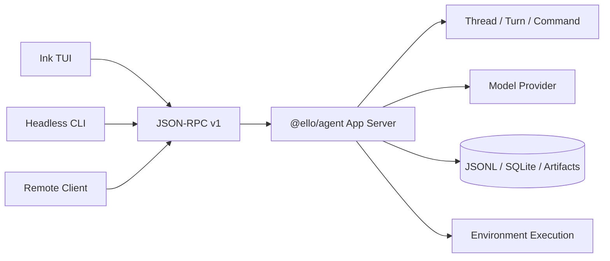
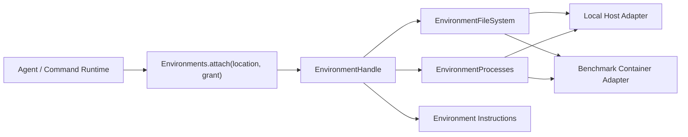

# Ello

<p align="center"><strong>简体中文</strong> | <a href="README-en.md">English</a></p>

**Ello 是面向长程软件工程任务的 Coding Agent。** 它不把模型限制在“调用一个小工具、等待一次结果”的循环里，而是用一个可编译、可调度、可恢复的 `command_run` 承载环境执行与 Agent 能力，让模型把更多预算用于定位根因、实现改动和验证结果。

> DeepSWE v1.1：Ello Rapid 与 Thorough 均为 **13/20（65%）**，Claude Code 为 **9/20（45%）**。在可比的配对任务上，Rapid 的模型轮次中位数减少 **68.3%**，Tool 调用减少 **70.7%**，input token 减少 **74.5%**。

## 运行演示


## Benchmark

### 当前结果

最新一轮固定使用同一个 DeepSeek V4 Flash 0731 模型、High reasoning effort、同一组 20 个 DeepSWE v1.1 任务，以及相同的 Docker image、资源限制和 verifier。比较对象是 Ello Rapid、Ello Thorough 与 Claude Code 三个完整 Agent 配置。

| 配置          | 有效任务 | 通过 |    通过率 | 相对 Claude Code |
| ------------- | -------: | ---: | --------: | ---------------- |
| Ello Rapid    |       20 |   13 | **65.0%** | **+20.0 pp**     |
| Ello Thorough |       20 |   13 | **65.0%** | **+20.0 pp**     |
| Claude Code   |       20 |    9 |     45.0% | baseline         |

两个 Ello 配置对 Claude Code 的配对结果均为 **6 胜、12 平、2 负**。60 个 job 均已完成并取得 verifier score。

### 资源效率

下面的下降比例先在双方 evidence 都可用的同一 Task 上计算 `Ello / Claude Code`，再取中位数。括号内是可比任务数；缺失 usage 不以 0 填补。

| 相对 Claude Code |       elapsed |      模型轮次 | Command / Tool 调用 |  input / output token |
| ---------------- | ------------: | ------------: | ------------------: | --------------------: |
| Ello Rapid       | ↓69.0% (n=17) | ↓68.3% (n=17) |       ↓70.7% (n=17) | ↓74.5% / ↓73.2% (n=7) |
| Ello Thorough    | ↓58.9% (n=17) | ↓65.3% (n=17) |       ↓66.8% (n=17) | ↓60.1% / ↓62.2% (n=6) |

Round 和工具事件由不同 Agent adapter 归一化，原子语义并不完全相同，因此这里只把它们作为与 elapsed、token 同时观察的描述性指标。严格 `publishable` gate 仍为 `false`：verifier 矩阵完整，但历史 usage 和 tool-audit coverage 未达到 60/60。

### 与上一轮记录

仓库上一版 DeepSWE 记录中，Ello 为 6/20（30%）；本轮为 13/20（65%），观察值提高 **35 个百分点**。这不是受控回归对比：模型、task-set hash、Docker 执行边界和 Agent 实现都发生了变化，因此它只能说明项目迭代后的纵向结果，不能把 35 个百分点归因给某一项功能。

当前同模型、同任务、同 verifier 的横向结论是 Ello 相对 Claude Code 提高 **20 个百分点**；这是更适合对外引用的数字。

### 隔离执行与可审计证据

Benchmark 使用与产品相同的 Client-Server 路径，而不是为 Ello 创建一套特殊执行器：

1. 每个 job 从固定 Docker image 提取干净工作区，并先运行未修改代码的 baseline preflight。
2. runner 为 job 启动独立 App Server 进程，隔离 `ELLO_HOME`、配置、SQLite、Thread、artifact、recorder 和 provider 环境。
3. 普通无界面 CLI 通过 Unix JSON-RPC 连接 Server；Agent 的文件与进程操作由该 job 的 Container Environment 执行。
4. runner 捕获 `model.patch`，再在新的同镜像容器中应用 patch 并运行 verifier。
5. EngineEvent、模型 usage、Command、patch、verifier assertion 和 retry lineage 进入可校验报告。

完整 raw run 已通过 136 个 attempt 的 lineage、artifact checksum 与报告一致性校验。Git 只发布聚合报告和每题的最小审计集，重型 stdout、evidence 与 phase timing 留在 ignored raw run。

- [当前 Benchmark 证据记录](docs/benchmark/current-task-set-record.md)
- [完整生成报告](docs/benchmark/results/report.md)
- [逐 Task patch 与 verifier 摘要](docs/benchmark/results/tasks/deep-swe/)
- [Benchmark 方法](docs/benchmark/benchmark-methodology.md)

这仍是 Agent 系统级对比：prompt、Command 协议、上下文策略和运行时同时变化。当前结果不能证明 Command Run、Backward Reasoning 或其他单项机制各自贡献了多少差异。

## 为什么用 Command 替代工具

### 传统 Tool Calling 的结构性成本

大多数 Coding Agent 把读取、搜索、编辑、Shell、MCP、Memory 和任务管理分别注册为 provider Tool。这个设计直观，但长任务会反复支付四类成本：

| 问题                 | 对长程任务的影响                                                           |
| -------------------- | -------------------------------------------------------------------------- |
| 每个动作占用模型回合 | 搜索、读取、修改、构建和测试之间反复等待 provider，网络与推理延迟累积      |
| 上下文被重复发送     | 每个后续 Tool Call 都重新携带 system prompt、工具 schema 和不断增长的历史  |
| 模型承担底层调度     | 模型需要决定哪些读操作可并发、修改如何串行、失败后哪些动作仍安全           |
| 恢复语义分散         | 审批、用户输入、后台进程和外部能力各自中断 Tool loop，容易重放已完成的工作 |

工具数量继续增加时，provider-visible schema 也持续变化，prompt cache 更难稳定；模型还需要在大量名称相近的 Tool 中选择。问题不只是 JSON 长，而是执行编排被放在了最昂贵、最不确定的模型回合里。

### Ello 的 Command Run

Ello 对 provider 只暴露一个稳定 Tool：

```text
{ command_run }
```

模型在一次调用中提交 1 到 32 个 Command Frame。每个 Frame 只使用 `step`、`command`、`args`、`body`、`input` 和 `onFailure`；Command Catalog 负责把名称解析为类型化能力。

```text
Model
  -> command_run
  -> compile every Frame
  -> group by step
  -> schedule through Environment Gate
  -> permission / approval
  -> execute
  -> project bounded observations
  -> one outer result
```

例如，已知依赖关系的工作可以组织为：

| Phase | Command                                  |
| ----: | ---------------------------------------- |
|     1 | 并发搜索相关文件、读取配置和定位测试     |
|     2 | 在事实已经明确后应用 patch               |
|     3 | 并发运行聚焦测试、typecheck 和 diff 检查 |

这不是把 Shell 换一个名字。Command Run 是拥有编译、调度、权限、失败屏障、checkpoint、恢复、事件和结果投影的执行内核：

- **全批编译，副作用前失败：** 任一 Frame 的 schema、Command、参数或类型化输入非法，整批不会开始执行。
- **按真实 effect 调度：** `step` 只表达依赖；同 phase 的安全只读 Command 可共享执行，修改和未知操作经 Environment Gate 串行化。
- **能力扩展不膨胀 Tool 面：** 核心能力、MCP、Memory、Goal 和 Subagent 进入动态 Command Catalog，provider schema 保持稳定。
- **统一审批与恢复：** checkpoint 保存已编译 Frame、phase cursor 和完成结果；批准或外部输入返回后不重新解析模型文本，也不重放完成前缀。
- **稳定的模型历史：** provider transcript 始终是合法的一对 outer `command_run` call/result，内部审计记录不伪装成 Tool Call。
- **有界模型观察：** 完整输出保留在 artifact/audit，模型只接收有界 observation，避免一次日志淹没后续上下文。

Command 也有明确边界：如果后续输入依赖尚未看到的输出，模型必须在下一回合继续，不能在同一静态 batch 中猜测。Ello 批处理“已经知道如何执行”的工作，而不是提前编造未知结果。

详见 [Agent 与 Command Run 回合循环](docs/agent/agent-loop.md)、[调度与恢复](docs/tools/tool-scheduler.md) 和 [Command Catalog](docs/tools/command-search-and-invoke.md)。

## Backward Reasoning

LLM 擅长从已有文本模式中生成“看起来常见”的下一步，但 issue 描述、报错堆栈、已有实现，甚至用户建议的修复位置，都只是关于问题的证据，不天然等于根因。直接从建议方案向前写代码，容易在症状处增加分支、复制状态或把协议两端修成不一致。

Ello 的 Backward Reasoning 从期望的可观察结果向后推导：

```text
验收结果
  <- 必须保持的稳定约束
  <- 能观察该约束的边界
  <- 生产与消费该状态的调用路径
  <- 状态所有者 / 持久化 / 协议
  <- 能解释现有证据的最小原因
```

实际策略分为七步：

1. 明确真实目标、验收标准和用户明确要求。
2. 把强制约束与建议实现分开。
3. 找出系统必须保持的稳定 invariant。
4. 定位错误第一次变得可观察的稳定边界。
5. 沿调用路径、状态迁移、持久化和协议生产者/消费者向后追踪。
6. 找到能同时解释现有证据的最小原因。
7. 修改该原因，并在稳定边界验证用户可观察行为。

例如，一个“刷新后审批消失”的问题，向前修补可能只在 TUI 中缓存审批；反向推理会先确定“未完成 Server Request 必须在断线后可恢复”的验收约束，再追踪 Client 投影、JSON-RPC ID、Thread record 和 Server Request 所有权，最终把修复落在持久事实源，而不是界面临时状态。

Rapid 与 Thorough 使用相同 runtime 和 Command 协议，区别是调查深度：

- **Rapid：** 找到足以解释证据的最小原因，聚焦修改并运行成本合适的验证。
- **Thorough：** 对共享、状态化或协议问题继续检查所有权、持久化、恢复、兼容性和下游契约，再扩大验证范围。

Backward Reasoning 是实际装配的 prompt policy，不是隐藏 planner，也不是一个独立 runtime mode。Benchmark 展示的是完整 Agent 配置之间的关联，不是该策略的单功能消融。

## 基础 Features

这些能力解决的是不同时间尺度和不同所有权的问题，不能互相替代：

| Feature                | 解决的问题                          | 生命周期与边界                                                                      |
| ---------------------- | ----------------------------------- | ----------------------------------------------------------------------------------- |
| **Memory**             | 跨 Thread 复用用户偏好和项目背景    | private/team Markdown topic 持久保存；system context 只注入索引，正文按需读取       |
| **Goal**               | 跨 Turn 保持一个长期目标与预算      | 绑定当前 Thread，保存 active/paused/blocked/complete 状态和累计 token               |
| **Skills**             | 按需加载可复用的专业工作说明        | global/project catalog 只注入轻量索引；激活后的 `SKILL.md` 进入当前 run             |
| **Subagent**           | 把有边界的工作交给独立执行上下文    | child task 使用独立 prompt、模型 role、工具与 transcript；结果和 usage 回到主 Agent |
| **Context Checkpoint** | 控制单个 Thread 的 provider history | 旧 Thread log 继续保留；checkpoint 只替换 provider context 投影并保持合法调用配对   |
| **MCP**                | 接入外部系统和远端能力              | MCP Tool 适配为内部 Command，继续经过 schema、权限、调度和审计                      |

### Memory

Memory 保存无法稳定地从代码或 Git 推导的长期信息，例如用户偏好、团队约定和外部系统入口。它不是当前任务进度，也不会把所有正文常驻在 prompt 中。

### Goal

Goal 保存当前 Thread 正在推进的目标、状态和可选 token budget。普通 turn 结束不会自动结束 Goal；只有完成、阻塞、暂停或清理才改变其长期状态。

### Skills

Skill 是带 frontmatter 和 `SKILL.md` 的可复用指令包。Skills 描述“如何做一类工作”，Memory 描述“这个用户或项目有哪些长期事实”；二者都按需加载，但所有权和更新方式不同。

### Subagent

Subagent 适合边界明确、可以独立调查或验证的任务。主 Agent 保留用户交互和最终决策，child 运行保留自己的 task、事件、transcript 和取消生命周期，不把全部探索塞回主上下文。

### Context Checkpoint

Context Checkpoint 解决的是当前 Thread 历史过长，而不是跨会话知识。完整 transcript 仍是 durable 事实源；provider 只看到 checkpoint 加近期合法消息，Command 大输出则使用有界 observation 和 artifact。

## 架构

### Client-Server

Ello 从一开始就把执行内核与界面分开：


```mermaid
flowchart LR
  TUI[Ink TUI] --> RPC[JSON-RPC v1]
  CLI[Headless CLI] --> RPC
  Remote[Remote Client] --> RPC
  RPC --> Server["@ello/agent App Server"]
  Server --> Thread[Thread / Turn / Command]
  Server --> Provider[Model Provider]
  Server --> State[(JSONL / SQLite / Artifacts)]
  Server --> Environment[Environment Execution]
```

`@ello/agent` 拥有 provider 凭据、模型执行、Command、权限、Thread、存储和资源生命周期；`@ello/tui` 只负责 CLI、终端交互、typed Client 和 transport。stdio、WebSocket 与 Unix socket 共享同一协议。

这样实现有五个直接原因：

- **安全与所有权明确：** Client 不接触 provider 凭据，不直接执行工具，也不写 Server 状态。
- **执行不依赖界面生命周期：** TUI 重绘、断开或替换不会成为 Agent 状态事实源。
- **恢复是协议能力：** Thread snapshot、连续事件和 durable Server Request 允许 Client 重连后恢复审批与用户输入。
- **多个 Client 复用同一内核：** TUI、无界面 CLI、Benchmark 和未来界面走相同业务路径。
- **独立演进：** 只要 versioned JSON-RPC 契约保持兼容，模型/权限/存储与 UI 可以分别修改和测试。

### 依赖倒置的 Environment Execution

Agent 不直接依赖 Node `fs`、`child_process` 或 Docker。高层的 Agent 与 Command runtime 只依赖 Environment contract：


```mermaid
flowchart LR
  Agent[Agent / Command Runtime] --> Attach["Environments.attach(location, grant)"]
  Attach --> Handle[EnvironmentHandle]
  Handle --> FS[EnvironmentFileSystem]
  Handle --> Proc[EnvironmentProcesses]
  Handle --> Inst[Environment Instructions]
  FS --> Local[Local Host Adapter]
  Proc --> Local
  FS --> Container[Benchmark Container Adapter]
  Proc --> Container
```

`ExecutionLocation` 指定稳定的 Environment Reference 与 working directory，`EnvironmentGrant` 指定 Handle 不能扩大的能力上限。attach 后得到的 `EnvironmentHandle` 绑定 generation、路径空间和资源所有权：

- `EnvironmentFileSystem` 只返回普通文件元数据和字节，不泄漏宿主 `Stats` 或真实实现。
- `EnvironmentProcesses` 提供 `exec/spawn/inspect/write/wait/signal`，使用不透明 Process Reference，而不是把 PID 暴露给 Agent。
- stdout/stderr 使用有界缓冲和 cursor；attached 进程随 Handle 关闭，background 进程仍受 Environment generation 和最大运行时间管理。
- `EnvironmentExecutionGate` 按 generation 协调 shared read 与 exclusive mutation；模型表达依赖，runtime 决定安全并发。
- Environment instructions 把实际 working directory、generation 和隔离语义作为运行时上下文交给模型。

产品入口装配 Local Host adapter；Benchmark 在不修改 Agent engine 的情况下装配 Container adapter，让文件和进程都发生在任务容器的 `/app` 中。这个依赖方向使未来的远程 workspace、沙箱或其他执行后端可以替换 adapter，而不需要复制 Command、权限、Thread 或模型循环。

## Packages

- [`@ello/agent`](packages/ello-agent/README.md)：App Server、Agent/Command runtime、Features、协议、存储与 Environment contract。
- [`@ello/tui`](packages/ello-tui/README.md)：CLI、Ink TUI、typed JSON-RPC Client 与本地/远程 transport。
- [`@ello/bench`](packages/ello-bench/README.md)：Docker benchmark、Agent adapter、证据、verifier、恢复、统计与报告。

## 快速开始

环境要求：Node.js 24+、pnpm 11.11.0。

```bash
pnpm install
pnpm build
pnpm --filter @ello/tui run ello
```

不启动 TUI，直接执行一次任务：

```bash
pnpm --filter @ello/tui run ello --no-tui run "解释这个仓库最近的改动"
```

开发时全局使用本地 `ello`：

```bash
pnpm --filter @ello/tui build
cd packages/ello-tui
pnpm add -g .
ello --help
```

## 文档

- [中文技术文档总览](docs/README.md)
- [Agent 与 Command Run](docs/agent/README.md)
- [Context Checkpoint](docs/compact/README.md)
- [Prompt 与 provider cache](docs/prompt/README.md)
- [Goal](docs/goal/README.md)
- [Memory](docs/memory/README.md)
- [Skills](docs/skills/README.md)
- [Subagent](docs/subagents/README.md)
- [MCP](docs/tools/mcp.md)
- [TUI](docs/tui/README.md)

## 开发验证

```bash
pnpm typecheck
pnpm test
pnpm lint
```

测试按业务能力放在 `packages/*/tests/<module>/`，断言用户可观察行为；实现文档以当前代码和协议为准。
