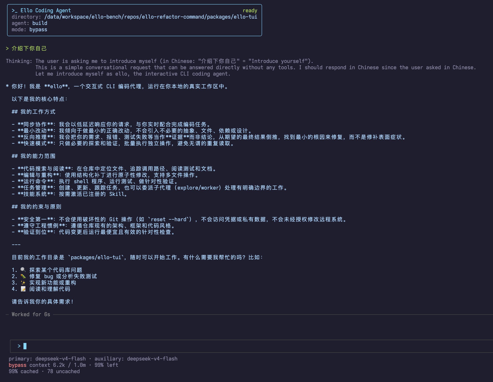
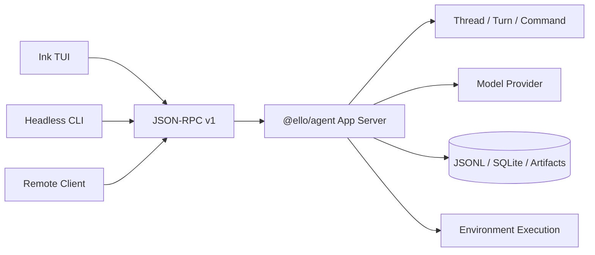
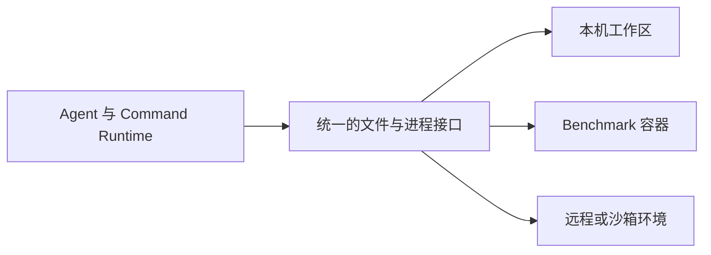

# Ello

<p align="center"><strong>简体中文</strong> | <a href="README-en.md">English</a></p>

**Ello 是面向长程软件工程任务的 Coding Agent。** 它不把模型限制在“调用一个小工具、等待一次结果”的循环里，而是用一个可编译、可调度、可恢复的 `command_run` 承载环境执行与 Agent 能力，让模型把更多预算用于定位根因、实现改动和验证结果。

> DeepSWE v1.1：Ello Rapid 与 Thorough 均为 **13/20（65%）**，Claude Code 为 **9/20（45%）**。在可比的配对任务上，Rapid 的模型轮次中位数减少 **68.3%**，Tool 调用减少 **70.7%**，input token 减少 **74.5%**。

## 运行演示



## 架构

### 基于 Client-Server 的服务端态 Agent

Ello 从一开始就把执行内核与界面分开：


```mermaid
flowchart LR
  TUI[Ink TUI] --> RPC[JSON-RPC v1]
  CLI[Headless CLI] --> RPC
  Remote[Remote Client] --> RPC
  RPC --> Server["@ello/agent App Server"]
  Server --> Thread[Thread / Turn / Command]
  Server --> Provider[Model Provider]
  Server --> State[(JSONL / SQLite / Artifacts)]
  Server --> Environment[Environment Execution]
```

`@ello/agent` 拥有 provider 凭据、模型执行、Command、权限、Thread、存储和资源生命周期；`@ello/tui` 只负责 CLI、终端交互、typed Client 和 transport。stdio、WebSocket 与 Unix socket 共享同一协议。

这样实现有五个直接原因：

- **安全与所有权明确：** Client 不接触 provider 凭据，不直接执行工具，也不写 Server 状态。
- **执行不依赖界面生命周期：** TUI 重绘、断开或替换不会成为 Agent 状态事实源。
- **恢复是协议能力：** Thread snapshot、连续事件和 durable Server Request 允许 Client 重连后恢复审批与用户输入。
- **多个 Client 复用同一内核：** TUI、无界面 CLI、Benchmark 和未来界面走相同业务路径。
- **独立演进：** 只要 versioned JSON-RPC 契约保持兼容，模型/权限/存储与 UI 可以分别修改和测试。

### 依赖倒置的 Environment Execution

Ello 既可以直接操作本机项目，也可以在 Benchmark 容器中工作。为了让 Agent 不必关心代码究竟运行在哪里，文件读写和进程执行都通过统一的 Environment 接口完成：


```mermaid
flowchart LR
  Agent[Agent 与 Command Runtime] --> Environment[统一的文件与进程接口]
  Environment --> Local[本机工作区]
  Environment --> Container[Benchmark 容器]
  Environment --> Future[远程或沙箱环境]
```

每次运行都会绑定一个明确的工作目录和权限上限。Command 只能在这个范围内读取文件、写入内容和启动进程，不能因为模型提出了更大的请求就自行扩大权限。

- **相同的 Agent 路径：** 搜索、编辑、测试和审批在本机与容器中使用同一套 Command，不需要为 Benchmark 复制执行逻辑。
- **环境边界明确：** Agent 只看到当前工作区中的文件和受控进程，不依赖宿主系统的内部对象或 PID。
- **资源可收回：** 输出大小、后台进程和最长运行时间由 Environment 管理；一次运行结束时，相关资源可以统一关闭。
- **并发由 runtime 决定：** 模型只声明步骤之间的依赖，Environment 负责并发执行安全的读取，并让写入按顺序发生。

因此，产品模式可以连接本机工作区，Benchmark 可以把同一个 Agent 接到任务容器的 `/app`，未来也能接入远程 workspace 或沙箱，而不用重写 Command、权限、Thread 或模型循环。

## Benchmark

### 当前结果

最新一轮固定使用同一个 DeepSeek V4 Flash 0731 模型、High reasoning effort、同一组 20 个 DeepSWE v1.1 任务，以及相同的 Docker image、资源限制和 verifier。比较对象是 Ello Rapid、Ello Thorough 与 Claude Code 三个完整 Agent 配置。

| 配置          | 有效任务 | 通过 |    通过率 | 相对 Claude Code |
| ------------- | -------: | ---: | --------: | ---------------- |
| Ello Rapid    |       20 |   13 | **65.0%** | **+20.0 pp**     |
| Ello Thorough |       20 |   13 | **65.0%** | **+20.0 pp**     |
| Claude Code   |       20 |    9 |     45.0% | baseline         |

两个 Ello 配置对 Claude Code 的配对结果均为 **6 胜、12 平、2 负**。60 个 job 均已完成并取得 verifier score。

### 资源效率

下面的下降比例先在双方 evidence 都可用的同一 Task 上计算 `Ello / Claude Code`，再取中位数。括号内是可比任务数；缺失 usage 不以 0 填补。

| 相对 Claude Code |       elapsed |      模型轮次 | Command / Tool 调用 |  input / output token |
| ---------------- | ------------: | ------------: | ------------------: | --------------------: |
| Ello Rapid       | ↓69.0% (n=17) | ↓68.3% (n=17) |       ↓70.7% (n=17) | ↓74.5% / ↓73.2% (n=7) |
| Ello Thorough    | ↓58.9% (n=17) | ↓65.3% (n=17) |       ↓66.8% (n=17) | ↓60.1% / ↓62.2% (n=6) |

Round 和工具事件由不同 Agent adapter 归一化，原子语义并不完全相同，因此这里只把它们作为与 elapsed、token 同时观察的描述性指标。严格 `publishable` gate 仍为 `false`：verifier 矩阵完整，但历史 usage 和 tool-audit coverage 未达到 60/60。

### 隔离执行与可审计证据

Benchmark 使用与产品相同的 Client-Server 路径，而不是为 Ello 创建一套特殊执行器：

1. 每个 job 从固定 Docker image 提取干净工作区，并先运行未修改代码的 baseline preflight。
2. runner 为 job 启动独立 App Server 进程，隔离 `ELLO_HOME`、配置、SQLite、Thread、artifact、recorder 和 provider 环境。
3. 普通无界面 CLI 通过 Unix JSON-RPC 连接 Server；Agent 的文件与进程操作由该 job 的 Container Environment 执行。
4. runner 捕获 `model.patch`，再在新的同镜像容器中应用 patch 并运行 verifier。
5. EngineEvent、模型 usage、Command、patch、verifier assertion 和 retry lineage 进入可校验报告。

完整 raw run 已通过 136 个 attempt 的 lineage、artifact checksum 与报告一致性校验。Git 只发布聚合报告和每题的最小审计集，重型 stdout、evidence 与 phase timing 留在 ignored raw run。

- [当前 Benchmark 证据记录](docs/benchmark/current-task-set-record.md)
- [完整生成报告](docs/benchmark/results/report.md)
- [逐 Task patch 与 verifier 摘要](docs/benchmark/results/tasks/deep-swe/)
- [Benchmark 方法](docs/benchmark/benchmark-methodology.md)

这仍是 Agent 系统级对比：prompt、Command 协议、上下文策略和运行时同时变化。当前结果不能证明 Command Run、Backward Reasoning 或其他单项机制各自贡献了多少差异。

## 为什么用 Command 替代工具

### 传统 Tool Calling 的结构性成本

大多数 Coding Agent 把读取、搜索、编辑、Shell、MCP、Memory 和任务管理分别注册为 provider Tool。这个设计直观，但长任务会反复支付四类成本：

| 问题                 | 对长程任务的影响                                                           |
| -------------------- | -------------------------------------------------------------------------- |
| 每个动作占用模型回合 | 搜索、读取、修改、构建和测试之间反复等待 provider，网络与推理延迟累积      |
| 上下文被重复发送     | 每个后续 Tool Call 都重新携带 system prompt、工具 schema 和不断增长的历史  |
| 模型承担底层调度     | 模型需要决定哪些读操作可并发、修改如何串行、失败后哪些动作仍安全           |
| 恢复语义分散         | 审批、用户输入、后台进程和外部能力各自中断 Tool loop，容易重放已完成的工作 |

工具数量继续增加时，provider-visible schema 也持续变化，prompt cache 更难稳定；模型还需要在大量名称相近的 Tool 中选择。问题不只是 JSON 长，而是执行编排被放在了最昂贵、最不确定的模型回合里。

### Ello 的 Command Run

Ello 对 provider 只暴露一个稳定 Tool：

```text
{ command_run }
```

模型在一次调用中提交 1 到 32 个 Command Frame。每个 Frame 只使用 `step`、`command`、`args`、`body`、`input` 和 `onFailure`；Command Catalog 负责把名称解析为类型化能力。

```text
Model
  -> command_run
  -> compile every Frame
  -> group by step
  -> schedule through Environment Gate
  -> permission / approval
  -> execute
  -> project bounded observations
  -> one outer result
```

这不是把 Shell 换一个名字。Command Run 是拥有编译、调度、权限、失败屏障、checkpoint、恢复、事件和结果投影的执行内核：

- **全批编译，副作用前失败：** 任一 Frame 的 schema、Command、参数或类型化输入非法，整批不会开始执行。
- **按真实 effect 调度：** `step` 只表达依赖；同 phase 的安全只读 Command 可共享执行，修改和未知操作经 Environment Gate 串行化。
- **能力扩展不膨胀 Tool 面：** 核心能力、MCP、Memory、Goal 和 Subagent 进入动态 Command Catalog，provider schema 保持稳定。
- **统一审批与恢复：** checkpoint 保存已编译 Frame、phase cursor 和完成结果；批准或外部输入返回后不重新解析模型文本，也不重放完成前缀。
- **稳定的模型历史：** provider transcript 始终是合法的一对 outer `command_run` call/result，内部审计记录不伪装成 Tool Call。
- **有界模型观察：** 完整输出保留在 artifact/audit，模型只接收有界 observation，避免一次日志淹没后续上下文。

Command 也有明确边界：如果后续输入依赖尚未看到的输出，模型必须在下一回合继续，不能在同一静态 batch 中猜测。Ello 批处理“已经知道如何执行”的工作，而不是提前编造未知结果。

一个配置变更可以直观看到两种执行方式的差异。分散式调用会把同一条路径切成多个 provider 往返：

| 往返 | Agent 动作                                            | 等待的结果       |
| ---: | ----------------------------------------------------- | ---------------- |
|    1 | 搜索 `initial_mode` 与 `bypass_enabled`               | 确认配置入口     |
|    2 | 读取文档并提交 `apply_patch`                          | 确认修改成功     |
|    3 | 运行 `pnpm --filter @ello/agent test -- tests/config` | 获取聚焦测试结果 |
|    4 | 运行 `pnpm typecheck`                                 | 获取类型检查结果 |
|    5 | 运行 `pnpm lint`                                      | 获取静态检查结果 |

Ello 把这类“输入已经明确”的动作编成一份执行链。provider 仍只看到 `command_run`，但一次请求可以携带多个有序 Frame；runtime 负责校验、并发、权限、失败处理和恢复，模型只接收每一步的受限结果。

_**Ello 执行链：**_

```json
{
  "name": "command_run",
  "arguments": {
    "commands": [
      {
        "step": 1,
        "command": "bash",
        "body": "rg -n \"initial_mode|bypass_enabled\" packages/ello-agent/src docs/config"
      },
      {
        "step": 1,
        "command": "bash",
        "body": "sed -n '1,180p' docs/config/README.md"
      },
      {
        "step": 2,
        "command": "apply_patch",
        "body": "*** Begin Patch\n*** Update File: docs/config/README.md\n@@\n-initial_mode: ask-before-changes\n+initial_mode: plan\n*** End Patch"
      },
      {
        "step": 3,
        "command": "bash",
        "body": "pnpm --filter @ello/agent test -- tests/config"
      },
      {
        "step": 4,
        "command": "bash",
        "body": "pnpm typecheck"
      },
      {
        "step": 4,
        "command": "bash",
        "body": "pnpm lint"
      }
    ]
  }
}
```

这份请求不是把多个 Shell 命令拼成一条长脚本：每个 Frame 仍有独立的类型、effect 和审计记录。`step` 只表达依赖；同一阶段的只读操作可以共享执行，配置写入、外部访问和未知 effect 仍由 Gate 串行处理并按权限请求审批。

详见 [Agent 与 Command Run 回合循环](docs/agent/agent-loop.md)、[调度与恢复](docs/tools/tool-scheduler.md) 和 [Command Catalog](docs/tools/command-search-and-invoke.md)。

## 反向推理

LLM 会优先延续训练数据中常见的实现模式，但“常见”不等于符合这个仓库的契约。报错位置、Issue 描述和用户给出的修复方向都只是线索；真正需要满足的是用户能观察到的结果，以及系统在过程中必须保持的约束。

普通 Agent 通常从当前状态逐步推向提示中的目标。这里，$s_1$ 表示当前状态，$s_n$ 表示用户要求的最终结果：

$$
s_1 \rightarrow s_2 \rightarrow s_3 \rightarrow \cdots \rightarrow s_n
$$

Ello 则先根据目标 $s_n$ 推导它成立前必须满足的状态 $s_{n-1}$，再从 $s_{n-1}$ 继续回推 $s_{n-2}$。这个过程逐层收敛到当前状态，同时检查每一步是否能被仓库中的证据支持：

$$
s_n \rightarrow s_{n-1} \rightarrow s_{n-2} \rightarrow \cdots \rightarrow s_1
$$

因此，Ello 会先写出结果的判定方式，再沿着数据和控制流回溯。它不会把报错行直接当成修改点，而是逐层回答“哪个契约失效、谁拥有这个契约、错误状态从哪里产生”：


```mermaid
flowchart RL
  Outcome[用户可观察结果] --> Boundary[首次偏离的稳定边界]
  Boundary --> Contract[被破坏的约束或协议]
  Contract --> Owner[状态与生命周期所有者]
  Owner --> Cause[能解释全部证据的原因]
```

回溯过程围绕三个问题展开：什么现象能证明任务完成，哪个稳定边界最早偏离预期，哪个所有者能够同时解释现有证据。只有这些问题得到回答后，Agent 才决定修改位置和验证范围。

例如，若“切换模式后下一次命令仍被旧权限拦截”，表面修补可能是在 TUI 里刷新一个标签。反向推理会先固定“新模式必须从下一次 Command 判定开始生效”，然后检查 SessionMode 的持有者、child 继承、permission session 和恢复事件，最终把修复放在 Server 的实时状态边界。

这种方法也适用于数据正确性：如果缓存命中率异常，先确认验收指标和 cache key 的稳定字段，再回溯 key 的生产者、持久化格式和读取方，而不是在统计输出处增加一个补偿分支。

Rapid 与 Thorough 使用相同 runtime 和 Command 协议，区别是调查深度：

- **Rapid：** 找到足以解释证据的最小原因，聚焦修改并运行成本合适的验证。
- **Thorough：** 对共享、状态化或协议问题继续检查所有权、持久化、恢复、兼容性和下游契约，再扩大验证范围。

Backward Reasoning 是实际装配的 prompt policy，不是隐藏 planner，也不是一个独立 runtime mode。Benchmark 展示的是完整 Agent 配置之间的关联，不是该策略的单功能消融。

## 核心 Features

这些能力解决的是不同时间尺度和不同所有权的问题，不能互相替代：

| Feature                | 解决的问题                            | 生命周期与边界                                                                        |
| ---------------------- | ------------------------------------- | ------------------------------------------------------------------------------------- |
| **Memory**             | 跨 Thread 复用用户偏好和项目背景      | private/team Markdown topic 持久保存；system context 只注入索引，正文按需读取         |
| **Goal**               | 跨 Turn 保持一个长期目标与预算        | 绑定当前 Thread，保存 active/paused/blocked/complete 状态和累计 token                 |
| **Skills**             | 按需加载可复用的专业工作说明          | global/project catalog 只注入轻量索引；激活后的 `SKILL.md` 进入当前 run               |
| **Subagent**           | 把有边界的工作交给独立执行上下文      | child task 使用独立 prompt、模型 role、工具与 transcript；结果和 usage 回到主 Agent   |
| **Context Compaction** | 压缩单个 Thread 的 provider history   | 旧 Thread log 继续保留；compaction 只替换 provider context 投影并保持合法调用配对     |
| **MCP**                | 接入外部系统和远端能力                | MCP Tool 适配为内部 Command，继续经过 schema、权限、调度和审计                        |
| **Task**               | 管理多个工作项的状态、负责人和依赖    | SQLite Task board；支持创建、领取、更新和依赖关系，可跨 turn 继续                     |
| **Plan Mode**          | 在修改前调查、写计划并等待确认        | 只允许受限调查；计划持久化并以 hash 校验，接受后切换到 `ask-before-changes`           |
| **Session Mode**       | 控制当前 Thread 的执行节奏和默认授权  | `plan`、`ask-before-changes`、`accept-edits`、可选 `bypass`，状态由 Server 持有并恢复 |
| **Permissions**        | 决定每个 Command 自动执行、审批或拒绝 | Server 结合 mode、工具类别、路径和规则判断；支持 session、project、user 三层规则      |

## Packages

- [`@ello/agent`](packages/ello-agent/README.md)：App Server、Agent/Command runtime、Features、协议、存储与 Environment contract。
- [`@ello/tui`](packages/ello-tui/README.md)：CLI、Ink TUI、typed JSON-RPC Client 与本地/远程 transport。
- [`@ello/bench`](packages/ello-bench/README.md)：Docker benchmark、Agent adapter、证据、verifier、恢复、统计与报告。

## 快速开始

环境要求：Node.js 24+、pnpm 11.11.0。

```bash
pnpm install
pnpm build
pnpm --filter @ello/tui run ello
```

不启动 TUI，直接执行一次任务：

```bash
pnpm --filter @ello/tui run ello --no-tui run "解释这个仓库最近的改动"
```

开发时全局使用本地 `ello`：

```bash
pnpm --filter @ello/tui build
cd packages/ello-tui
pnpm add -g .
ello --help
```

## 文档

- [中文技术文档总览](docs/README.md)
- [Agent 与 Command Run](docs/agent/README.md)
- [Context Compaction](docs/compact/README.md)
- [Prompt 与 provider cache](docs/prompt/README.md)
- [Goal](docs/goal/README.md)
- [Task](docs/task/README.md)
- [Plan Mode](docs/plan/README.md)
- [会话模式与权限](docs/permission/README.md)
- [Memory](docs/memory/README.md)
- [Skills](docs/skills/README.md)
- [Subagent](docs/subagents/README.md)
- [MCP](docs/tools/mcp.md)
- [TUI](docs/tui/README.md)

## 开发验证

```bash
pnpm typecheck
pnpm test
pnpm lint
```

测试按业务能力放在 `packages/*/tests/<module>/`，断言用户可观察行为；实现文档以当前代码和协议为准。
