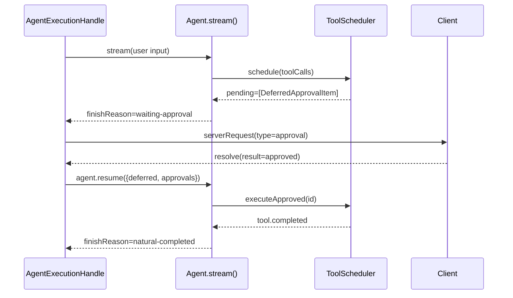

# Agent 与回合循环

## Agent 的抽象

ello 的 Agent 抽象只有两个概念：

- `create_agent(options)` → 工厂函数，接收模型、工具、环境、指令等配置，返回一个 `Agent` 实例。
- `Agent` 暴露两个执行方法：`stream(input)` 和 `run(input)`。外加一个 `close()` 释放资源和一个 `resume()` 用于审批恢复后的续接。

```ts
const agent = createAgent({
  model: providerRegistry.resolveLanguageModel('anthropic:claude-sonnet-4-20250514'),
  instructions: 'You are a coding agent.',
  executionTools: [...],
  modelTools: [...],
});

// 流式：同步返回事件流，后台异步执行
const stream = agent.stream('What changed in this file?');
for await (const event of stream) {
  // message.delta, tool.started, tool.completed, ...
}
const result = await stream.final;

// 同步：内部消费事件流，只返回最终结果
const result = await agent.run('What changed?');
console.log(result.output);
```

这个抽象的价值是：它把"Agent 能做什么"和"Agent 怎么做"彻底分开了。`CreateAgentOptions` 是和 provider、工具、环境无关的配置声明。调用方不需要知道模型是 OpenAI 还是 Anthropic，不需要知道工具是直接暴露给模型还是走 `tool_search` 路由，不需要知道 compact 在哪一刻触发。`Agent` 接口把这些复杂度封在了 `create_agent` 后面。

### 为什么需要 stream 和 run 两个方法

`stream()` 是给 TUI 用的。TUI 需要实时渲染模型输出的每个 token、工具执行的每个阶段。事件流中的 `message.delta`、`tool.started`、`approval.required` 直接驱动界面更新。

`run()` 是给内部 Agent 用的。compact agent 生成摘要、title generator 生成标题、memory-extractor 提取记忆——这些场景不需要实时展示，调用方只需要最终结果。`run()` 的内部实现就是把 `stream()` 消费到底，然后取 `stream.final`：

```ts
async run(input, options = {}): Promise<AgentRunResult> {
  const stream = this.stream(input, options);
  for await (const _event of stream) { /* 不关心中间事件 */ }
  return stream.final;
}
```

不提供第三个方法 `runSync()`——没有这个需求。所有 Agent 执行都是异步的（模型 API 调用本身是异步的），用一个假的同步包装没有意义。

### Agent 实例的复用

同一个 `ElloAgent` 实例可以被多次调用 `stream()` 或 `run()`。每次调用创建一个独立的 `RunSession`，拥有独立的消息历史、独立的 AbortController、独立的事件流。同一个 Thread 的不同 Turn 可以复用同一个 Agent 实例——但 ello 实际上没有这样做，因为不同 Turn 之间权限规则、skills 索引、provider 设置可能变化。`agent-turn-executor.ts` 中的 `composeAgent()` 为每个 Turn 创建新的 Agent。

## 回合循环

Agent 执行的核心是 `runAgentLoop()`。它不保存任何业务状态——所有状态都在 `RunSession` 中。循环本身只按固定节奏调用 RunSession 的方法：

```ts
export async function runAgentLoop(run: RunSession): Promise<void> {
  try {
    await run.start();

    while (run.canStartTurn()) {
      const turn = await run.startTurn();
      if (turn.skipModel === 'interrupted') {
        await run.finishTurn(
          turn,
          undefined,
          undefined,
          { messages: [], toolCalls: [], pendingCount: 0 },
          'interrupted',
        );
        break;
      }

      const input = await buildModelInput(run);
      const assistant = await callModel(run, input);
      const toolResults = await executeToolCalls(run, assistant);

      await run.finishTurn(
        turn,
        input.diagnostics,
        assistant.response,
        toolResults,
        assistant.stopReason,
      );

      if (run.shouldStopAfterTurn()) break;
    }

    await run.finish();
  } catch (error) {
    await run.fail(error);
  }
}
```

### 循环为什么只有六步

每回合只做六件事。这个数量来自一个具体的约束：**每增加一个步骤，就增加一个模型调用的延迟点，同时增加一个可以被错误打断的状态**。

`start()` → 加载历史、准备 resume 数据。只在首回合执行一次。这一步失败意味着 Thread 的 JSONL 不可读或 resume 数据格式错误——没有恢复路径，直接失败。

`startTurn()` → 从五条消息队列中抽取当前回合的消息。这一步可能被中断信号跳过（`skipModel === 'interrupted'`）。

`buildModelInput()` → 拼接 system prompt、裁剪消息窗口、构建 tool schema。这一步涉及 token 估算和 fingerprint 计算，是纯 CPU 操作，不应该访问网络。

`callModel()` → 委托 `ModelAdapter` 调用 provider API。这一步是本回合的最大延迟来源（数百毫秒到数十秒）。异步等待期间，中断信号可以触发 abort。

`executeToolCalls()` → 委托 `ToolScheduler` 执行工具。这一步可能产生审批挂起——挂起后 `shouldStopAfterTurn()` 返回 true，循环退出，等待外部 resume。

`finishTurn()` → 把新消息推入历史、累计用量、记录诊断。

### 循环不识别 provider

`callModel()` 通过 `ModelAdapter` 接口调用模型。`ModelAdapter` 是一个简单的抽象：

```ts
interface ModelAdapter {
  callModel(run: RunSession, input: ModelInput): Promise<ModelCallResult>;
}
```

默认实现是 `AiSdkModelAdapter`，内部委托给 Vercel AI SDK。但 `runAgentLoop` 不 import AI SDK——它只依赖 `ModelAdapter` 接口。换 provider 不需要改循环代码。

同样的，`executeToolCalls()` 委托给 `ToolScheduler`，`runAgentLoop` 不直接 import Task 工具、Shell 工具或文件编辑工具。

## 消息队列

### 问题

一个 Turn 的模型输入来自多种来源，这些来源的到达时间不同：

- 用户输入：Turn 开始时一次性提供。
- 会话历史：从 JSONL transcript 恢复的持久化消息。
- 审批恢复：上一轮 run 中挂起的 tool-call，现在有了用户的批准/拒绝决定。
- 用户中途追加指令（steer）：模型已经在生成 token 时，用户通过 TUI 发送了新指令。不能打断当前 provider 请求去追加这条指令，只能等下一回合。
- 模型请求用户输入后的回复（follow-up）：和 steer 类似，需要排队。

如果只有一条消息队列，这些来源的时序和优先级会混在一起。用户在模型生成中途发送的 steer 可能被塞到会话历史前面，导致模型先看 steer 再看历史——上下文完全错乱。

### 方案：五条队列，固定抽取顺序

`AgentRunControl` 维护五条队列，每条有独立的入队方式和抽取粒度：

| 队列      | 抽取方式            | 入队时机                    | 语义                     |
| --------- | ------------------- | --------------------------- | ------------------------ |
| session   | 首回合一次性抽干    | `run.start()`               | 持久化 transcript        |
| deferred  | 每个 run 首回合抽干 | 审批挂起或 deferred 工具    | 审批恢复的 tool-result   |
| input     | 一次性抽干          | `run.start()`               | 当前用户输入             |
| steering  | 每回合一条          | 运行中通过 `stream.steer()` | 用户中途追加的指令       |
| follow-up | 每回合一条          | 运行中通过 `stream.steer()` | 模型请求用户输入后的回复 |

抽取顺序固定为 session → deferred → input → steering → follow-up。顺序由消息的时序依赖决定：

**session 必须在 deferred 之前。** session 中已存在 assistant tool-call（来自上一次 run 的模型响应）。deferred 队列中包含的是用户批准后需要补的 tool-result。如果 deferred 排在 session 前面，tool-result 会出现在 tool-call 之前——provider 会拒绝这个请求。

**deferred 和 input 必须在 session 之后。** 它们都是新增内容，不能插入到历史中间。

**steering 和 follow-up 排在最后。** 它们是运行中到达的指令，和首回合的初始消息有明确的时序先后。

**steering 和 follow-up 使用 `'one-at-a-time'` 模式。** 每回合只取一条。用户连续发送三条 steer 时，三条会在三个不同回合中依次进入模型上下文，而非一次全部灌入。这给了模型在每一回合看到一条新指令后调整行为的机会。

### 实现

`AgentRunControl` 把五条队列的实现统一为 `DefaultAgentMessageQueue<T>`：

```ts
class DefaultAgentMessageQueue<T> implements AgentMessageQueue<T> {
  private readonly items: T[] = [];
  constructor(readonly mode: AgentMessageQueueMode = 'all') {}

  push(item: T): void {
    this.items.push(item);
  }

  drain(): T[] {
    if (this.items.length === 0) return [];
    if (this.mode === 'one-at-a-time') {
      const item = this.items.shift();
      return item === undefined ? [] : [item];
    }
    return this.items.splice(0);
  }
}
```

`mode` 控制抽取粒度。`'all'` 用于 session、deferred、input——一次性全部取出。`'one-at-a-time'` 用于 steering 和 follow-up——每次只取队首一条。

`drainNextTurn()` 在每个回合开始时被调用，按固定顺序从各队列抽取并合并成单条消息序列。同时生成 `QueueDrainDiagnostic`，记录每条队列被抽取了多少条：

```ts
interface QueueDrainDiagnostic {
  readonly queue: string; // 'session' | 'deferred' | 'input' | 'steering' | 'follow-up'
  readonly count: number;
}
```

诊断让排查变得简单。当模型的行为不符合预期时，可以查看诊断确认"这条 steer 是否进入了当前模型调用"——而不需要打印完整的上下文窗口。

## 停止条件

`shouldStopAfterTurn()` 的返回值决定循环是否继续。停止条件有七种，但可以分为三类。

**正常结束。** `natural-completed`：模型返回了非空的最终回答。这是预期的正常终止。

**挂起等待。** `waiting-approval`（工具需要用户审批）和 `waiting-tool-result`（deferred 工具需要宿主回填）。这两种情况下的循环退出是正常的挂起行为。外部调用方通过 `result.pending` 获取挂起的项目，审批后调用 `agent.resume()` 启动新的 run 继续执行。

**异常终止。** `max-turns`（达到上限）、`interrupted`（收到中断信号）、`no-progress`（本回合没有产生新消息）、`error`（某步骤抛错）。

`no-progress` 值得单独说。它的检测逻辑在 `finishTurn()` 中：比对本回合开始前的消息列表和结束后的消息列表。如果模型调用后没有新增消息，且模型没有产生 tool-calls，则判定为无进展。某些 provider 在上下文过长时可能返回空响应或只包含 `stop` 但 `content` 为空——靠常规的 `natural-completed` 检测不到这种情况，`no-progress` 作为兜底防止空转。

`maxTurns` 默认值的来源：主 Agent 使用 `AgentDefinition.maxTurns`（未设置时为 100），internal agent 各有自己的上限（compact 为 4，memory-extractor 为 8）。100 看起来很大，在正常对话中 5-15 回合就会结束。100 是防止模型陷入循环的硬上限。

## 事件流与背压

`stream()` 同步返回 `AgentEventStream`，后台异步执行 `runAgentLoop`。`AgentEventStream` 实现了 `AsyncIterator<EngineEvent>` 并暴露 `final: Promise<AgentRunResult>`。

事件流有 1024 条缓冲容量。消费者停止消费时，生产者不会无限制堆积：

```ts
emit(event: EngineEvent): void {
  if (this.closed) throw new Error('Cannot emit after stream closed.');
  const waiter = this.waiters.shift();
  if (waiter !== undefined) {
    waiter.resolve({ done: false, value: event });
    return;
  }
  if (this.queue.length === this.capacity) {
    throw new AgentStreamBackpressureError(this.capacity);
  }
  this.queue.push(event);
}
```

1024 容量在连续 delta 输出场景下足够缓冲几秒。如果 TUI 渲染卡顿超过这个窗口，Turn 直接失败——`AgentStreamBackpressureError` 会被 `runAgentLoop` 的 catch 捕获并转为 `run.failed`。

拒绝了一个选项：无界队列。无界队列在 TUI 挂掉后会让 Server 持续堆积事件，最终 OOM 并丢失整个 Thread 的状态。这和 C/S 架构的设计前提矛盾——分离就是为了让 TUI 崩溃不影响 Server。

## Turn 跨多个 Engine run

一个 Turn 不一定等于一个 Engine run。审批流程中，同一个 Turn 可能包含多个 run：



`AgentExecutionHandle.drive()` 中有一个 `while(true)` 循环：

```ts
let stream = this.options.agent.stream(input, runOptions);
while (true) {
  this.activeStream = stream;
  for await (const event of stream) await this.project(event);
  const result = await stream.final;
  const pending = result.pending ?? [];
  if (pending.length === 0) {
    /* 结束 */
  }
  const resolution = await this.resolveDeferred(pending);
  stream = this.options.agent.resume(
    {
      deferred: pending,
      approvals: resolution.approvals,
      toolResults: resolution.toolResults,
    },
    runOptions,
  );
}
```

每次 `stream()` 或 `resume()` 调用对应一个 Engine run。`pending` 非空时循环继续——`resolveDeferred` 等待 Client 批复，然后 `resume` 创建新的 run。第二个 run 可能再次生产 `pending`，循环继续。

这种多 run 串联的设计直接把"Agent 引擎"和"审批流程"解耦了。Agent 引擎不知道审批的存在——它只知道这次 run 以 `waiting-approval` 结束了。审批的等待、Client 交互、超时处理全部在 `AgentExecutionHandle` 层处理。
