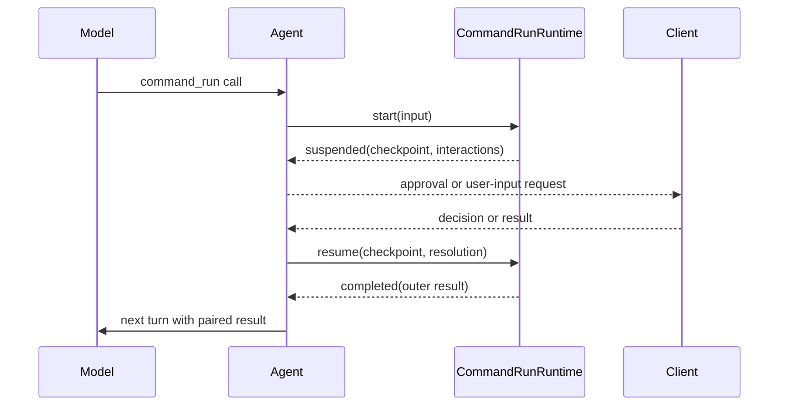

# Agent 与 Command Run 回合循环

## Agent interface

`createAgent(options)` 创建可 `stream()`、`run()`、`resume()` 和 `close()` 的 Agent。
每次执行拥有独立的 RunState、消息历史、AbortController、事件流与诊断。调用方提供
`CommandRunRuntime`，Agent engine 不知道 Command Catalog、MCP、权限或文件锁的实现细节。

```ts
const agent = createAgent({
  model,
  instructions,
  commandRun,
});

const stream = agent.stream('Inspect and fix the failure.');
for await (const event of stream) {
  // message.delta, command.event, approval.required, ...
}
const result = await stream.final;
```

`stream()` 供 TUI 和 Thread 投影实时消费事件；`run()` 消费同一事件流并只返回最终结果。

## 每个模型回合

核心循环按以下顺序推进：

```text
start turn
  -> build model input
  -> call provider
  -> validate the single outer command_run call
  -> CommandRunRuntime.start/resume
  -> append one outer result or suspend
  -> finish turn
```

`buildModelInput()` 只向 provider 注册 `command_run`。Provider adapter 负责协议转换，
不解析内部 Command。模型返回零个 Tool Call 时可以自然结束；返回一个 `command_run` 时进入
runtime；返回其他名称或多个 outer call 时整批失败且零 Command 副作用。

Command Run 先完整编译全部 Frame，再按 Scheduling Phase 执行。内部事件通过
`command.event` 进入 Agent 事件流，最终被 Thread 和 TUI 投影；provider 历史只追加 outer
`command_run` result。

## 消息队列

`AgentRunControl` 保存 session、deferred、input、steering 和 follow-up 五类输入。历史先进入
模型，新增输入随后追加；steering 和 follow-up 每回合最多抽取一条，以保持实际到达顺序。

deferred 队列保存 Command interaction 及其 `CommandRunCheckpoint`，不保存待合成的内部 Tool
Call。恢复完成后只补 outer `command_run` result，从而满足 provider 对 Tool Call 唯一性和
配对顺序的要求。

## 停止与暂停

回合可以因自然完成、最大回合数、中断、无进展或错误停止。审批和 deferred capability 是
暂停，不是普通失败：


```mermaid
sequenceDiagram
  participant Model
  participant Agent
  participant Runtime as CommandRunRuntime
  participant Client
  Model->>Agent: command_run call
  Agent->>Runtime: start(input)
  Runtime-->>Agent: suspended(checkpoint, interactions)
  Agent-->>Client: approval or user-input request
  Client-->>Agent: decision or result
  Agent->>Runtime: resume(checkpoint, resolution)
  Runtime-->>Agent: completed(outer result)
  Agent->>Model: next turn with paired result
```

一个 Turn 因此可以包含多个 Engine run。`AgentExecutionHandle` 等待 Client 处理 Server
Request，再调用 `agent.resume()`；同一个 checkpoint 若再次暂停，会继续该过程。已完成
Command 不会重放。

## 事件与背压

`AgentEventStream` 实现有界 `AsyncIterable`。消息 delta、Command Run 事件、审批、deferred、
完成与失败都按发生顺序发布；消费者长期停止读取会触发背压错误，避免 Server 无界占用内存。

Thread 层把 Command 事件归并为单个 `commandRun` item，并在发布交互请求前 flush JSONL。
TUI 只消费协议类型：live timeline 与历史 reload 使用相同记录，不执行工具，也不重新推断
logical capability。

## 不变量

1. 任意 coding Agent 的 provider toolset 精确为 `{ command_run }`。
2. 一次 provider 响应最多执行一个 outer Command Run。
3. 内部 Command 不产生 provider Tool Call 或 Tool Result。
4. 编译失败零副作用；phase 之间严格有序。
5. 审批和 deferred 恢复使用持久 checkpoint，不重放完成前缀。
6. compaction 只保留完整 outer call/result pair。
7. Agent/TUI 协议事件携带稳定 `commandRunId` 和 `commandId`。

源码入口：

- `packages/ello-agent/src/features/agent/engine/agent.ts`
- `packages/ello-agent/src/features/agent/engine/run-state.ts`
- `packages/ello-agent/src/features/agent/engine/tools.ts`
- `packages/ello-agent/src/features/command/index.ts`
