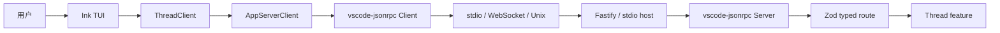
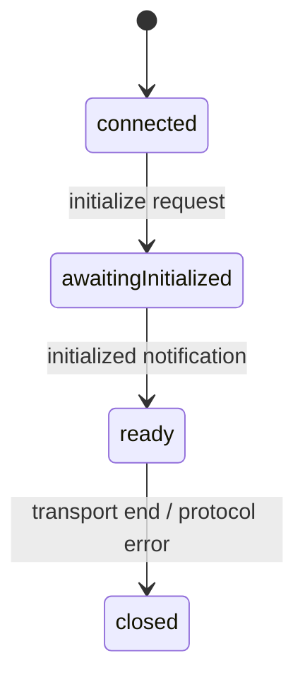

# ello-agent 的 Client/Server 架构

## 重构前的架构

ello 最初是一个同构的 TypeScript 应用。TUI 渲染、Agent 执行、工具调度、文件写入全部跑在同一个 Node.js 进程里。调用链路是直接的函数调用：用户输入 → Ink 组件事件 → Agent 模块 → 模型 API → 工具执行 → 回到 Ink 渲染。

同构架构在原型阶段有它的好处。不需要序列化、不需要 transport、不需要握手——所有状态都在内存里，调试时可以单步追踪整条链路。

但同时引入了三个随着功能增长越来越尖锐的问题。

## 同构架构的三个问题

**TUI 崩溃会丢失 Agent 状态。** Ink 是一个 React 渲染器。当组件抛出未捕获异常时，整个进程退出。在同构架构下，这也意味着正在运行的 Agent Turn、已执行但未持久化的工具调用、累积的 token 用量全部丢失。用户重新启动后看到的是空白界面，无法恢复刚才的对话。

**没有协议边界，TUI 和 Agent 的实现细节深度耦合。** TUI 可以直接读取 Agent 的内部状态——`agent.state.messages`、`agent.currentTurn.toolCalls`——而且确实这样做了。修改 Agent 的内部数据结构会导致 TUI 渲染层崩溃。反过来，TUI 的渲染卡顿会阻塞事件循环，推迟模型 token 的消费——模型 provider 侧的超时计时器不等人。

**无法独立测试 Agent。** 要验证 Agent 的工具审批流程是否正确，必须启动完整的 TUI 进程。没有 CLI 测试、没有 headless 测试、没有回归套件。每次改动 Agent 核心逻辑，最可靠的验证手段是人工在 TUI 中操作一遍。

三个问题的根因是同一个：Agent 没有被当作独立的服务来对待。

## 分离方案

我们将 ello 拆成两个 package：

- `@ello/agent`：App Server。持有 Thread 历史、模型调用、工具执行、权限引擎、存储。启动后监听 transport，等待 Client 连接。
- `@ello/tui`：终端 Client。通过 JSON-RPC 与 Server 通信。只做两件事：发送请求，把 Server 返回的 snapshot 和事件渲染到终端。

两个进程之间只有一条规则：TUI 不持有 Agent 状态，不构造 Thread 数据，不执行工具。所有状态变更发生在 Server 侧，TUI 是投影的消费者。



分离面向的是单 Client 模式。分离的价值在于：

- TUI 崩溃时，Server 进程继续运行。Thread 状态完整保留在 JSONL 文件中。TUI 重启后重新连接，Server 返回最新 snapshot，恢复对话。
- Agent 可以通过 headless 测试直接调用。不需要启动终端渲染器，不需要模拟用户输入。
- 模型 provider SDK 的升级、工具执行逻辑的修改、权限引擎的重构——只要 JSON-RPC 协议不破，TUI 和 Agent 可以独立发布。

## 四个关键设计决策

### 1. 本地也走进程边界

即使是本地开发，TUI 也通过 `StdioChildTransport` 启动子进程运行 `@ello/agent/server-entry`：

```ts
this.child = spawn(process.execPath, [
  options.entryPath,
  '--listen',
  'stdio://',
  ...(options.root === undefined ? [] : ['--root', options.root]),
]);
```

子进程 stdout 只走 JSON-RPC，日志和诊断写 stderr。`LocalChildStderrRouter` 过滤正常的 server 生命周期日志（`server.listening`、`server.closing`），但不吞掉异常。

不提供"嵌入模式"（把 Server 作为 npm 包 import 进 TUI 进程）。嵌入模式会重新引入同构架构的所有问题：共享内存、共享事件循环、TUI 崩溃影响 Agent。

三种 transport 共用同一套协议行为。严格 envelope parser 位于自定义 MessageReader；通用 request/response 关联由 `vscode-jsonrpc` 完成；产品 schema 与能力检查位于 `dispatchRoute()`。

| Transport | 消息边界          | 场景              | 限制                              |
| --------- | ----------------- | ----------------- | --------------------------------- |
| stdio     | 每行一条 JSON-RPC | 本地 TUI          | 单行上限 8 MiB；stdout 不得写日志 |
| WebSocket | 一帧一条消息      | 远程或常驻 Server | socket 关闭后终止消息队列         |
| Unix      | WebSocket framing | 本机常驻进程      | 复用 WebSocketTransport           |

### 2. 握手是强制步骤

`ServerConnection` 在 `vscode-jsonrpc` handler 外维护严格握手状态机：



`initialize` 先到，`initialized` 通知在后。顺序错误时 Server 直接关闭连接。在 `ready` 之前收到的任何普通 RPC 返回 `notInitialized`。

这个严格性来自于一个教训：如果允许未初始化的连接发送请求，Server 必须为每条请求检查"连接是否已完成能力声明"——检查散布在所有 method handler 中，容易遗漏。把检查收敛到状态机里，handler 只处理 `ready` 状态的连接。

握手阶段，Client 声明 `supportsServerRequests` 和 `supportsUserInput`。Server 据此决定是否向该连接发布审批请求或用户输入请求。一个 Headless Client 可以把两者都设为 false，Server 不会向它发送交互式请求。

### 3. response 先于 notification

普通 RPC 处理过程中，Server 可能在返回 result 之前就产生了 live notification 或 Server Request。如果 notification 先到达 Client，Client 可能把它当作增量更新，覆盖掉旧的 snapshot——而 result 中的完整 snapshot 随后才到，又把新数据覆盖回去。

`MessageStrategy` 在处理 Client Request 前建立 response barrier。Feature 通过 `RpcPeer` 产生的 notification 与 Server Request 先进入 `ProtocolMessageWriter` outbox；handler 返回后，`vscode-jsonrpc` 生成 response，Writer 先发送该 response，再按原顺序释放 outbox。

`thread/resume` 的到达顺序因此确定：完整 snapshot → pending Server Request → live 事件。Client 不会在 result 返回前收到片段更新。

每个连接最多排队 256 条、8 MiB UTF-8 JSON，并为 response 保留 32 条和 1 MiB。超过上限或背压超时后关闭连接。这个限制防止慢 Client 把 Server 内存变成无界队列。连接关闭时，所有等待中的 Server Request 都被 reject——Client 必须重新订阅以获取未完成的请求。

TUI Client 同样不再维护 request ID 或 pending response map。`MessageConnection.sendRequest()` 负责关联 response；`ThreadClient` 只保存待用户决策的审批和输入交互。Server Request handler 可以保持 Promise 未完成，直到用户显式选择结果。

### 4. RPC 能力声明独立于工具权限

`CLIENT_METHOD_CAPABILITIES` 为每个 Client method 声明操作级别（`read`、`submit`、`write`、`admin`）。它约束"该连接能不能调用此 RPC"。

工具权限引擎约束"模型能不能执行该工具"。两层的评估依据不同：前者看 connection 的 identity，后者看 session mode、规则匹配、路径 scope 和审批策略。

把两层合并会导致冲突。一个 `write` 级别的连接可能想限制模型的写权限，一个 `read` 级别的连接可能需要模型在沙箱里执行诊断工具。分开之后，连接权限和模型权限可以独立调整。

```ts
export const CLIENT_METHOD_CAPABILITIES = {
  'thread/read': 'read',
  'turn/start': 'submit',
  'thread/settings/update': 'write',
  'server/shutdown': 'admin',
} satisfies Record<ClientMethod, Capability | null>;
```

显式表比路径前缀推断更啰嗦。新增 RPC 时如果未声明 capability 会触发类型错误——把权限审查留在代码评审阶段，不在运行时才发现。

## 取舍

分离架构的代价是明确的。

**序列化开销。** 每次状态变更，Server 需要把 Thread snapshot 序列化为 JSON，Client 再反序列化。本地 stdio transport 下这个开销可以忽略（Node.js JSON 序列化在微秒级），但大型 Thread（数万条消息）的 snapshot 会达到数 MB，需要靠 compact 控制大小。

**进程管理复杂度。** TUI 需要管理 Server 子进程的生命周期：启动、健康检查、崩溃重启、优雅关闭。`StdioChildTransport` 承担了这些，但增加了出错面。Server 子进程退出时 TUI 需要展示有用的错误信息，而非 Node.js 的原始堆栈。

**调试门槛。** 同构架构下可以在一个调试器中单步追踪整条链路。分离后，问题可能出现在 Client transport、Server RPC、或 Agent 引擎，需要分开排查。

这些代价在原型阶段很难接受。在实际产品阶段，故障隔离和独立测试带来的收益超过了它们。
