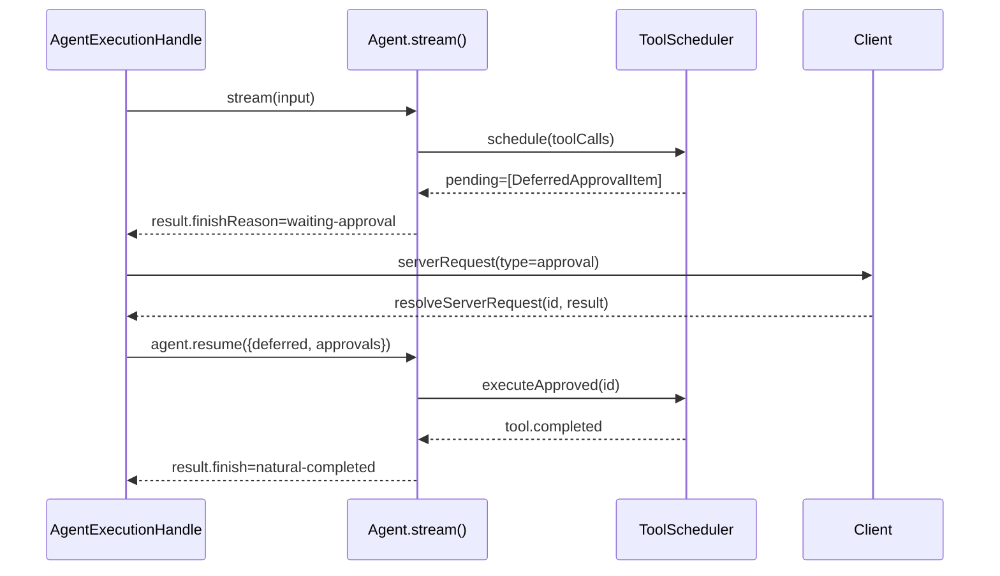

# 模型输入、工具循环与恢复

## buildModelInput 的五个步骤

每次回合调用 `buildModelInput(run)`，内部执行五个步骤：

1. **构建 system**：按 内核指令 → 环境指令 → 配置注入的 systemSections → 临时指令 拼接，空段落自动跳过。
2. **变换 messages**：以当前 RunSession 的消息历史为初值，先跑默认变换（窗口裁剪、token 预算、工具调用配对修复），再跑用户注册的自定义变换。
3. **构建 tools**：从 RunSession 取 `modelTools`（只含名称、描述、schema，不含 execute）。
4. **求值 providerOptions**：调用用户注册的函数，返回值传给 provider SDK。
5. **prepare 钩子**：把组装好的 input 交给用户注册的 `prepare` 函数做最终改写。prepare 之后重新计算 fingerprint。

```ts
const input = { system, messages, tools, providerOptions, diagnostics };
const prepared =
  (await run.config.modelInput?.prepare?.(input, run.ctx)) ?? input;
return { ...prepared, diagnostics: recompute(prepared) };
```

生产装配中，`composeAgent()` 在 `agent-turn-executor.ts` 里设置 systemSections：skill index、coding system prompt、goal 信息、工具路由说明。messageTransforms 固定为窗口裁剪（最近 200 条）和 token 预算裁剪（由 `config.context.max_input_tokens` 控制）。

recompute diagnostics 的原因：prepare 钩子可能改写 system 或 messages，改写后的 token 估算和 fingerprint 必须反映最终输入。如果 prepare 返回的 diagnostics 为 undefined，`buildModelInput` 直接抛错——不静默接受无诊断的输入。

## 模型看到的工具 vs 执行工具

`modelTools` 转为 AI SDK 的 `ToolSet`，只含 `description` 和 `inputSchema`：

```ts
result[agentTool.name] = tool({
  description: agentTool.description,
  inputSchema: agentTool.input,
});
```

`executionTools` 交给 `ToolScheduler`，包含 `execute` 函数、`execution` 模式（`immediate` 或 `deferred`）、`permission` 描述符。

分离瞄准的是安全边界。把 execute 留在 core，审批策略、事件记录、错误归一化都在可控范围内。若把 execute 交给 provider SDK 内部执行，框架无法在工具执行前插入审批判定、无法记录工具输出到事件流、无法终止正在执行的工具（OS 进程需要 `AbortSignal` 传递）。

`ToolScheduler` 的 `schedule()` 是核心路径。对每个 tool-call 依次：

1. 检查工具是否在 `callableToolNames` 集合中。不在 → 生成 `tool.failed` 和 error tool-result。
2. input 通过 Zod schema 校验。失败 → `tool.failed`。
3. 执行审批策略：`auto` → 直接执行；`required` → 挂起为 `DeferredApprovalItem`；`denied` → 生成 denied tool-result。
4. `immediate` 工具执行，`deferred` 工具生成 `DeferredToolCallItem`。

## deferred 工具只能单独出现

ToolScheduler 有一条约束：模型在一次 response 中如果请求了 deferred 工具，不能再请求其他工具。否则整批调用全部失败：

```ts
if (deferredCalls.length > 0 && calls.length !== 1) {
  const error = new Error(
    'Deferred tools must be the only tool call in a model response; no calls in this batch were executed.',
  );
  for (const call of calls) {
    // 全部标记为失败
  }
}
```

这个约束的原因：deferred 工具的执行不在模型当前 response 的同一个 run 中。它需要 Caller（TUI）接收 Server Request、回填结果，然后 resume 才真正执行。如果同批还有其他 immediate 工具，这些 immediate 工具的输出会进入当前 run 的 transcript，但 deferred 工具的结果要等到下一次 run。Provider 要求 tool-call/result 在同一个 context window 内配对，拆分会导致 provider 拒绝后续请求。

报错时拒绝整批调用，而非仅拒绝 deferred 调用。部分执行会导致模型认为某些工具成功而另一些失败，但实际 deferred 工具根本没有执行——模型会在下一回合收到不完整的 tool-result 集合。

## 审批产生第二个 Engine run

审批流程在 `agent-turn-executor.ts` 的 `AgentExecutionHandle.drive()` 中处理：



`drive()` 内部的 `while(true)` 循环处理多个 run 的串联：第一次 `stream()` 被审批挂起后，`result.pending` 非空，`resolveDeferred()` 等待 Client 批复。批复回来之后调用 `agent.resume()` 开始第二个 run。第二个 run 可能再次被审批挂起。

`prepareResume()` 在 resume 前补执行已批准的工具。它遍历 `resume.deferred`，对每个 `kind === 'approval'` 且 approved 的项调用 `toolScheduler.executeApproved()`。executeApproved 只执行单个工具，不跑完整的审批流程——用户已经批准了，不需要再次询问。

审批去重：`executeToolCalls` 中的 `onApprovalRequired` 回调会检查 deferred 队列是否已有同 id 的项：

```ts
const wasAlreadyPending = run.runControl.deferredQueue
  .snapshot()
  .some(
    (pending) =>
      pending.kind === 'approval' && pending.toolCallId === item.toolCallId,
  );
if (!wasAlreadyPending) {
  run.runControl.pushDeferred(item);
  await run.events.emit({ type: 'approval.required', item });
}
```

同一 tool-call 在多次 run 中可能重复触发审批——例如模型在 resume 后的第二个 run 中再次要求同样的工具。有些情况下这是正常的（用户选择了 `acceptForSession`，但下一回合模型又请求了同类工具），有些情况下是异常（同一个 tool-call id 被模型重复发出）。去重保证不会为同一个 id 创建两份 pending Server Request。

## 错误恢复不复制 assistant 消息

`AgentRunControl.createRecoveryMessages()` 在 resume 时重建消息序列。它检查 session 中已有的 tool-call id：如果历史中已存在该 tool-call，只补 tool-result；如果不存在，同时补 assistant tool-call 和 tool-result。

```ts
const existingIds = new Set(
  run.state.messages
    .filter((m) => m.role === 'assistant')
    .flatMap((m) => collectToolCallIds(m)),
);
```

Provider 对 tool-call/result 的配对要求严格。重复的 assistant tool-call 会导致 Anthropic 返回 `messages: tool call ids must be unique`，OpenAI 返回 400。只补 tool-result 避免了这种错误，同时保持 transcript 完整性。

## steer 不打断当前 provider 请求

TUI 在 active Turn 中调用 `turn/steer`。Engine stream 的 `steer()` 把消息推入 `steeringQueue`：

```ts
steer(message: AgentMessage): void {
  if (this.closed) return;
  this.onSteer(message);
}
```

`steeringQueue` 是 `'one-at-a-time'` 模式，每回合只抽一条。steer 在 `startTurn()` 时被抽取，不打断正在进行的 provider 请求。当前模型调用及已执行的工具会保留，steer 在下一回合建模时加入 system/messages 之后。

TUI 展示 pending steers 列表。用户看到 steer 尚未被处理时不会重复发送。

## 工具错误语义

| 状态                | 工具是否执行 | tool-result 内容           | 下一回合模型能做什么   |
| ------------------- | ------------ | -------------------------- | ---------------------- |
| `denied`            | 否           | `{ denied: true, reason }` | 看到拒绝原因，换方案   |
| `failed`            | 已尝试       | `{ error: message }`       | 读取错误信息，修正参数 |
| `approval required` | 否           | 不生成 tool-result         | 等待 resume            |
| `deferred`          | 否           | 不生成 tool-result         | 等待宿主回填           |

失败和拒绝不同：拒绝是权限系统的判定，工具没有运行；失败是工具运行后抛错。ToolScheduler 为两者生成相同的 `role: 'tool'` 消息结构，但 content 不同。模型通过 content 中的 `denied` / `error` 字段区分。

单个工具抛错不影响同一批其他工具。ToolScheduler 的 `schedule()` 对每个 call 使用独立的 try/catch，一个工具的失败记录为 `tool.failed`，其余照常。这种策略的前提是工具之间没有隐式依赖——如果有，依赖链在 agent 层面处理，不在 scheduler 层面。
