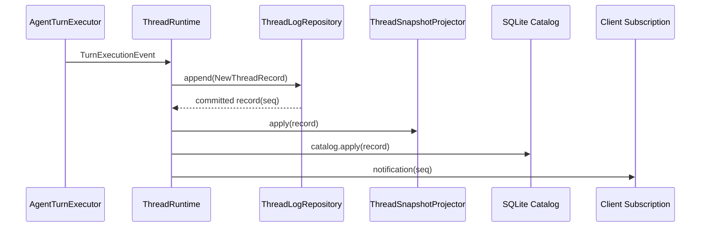

# Thread 运行时与事件日志

## ThreadManager 管什么

`ThreadManager` 是 Thread 创建、加载、恢复、fork、archive、delete 的唯一入口。每个操作都经过它，不存在绕过 ThreadManager 直接操作 JSONL 的路径。

进程内维护 `Map<string, ThreadEntry>` registry。每个 ThreadEntry 包含：ThreadRuntime 实例、订阅关系、hold 计数、unload timer。无订阅 Thread 默认 30 秒后卸载。以下任一条件阻止卸载：

- 正在执行 Turn（`activeTurn !== undefined`）。
- 有未解决的 Server Request（`pendingServerRequests.length > 0`）。
- 有调用方持有 runtime hold。
- 仍有连接订阅。

加载采用 `loading: Map<string, Promise<ThreadEntry>>` 合并并发请求。两个连接同时订阅同一 Thread 时，只创建一个 ThreadRuntime，第二个请求等待第一个的 Promise 返回同一个 entry。

```ts
const existing = this.loading.get(id);
if (existing !== undefined) return existing;

const loading = this.createEntry(id);
this.loading.set(id, loading);
try {
  const entry = await loading;
  return entry;
} finally {
  this.loading.delete(id);
}
```

`startTurn` 内部调用 `this.assertOpen()` 检查 ThreadRuntime 未被关闭。Thread 关闭后所有操作返回 `threadClosed` 错误，不留下半开半闭的状态。

## Lease 防止跨进程写

`ThreadLeaseStore` 使用 `open(path, 'wx')` 创建 lock file。`'wx'` 是 POSIX 的排他创建语义：文件已存在时直接失败，不存在时才创建。lock file 记录 pid 和创建时间：

```ts
const handle = await open(path, 'wx', 0o600);
await handle.writeFile(JSON.stringify({ pid: process.pid, createdAt }));
await handle.sync();
```

已有 lock 时，读取 lock file 中的 pid。如果 pid 仍存在（进程还在运行），返回 `threadBusy`——拒绝该 Server 写同一 Thread。如果 pid 不存在（进程已退出，lock file 是死锁），清理并重建。

`fsync` 保证 lock file 数据写入磁盘后再返回。不经过 `fsync` 的 lock file 可能在 crash 时丢失，两个 Server 会同时认为持有 lease。

Promise 队列只能防止单进程内并发写同一 Thread（由于 Node.js 事件循环的单线程特性，同一时刻只有一个 mutation 在执行）。Lease 负责跨进程所有权。两者不能互换。

## JSONL 作为事实源

每个 Thread 对应一份 append-only JSONL，位于 `~/.ello/threads/{threadId}.jsonl`。每条记录包含 `schema`、`threadId`、连续 `seq` 和 `createdAt`：

```json
{"schema":1,"seq":1,"threadId":"thr_x","kind":"thread.created","createdAt":"..."}
{"schema":1,"seq":2,"threadId":"thr_x","kind":"turn.started","createdAt":"...","turn":{...}}
{"schema":1,"seq":3,"threadId":"thr_x","kind":"item.started","createdAt":"...","turnId":"...","item":{...}}
```

`ThreadLogRepository` 为每个 Thread 建立独立 Promise 写队列。同一 Thread 严格串行——前一条 `writeFile` 的 Promise resolve 后，下一条才开始。不同 Thread 可以并行写入。

写操作完成后再调用 listener：

```ts
await handle.writeFile(`${JSON.stringify(fullRecord)}\n`, 'utf8');
if (requiresFlush(fullRecord)) await handle.sync();
writer.nextSeq += 1;
this.listeners.get(threadId)?.(fullRecord);
```

`requiresFlush` 在以下边界返回 true：`turn.completed`、`item.completed`、Server Request 创建/解决、`thread.status` 变更。高频 delta 不逐条 sync——流式输出的 item delta 可能在 1 秒内产生数十条记录，逐条 `fsync` 会成为磁盘瓶颈。

读取端的校验比普通 JSONL parser 更严格：

- 文件必须以换行结尾（最后一行必须完整）。
- 每行必须是合法 JSON。
- `schema` 必须是支持的版本。
- `threadId` 必须一致。
- `seq` 必须从 1 开始连续递增。

尾行不完整时返回 `storageCorrupt` 错误，不静默丢弃。连续 seq 是 Client 检测丢包的基础——如果 Client 看到 seq 从 5 跳到 8，它知道丢了 3 条记录，会触发 recovery。

## 一次事件的三层视图



`ThreadRuntime` 订阅 log writer 的 listener。记录落盘后（即 `writeFile` + 可能的 `sync` 完成后），`applyPersistedRecord()` 更新三个消费者：

1. `ThreadSnapshotProjector`：内存中的增量 snapshot。维护 `items` Map、`turns` 列表、`pendingServerRequests` 数组。每次 apply 后可以调 `current()` 获取完整快照。
2. SQLite catalog：用于列表、分页和结构化查询的投影。要求收到连续 seq——缺口直接抛错。`threads.initialize()` 在启动时从 JSONL 逐行重建 catalog。
3. `SubscriptionHub`：向所有订阅该 Thread 的连接发送 notification，携带 seq。

Client 看到的事件不会领先于磁盘事实。如果 `append` 成功但 `applyPersistedRecord` 抛错，listener 已经注册，但错误会让 mutation queue 中的 Promise reject，Thread 进入错误状态。

SQLite catalog 只是 JSONL 的投影，而非第二份事实源。删除 SQLite 文件后，`threads.initialize()` 能从 JSONL 完整重建。反过来，JSONL 损坏时 SQLite 无法恢复——catalog 的 seq 连续性检查会失败。

## mutationQueue 与 Turn 并发

`ThreadRuntime.enqueue()` 把 settings、goal、plan、Turn 生命周期和 Server Request resolution 的操作串行化。每次 mutation 被封装为一个工厂函数，放进 Promise 链：

```ts
private enqueue<T>(fn: () => Promise<T>): Promise<T> {
  const task = this.mutationQueue.then(fn, fn);
  this.mutationQueue = task.catch(() => undefined);
  return task;
}
```

失败不阻塞队列——`catch(() => undefined)` 保证后续 mutation 仍能执行。调用方会收到 reject 的 Promise，但队列本身继续推进。

一个 Thread 只允许一个 active Turn。重复 `turn/start` 返回 `threadBusy`。Steer 必须携带 `expectedTurnId`，避免用户向已结束或不同 Turn 注入消息。如果 `expectedTurnId` 与当前 active Turn 的 id 不匹配，steer 操作返回错误。

Agent 执行在 `driveTask` 中异步推进：

```ts
this.activeTurn = {
  id: turn.id,
  handle,
  driveTask: this.driveTurn(handle).finally(() => {
    this.activeTurn = undefined;
  }),
};
```

`driveTask` 不在 mutation queue 中——它在 `enqueue` 启动 Turn 之后独立运行。执行过程中的事件通过 `applyPersistedRecord` 进入 mutation queue，但执行本身是并发的。

## 内部记录也推进公开 seq

`transcript.entry`、`content.replacement`、`serverRequest.created` 的内容不广播给 Client。但这些记录的 seq 仍然是连续递增的。Server 对外发送 `thread/sequence/advanced` notification，携带最新的公开 seq。

如果内部记录不推进 seq，下一条公开事件的 seq 会出现跳跃。Client 会误判 transport 丢包并触发 recovery。把"内容是否公开"和"事件序列是否连续"分开：Client 可以验证完整顺序，同时不会收到内部 transcript 或 artifact 内容。

## Fork 不复制 JSONL 文件

Fork 创建新的 `thread.created` 记录，携带原 Thread 的 `rootId`、`forkedFromId` 和 `cwd`。选定的 Turn、Item 和 transcript 被重新 append 到新 Thread 的 JSONL 文件中，生成从 seq=1 开始的连续序列。Active goal 复制为 paused 状态，使用新的 goal id。

写入成本高于文件复制（每个 Item 都要重新写入），但换来几个保证：

- 新 Thread 不依赖旧文件的字节偏移。旧 Thread 可以独立 archive、compact、删除。
- 新 Thread 的 seq 从 1 开始，client 端逻辑无需知道 fork 关系。
- SQLite catalog 通过相同的 append listener 自动更新，不需要专门写 fork 后的重建逻辑。
- Fork 后的 Thread 可以立即执行 Turn，不需要等旧 Thread 的 compact 完成。
