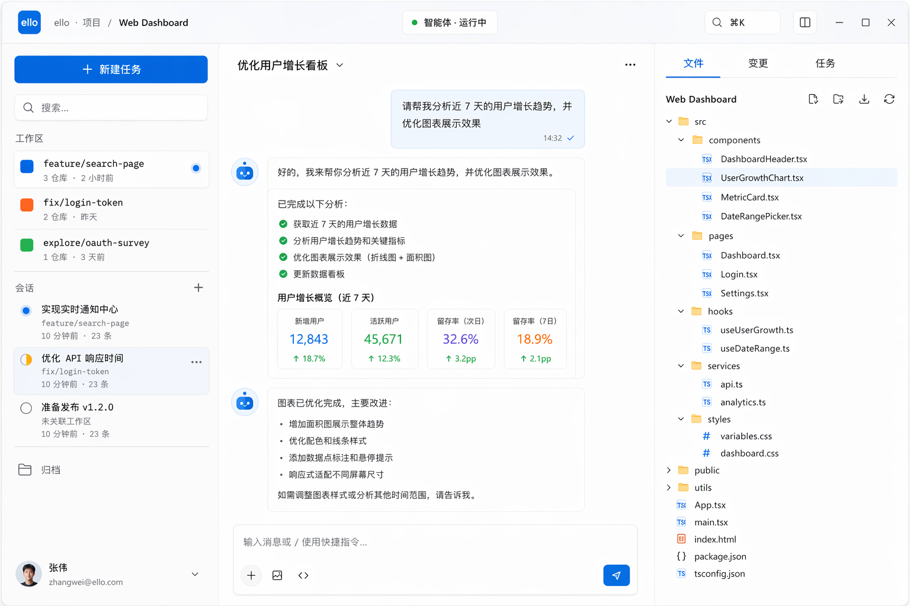
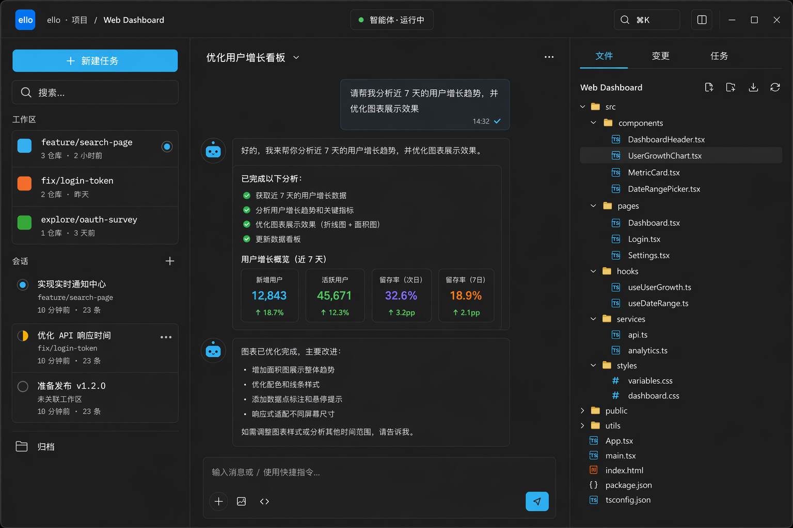

# App Shell — 应用骨架

> 承载一切的三栏框架:会话侧栏 / 主时间线 / 工作面板,外加 Acrylic 顶栏。布局参考 Tokenicode,材质与层级遵循 fluent-design.md。

## UI 构成

```
┌──────────────────────────────────────────────────────────┐
│  TopBar (Acrylic, 56px)                                  │
├──────────┬───────────────────────────────┬───────────────┤
│ Sidebar  │  Chat Timeline                │ Working Panel │
│ 280px    │  fluid (max-w 居中可读)        │ 320–480px     │
│ 可折叠    │                               │ 可拖宽/收起    │
└──────────┴───────────────────────────────┴───────────────┘
```

### TopBar(56px,Acrylic)

- 左:窗口控制区留位 72px→ 工作区名(面包屑:`工作区 / Thread 标题`)。
- 中:当前 Agent 状态徽标(模型名 + 会话模式 chip,如 `Opus 4.8 · ask-before-changes`),点击 chip 弹出模式切换。
- 右:命令面板入口(`Cmd+K` 图标 + 快捷键提示)、主题切换、设置、面板显隐切换按钮组(侧栏/右栏)。
- 材质:`backdrop-filter: blur(20px)` + `--acrylic-tint` + 1px `--highlight-stroke` 内描边;正文滚动时顶栏保持不透明可读(fluent-design.md §3:Acrylic 不放在长文本后方,顶栏下缘加分隔线)。

### 三栏

| 栏 | 宽度 | 行为 |
| --- | --- | --- |
| Sidebar | 默认 280px,折叠为 48px rail | 拖右缘 240–360px 调宽;折叠后只留图标 + tooltip |
| Timeline | 自适应 | 内容列 `max-w-3xl` 居中;宽屏模式可铺满(设置项) |
| Working Panel | 默认 360px,拖拽 320–480px | 拖窄于 260px 自动收起(借鉴 tura);页签:文件 / 变更 / 任务 |

栏间只用 1px `--border-subtle` 分隔,不用阴影分层(参考 open-webui 的 0.5px 克制分隔线)。

## 交互

- **拖拽调宽**:hover 栏缘显示 2px `--fluent-blue` 指示条,拖拽中以 150ms 跟随;松开后宽度写入 zustand persist。
- **折叠/展开**:`Cmd+B` 切侧栏,`Cmd+J` 切右栏;动画 `--duration-slow` + `--ease-fluent`,宽度与透明度同步,不平移内容(内容重排而非被推挤)。
- **空状态**:无 Thread 时 Timeline 显示品牌区(ello logo + "新建任务"主按钮 + 最近工作区快捷入口),参考 m1 首屏。
- **模式全局标识**:会话模式在四档间切换时,TopBar chip 颜色变化(plan 为紫色系以外的中性灰 + 图标,bypass 加警告边框),并在 Timeline 顶部插入一条系统消息记录切换。

## UX 决策与来源

1. **三栏而非两栏**:Tokenicode 验证了"会话 / 对话 / 文件"三栏对 coding agent 是信息密度与焦点的最佳平衡;ello 的审批与 diff 天然需要第三栏。
2. **右栏自动收起**(tura):窄屏下不让用户管理面板宽度,拖过阈值即收起,降低窗口管理负担。
3. **顶栏承载模式与状态**:模式是会话级最高频的"我在什么上下文"信号,必须全局常显,而不是藏在 composer 里。

## 窗口布局

- 顶栏保留窗口控制区并使用 Overlay title bar。
- 侧栏默认 280px,右栏默认 360px,均由桌面窗口拖拽调宽。
- 弹层使用 centered popover,保持单一桌面交互模型。

## 效果图




