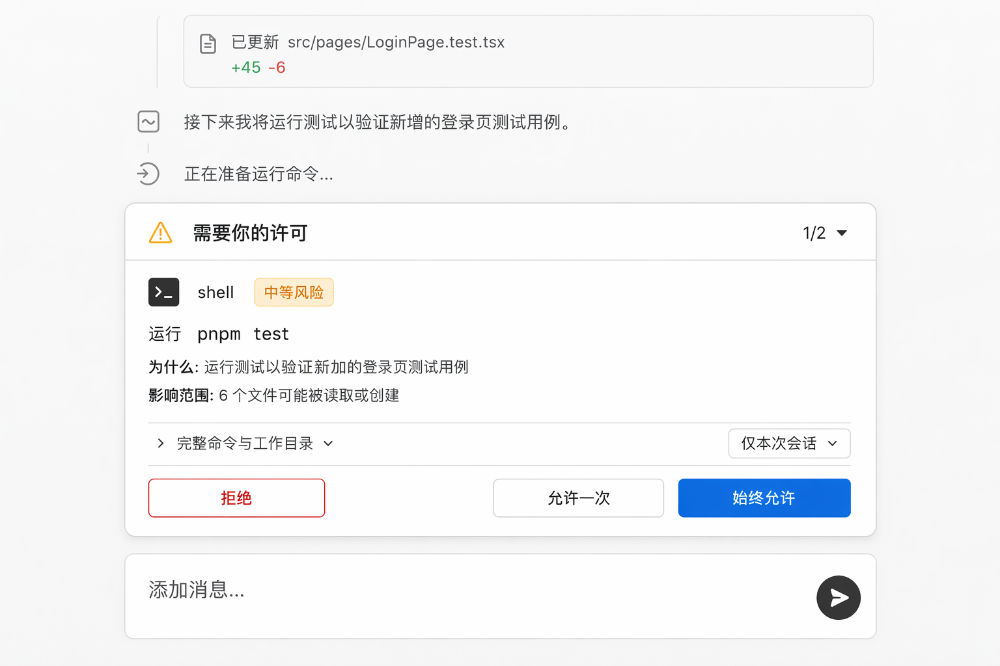
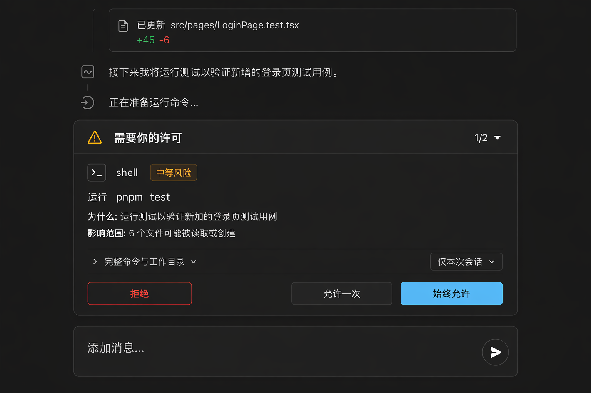

# Approval — 权限审批

> ello 权限模型的 UI 承载:审批四操作 `Allow once / Allow for this thread / Deny / Cancel`。交互哲学来自 tura(不弹窗、常驻队列),卡片结构参考 Tokenicode 与 m2 初版。

## UI 构成

### 审批队列(composer 上方常驻区)

```
┌────────────────────────────────────────────────────┐
│ ⚠ 需要你的许可                              1/2 ▾  │
│ ┌────────────────────────────────────────────────┐ │
│ │ 🖥 shell                              中等风险  │ │
│ │ 运行  pnpm test                         (mono) │ │
│ │ 为什么:运行测试以验证新加的登录页测试用例       │ │
│ │ 影响范围:6 个文件可能被读取或创建               │ │
│ │ 范围:[仅本次会话 ▾]                            │ │
│ │ [ 拒绝 ]        [ 允许一次 ]  [ 始终允许 ]      │ │
│ └────────────────────────────────────────────────┘ │
└────────────────────────────────────────────────────┘
```

- **位置**:固定在 composer 正上方,随消息流上推;不是模态,不遮罩时间线(tura 的核心决策:审批不打断心流,时间线仍可滚动查阅)。
- **队列**:多条待审批以 `1/2 ▾` 分页,或折叠为计数条(`3 项待审批 ▾`);默认展示第一条,处理完自动切下一条。
- **到达动效**:卡片从 composer 上方以 `--duration-base` 滑入 + 轻提示音(可关);侧栏对应会话亮 `warning` 点。

### 审批卡片分区

| 区 | 内容 |
| --- | --- |
| 头部 | 工具图标 + 工具名 + 风险徽标(低/中/高;危险命令 `danger` 色 + 图标,如 `rm -rf`、`sudo`) |
| 主体 | 操作一句话(`运行 pnpm test`,命令用 `font-mono`)+ Agent 给出的"为什么需要" + 影响范围(文件数/路径/域名) |
| 详情 | 默认折叠:`完整命令 / 工作目录 / 目标路径列表 ▾`,展开显示 mono 明细 |
| 范围选择 | 下拉:`仅本次调用 / 仅本次会话`(对应 Allow once / Allow for this thread) |
| 操作 | `[拒绝]`(danger 边框)+ `[允许一次]`(secondary)+ `[始终允许]`(primary fluent 蓝) |

按钮语义映射:允许一次 = `Allow once`;始终允许(会话)= `Allow for this thread`;拒绝 = `Deny`;`Esc` = `Cancel`(以取消状态结束,不视为拒绝)。

### 危险命令强化

危险命令(rm/sudo/curl|sh 等,Server 标记)卡片加 `border-card-border-accent` 换 `danger` 左边框 + 风险说明行,且"始终允许"降格为 secondary — 高危操作不允许一键长效放行。

## 交互

- **键盘**:`Tab` 在按钮间移动,`Enter` 确认;`Y` 允许一次 / `A` 始终允许 / `N` 拒绝 / `Esc` 取消。
- **处理反馈**:点击后卡片以 150ms 收起,时间线插入系统事件行(`✓ 已允许运行 pnpm test(仅本次)`),与 ello 事实源一致可回溯。
- **模式联动**:切换 `accept-edits` / `bypass` 后,对应类别的审批不再出现,顶栏模式 chip 即时反映。
- **超时与取消**:Agent 侧取消审批(如用户中途改任务)卡片变灰显示"已取消"后收起。

## UX 决策与来源

1. **队列而非模态**(tura):审批是高频交互(ask-before-changes 模式下每次写操作都是),模态会把用户锁进"点按钮机器";常驻区让用户可以先翻完时间线再决定。
2. **"为什么"与"影响范围"前置**(m2 初版已验证):审批的本质是信任决策,Agent 自述理由 + 影响面比命令原文更有决策价值,命令细节收进折叠区。
3. **三按钮而非二按钮**:ello 的四操作映射为三个可见按钮 + Esc;`Allow for this thread` 命名"始终允许(本次会话)"避免用户误以为永久授权 — 内存规则重启即失效,文案必须诚实。
4. **危险命令降权**:高危操作的长效放行按钮降格,用视觉成本换取一次停顿。

## 效果图




