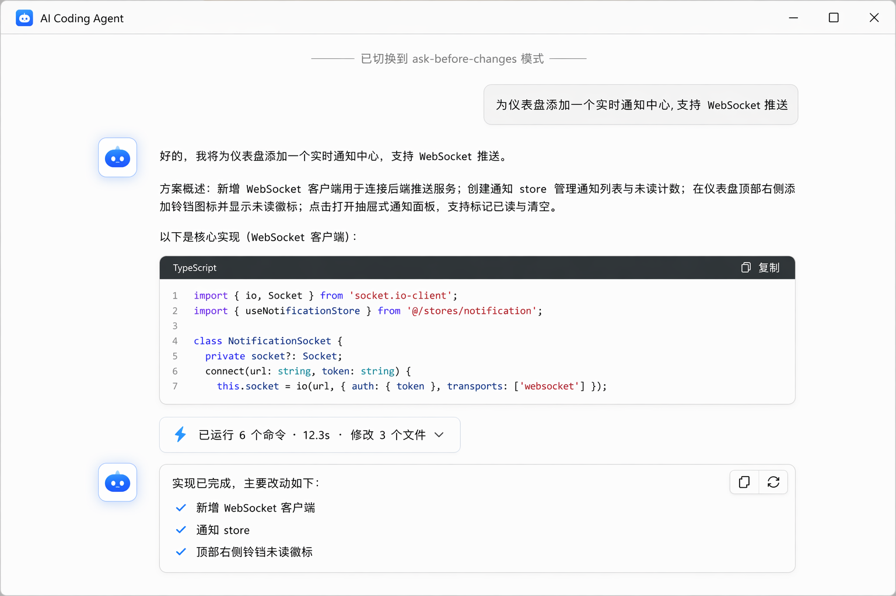
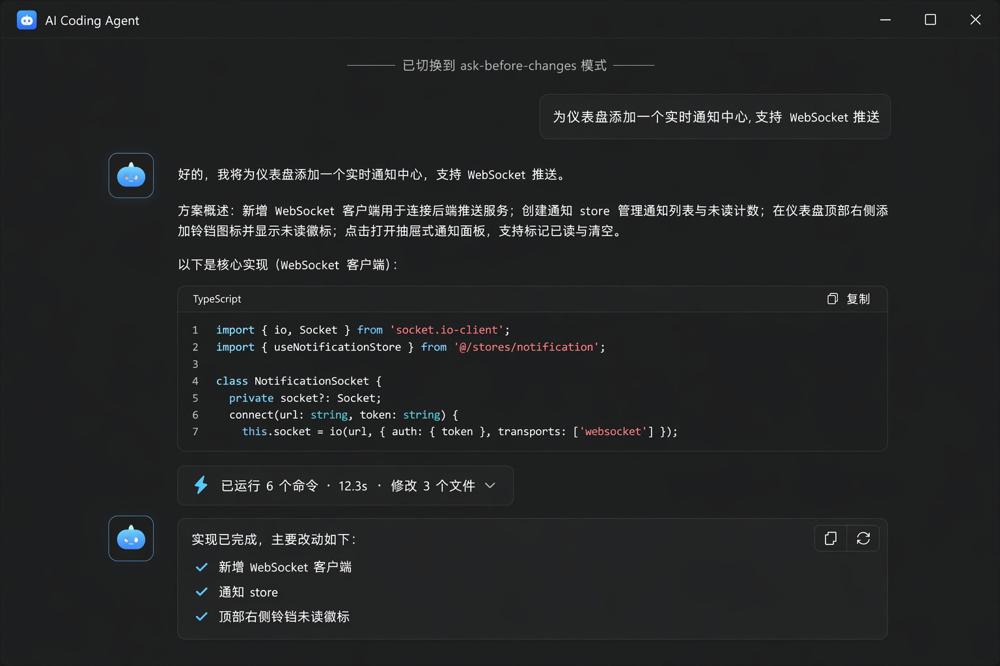

# Chat Timeline — 消息时间线

> Agent 执行过程的主舞台。不对称气泡借鉴 lobe-chat / open-webui,三阶段执行反馈借鉴 Tokenicode,操作条分级借鉴 lobe-chat。

## UI 构成

### 用户消息(有气泡,右置)

- `bg-surface-3` + `rounded-xl`(12px),最大宽 70%,右对齐,`px-4 py-3`。
- `body-m`/`text-primary`;双击进入行内编辑,编辑后从该消息重新生成后续回合。
- 附件以 chip 形式列在气泡上方(文件名 + 类型图标)。

### 助手消息(无气泡,平铺全宽)

- 左对齐占满内容列(`max-w-3xl`),无底色,接近文档阅读体验 — Agent 输出以长文与代码为主,气泡只会浪费宽度。
- 头像位放 ello 状态徽标(24px 圆角方块),执行中徽标有微光脉动。
- Markdown 全量渲染;代码块用 `bg-surface-2` + `font-mono` + 语法高亮,顶栏显示语言名 + copy(参考 open-webui 三段式代码卡)。
- 流式输出:文字以打字机追加,末尾显示 `▍` 光标;代码块在闭合前不抖动(预留行高)。

### 三阶段执行反馈(Tokenicode)

时间线内 Agent 的工作过程折叠为一条"执行卡"(详见 [tool-call](../tool-call/README.md)),卡上体现三阶段:

| 阶段 | 视觉 |
| --- | --- |
| 思考中 | 徽标脉动 + "思考中…" + 已耗时 |
| 写入中 | 蓝色进度指示 + 正在编辑的文件名 |
| 工具执行 | RunSummary 胶囊滚动更新(命令计数 + 耗时) |

### 消息操作条(hover 分级,lobe-chat)

- 默认隐藏,hover 消息时以 `--duration-fast` 淡入,位于消息右上角。
- 常驻 2 个高频:复制 / 重新生成;溢出菜单收:分支编辑、朗读、导出、删除。
- 出错消息操作条自动换成:重试 / 删除。
- 键盘:focus 消息时 `Alt+C` 复制、`Alt+R` 重新生成。

### 系统事件行

模式切换、审批结果、计划接受等域事件以 12px 居中灰字行插入时间线(`──── 已切换到 plan 模式 ────`),不占消息位。

## 交互

- **滚动**:新内容到达时若用户在底部则自动跟随;向上翻阅后出现"回到底部"悬浮按钮(带未读计数)。
- **回合分隔**:回合间 24px 间距 + 1px `--divider`;同回合内多条助手消息 12px 间距。
- **待审批锚点**:有待审批项时,时间线自动滚动到审批队列位置,且侧栏会话行亮 `warning` 点。
- **空状态**:新 Thread 显示引导卡(示例任务 ×3 + 模式说明一行)。

## UX 决策与来源

1. **不对称消息流**(lobe-chat / open-webui 共同验证):用户气泡给方向感,助手平铺给长文可读性,是 Agent 长输出场景的最优解。
2. **安静默认**:操作条、时间戳、模型名全部 hover 才出现(lobe-chat);时间线 95% 的时间是阅读态。
3. **执行过程折叠成卡**(tura + Tokenicode):时间线只放结论,工具细节收进 Inspector — 防止时间线被命令输出刷屏,这是 coding agent UI 与普通聊天 UI 的本质区别。
4. **域事件进时间线**:模式切换、审批决定是会话的"事实",留在时间线里可回溯,与 ello 的 JSONL 事实源(storage)语义一致。

## 效果图

