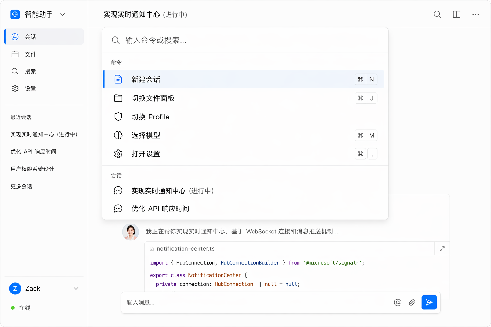
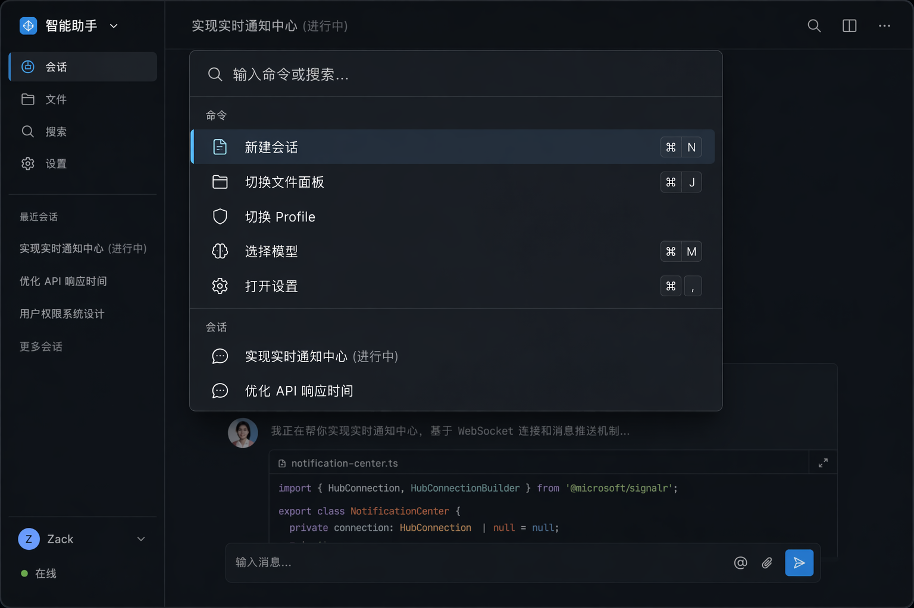

# Command Palette — 命令面板

> `Cmd+K` 全局命令入口。Acrylic 材质遵循 fluent-design.md §3,命令分组与快捷键标注参考 Tokenicode 与 m3 初版。

## UI 构成

```
        ┌─────────────────────────────────┐
        │ 🔍 输入命令或搜索…               │  ← 输入行(44px)
        ├─────────────────────────────────┤
        │ 命令                             │  ← 分组标题 f-sm/tertiary
        │  📋 新建会话                ⌘ N  │
        │  🗂 切换文件面板              ⌘ J  │
        │  🛡 切换 Profile                 │
        │  🧠 选择模型                ⌘ M  │
        │  ⚙ 打开设置                 ⌘ ,  │
        │ ─────────────────────────────── │
        │ 会话                             │
        │  💬 实现实时通知中心     (进行中) │
        │  💬 优化 API 响应时间             │
        └─────────────────────────────────┘
```

- **定位**:视口水平居中,距顶 18%,宽 560px。
- **材质**:Acrylic — `backdrop-filter: blur(20px)` + `--acrylic-tint` + `--highlight-stroke` 1px 内描边 + `shadow-3`(fluent-design.md §5/§8);背后 scrim `bg-overlay`(≤52%)。
- **圆角** `rounded-xl`(12px);列表最大高 400px,超出滚动。

### 条目行(36px)

图标(16px)+ 名称 `body-m` + 右侧快捷键(`font-mono` f-sm/tertiary,kbd 样式);选中行 `fluent-subtle` 底 + 左侧 2px rail。

### 分组与来源

| 分组 | 内容 |
| --- | --- |
| 命令 | 应用命令(新建会话、切面板、切模式、打开设置…),带快捷键 |
| 会话 | 最近 Thread(模糊匹配标题),右标状态 |
| 文件 | 工作区文件名(输入触发,默认不列出防噪音) |
| 技能/命令 | ello 的项目命令与 skills(Tokenicode:内置/项目/技能三分) |

## 交互

- **唤起**:`Cmd+K`(全局,任何焦点态);`Esc` 或点击 scrim 关闭;开关动画 `--duration-base`,面板 scale 0.98→1 + fade(fluent-design.md §7)。
- **搜索**:跨分组模糊匹配,匹配字符加粗;空结果显示"无匹配命令"+ 建议(创建新会话并发送该文本)。
- **键盘**:`↑/↓` 移动(`Cmd+↑/↓` 跨分组跳),`Enter` 执行,`Tab` 在分组间循环;鼠标 hover 与键盘选中态互相同步。
- **命令执行反馈**:执行后面板即关;有后续 UI 的命令(如"选择模型")直接在面板内进入二级列表,不弹新层 — 面板支持栈式 drill,`Backspace`(空输入时)返回上级。
- **最近使用**:空输入时默认展示"最近使用"5 条 + 高频命令,替代静态全列表。

## UX 决策与来源

1. **栈式 drill 而非连环弹窗**:选择模型、切换 Profile 这类二级选择在面板内完成(m3 显示的就是这种形态),层数永远是一,符合"不弹窗原则"。
2. **Acrylic 只给浮层**:面板是 fluent-design.md 允许的 Acrylic 场景(短暂、不下衬长文);正文卡片一律不透明,面板与正文材质对比本身就是层级信号。
3. **会话与文件同面板**(Tokenicode):`Cmd+K` 是"我想去某处/做某事"的统一入口,会话、文件、命令共用模糊匹配,减少记忆多个快捷键的负担。
4. **快捷键常显**:每个可键控命令右标快捷键,面板同时是快捷键的学习界面。

## 效果图




