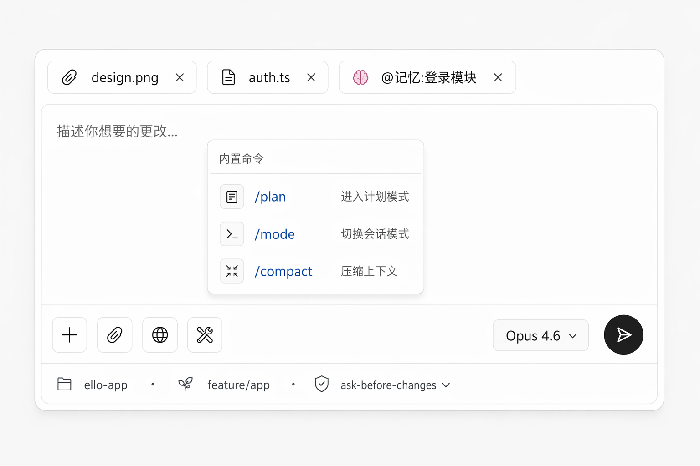
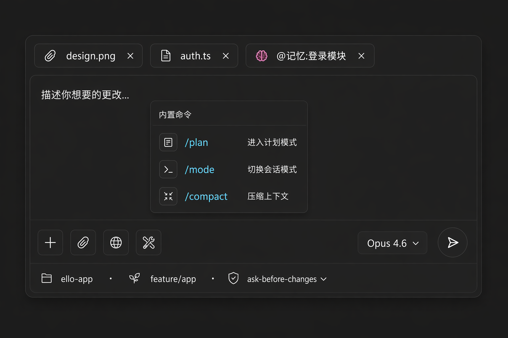

# Composer — 输入区

> 用户与 Agent 的主输入口。四层结构借鉴 lobe-chat,发送键的黑白反转与停止态参考 open-webui,模式控制对应 ello 会话模式。

## UI 构成(四层,自上而下)

```
┌──────────────────────────────────────────────────┐
│ 📎 design.png   📄 auth.ts   🧠 @记忆:登录模块   │  ← ① 附件/上下文条
│ ┌──────────────────────────────────────────────┐ │
│ │ 描述你想要的更改…                            │ │  ← ② 编辑器(自适应高)
│ │                                              │ │
│ └──────────────────────────────────────────────┘ │
│ [+] [📎] [🌐] [🛠] ············· [Opus 4.8 ▾] [➤]│  ← ③ ActionBar + 发送
│ 📁 ello-app · 🌿 feature/app · 🛡 ask-before… ▾  │  ← ④ ControlBar
└──────────────────────────────────────────────────┘
```

- **容器**:单卡片,`bg-surface-1` + `border-default` + `rounded-xl`(12px)+ focus 时 `border-card-border-accent`;最小高 72px(`input-h`)。
- **① 附件/上下文条**:拖入或添加的文件、目录、`@` 引用的记忆/技能,以 chip 横排,超出折叠 `+2`;chip 带类型图标与移除 `✕`。
- **② 编辑器**:自适应高(1–10 行),placeholder `描述你想要的更改…`;`Enter` 发送 / `Shift+Enter` 换行(可在设置互换);支持 `/` 斜杠命令与 `@` 引用的自动完成浮层。
- **③ ActionBar**:左侧功能按钮组(附件、联网、工具集,图标按钮 28px,可折叠进 `+` 菜单);右侧模型选择器(文字按钮)+ 发送键。
- **④ ControlBar**(f-sm/tertiary,28px):工作目录、git 分支、会话模式切换器 — 环境信息常显,模式切换是最高频控制。

### 发送键

- 形态:36px 圆形,黑白反转(open-webui):亮色主题 `bg-#1A1A1A` 白箭头,暗色反转;不用品牌蓝 — 发送是中性动作,蓝色留给"进行中"状态。
- 生成中同位变 **停止键**(方块图标,`danger` hover);状态切换 150ms 交叉淡入。
- 无输入时置灰 `text-disabled`;hover 显示快捷键 tooltip(`Cmd+Enter`)。
- 发送键右侧下拉(长尾):发送选项 — `发送 / 发送并排入队列(Agent 忙时)/ 存为草稿`。

### 斜杠命令 / @ 引用浮层

- 输入 `/` 或 `@` 触发,浮层贴编辑器上缘弹出(Acrylic + `shadow-2`),分组列出:内置命令 / 项目命令 / 技能(Tokenicode 方案);`@` 列出:文件 / 记忆 / 技能 / 任务。
- `↑/↓` 选择,`Tab` 补全,`Esc` 关闭;每项右侧显示说明一行。

### 模式切换器(ControlBar)

- 显示当前模式 `🛡 ask-before-changes ▾`,点击弹出四档菜单(带每档一行行为说明);`Shift+Tab` 循环切换(与 ello TUI 一致)。
- `bypass` 项带警告图标,选中需二次确认(唯一允许确认弹窗的场景 — 低频且影响面大)。
- `plan` 选中后 composer 顶部出现 [plan-mode](plan-mode.md) 模式条。

## 交互

- **粘贴**:大段文本(>20 行)自动转为附件 chip(`粘贴的文本.txt`),保持编辑器干净;图片粘贴直接入附件条。
- **草稿**:每 Thread 独立草稿,切换会话自动保存/恢复。
- **队列**:Agent 运行中发送,消息进入队列,composer 上方显示 `已排队 1 条 ▾`,可编辑/撤回。
- **禁用态**:连接断开时编辑器禁用,placeholder 显示 `连接已断开,正在重连…`,发送键置灰。
- **键盘**:`Cmd+Enter` 发送,`Shift+Tab` 切模式,`Esc` 清空(有输入时,二次 `Esc` 才清)。

## UX 决策与来源

1. **四层分离**(lobe-chat):附件、文本、功能、环境各居其位 — 把"说什么 / 带什么 / 用什么干 / 在哪干"四类信息物理分开,认知零混淆。
2. **黑白反转发送键**(open-webui):发送是全局最高频按钮,用明度对比而非彩色,暗色下天然成立,品牌色零滥用。
3. **模式放在 ControlBar 常显**:ello 的模式决定 Agent 行为边界,必须"所见即所得";藏进设置会让审批行为显得不可预测。
4. **大粘贴自动转附件**(lobe-chat):长日志/报错是 coding agent 的高频输入,转 chip 后编辑器保持可读,且附件可复用。

## 效果图




