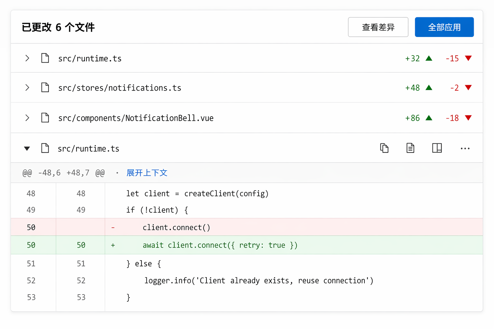
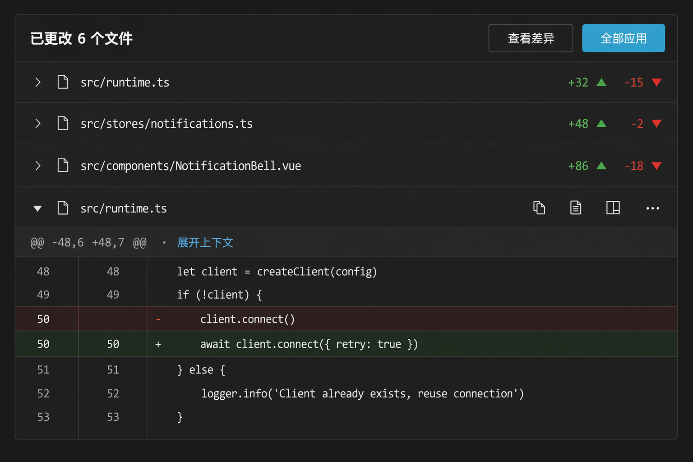

# Diff Viewer — 变更与 Diff 视图

> 右栏"变更"页签 + 工具调用展开态共用的 diff 渲染。半透明色块方案来自 tura,统计头与批量操作参考 m1 初版。

## UI 构成

### 变更列表模式(右栏页签)

```
┌─ 文件 │ 变更 6 │ 任务 ──────────── ✕ ─┐
│ 已更改 6 个文件        [查看差异][全部应用]│  ← 汇总头(m1)
│ ┌──────────────────────────────────┐ │
│ │ src/runtime.ts            +32 -15│ │
│ │ src/stores/notifications.ts +48 -2│ │
│ │ src/components/Notif…vue  +86 -18│ │
│ │ …                                │ │
│ └──────────────────────────────────┘ │
│ ▼ src/runtime.ts                     │
│  48  const client = new WS(url)      │
│  49 -  client.connect()              │
│  49 +  await client.connect({ retry })│
│  ...                                 │
└──────────────────────────────────────┘
```

- **汇总头**:`已更改 N 个文件` + 主操作 `全部应用` / 次操作 `查看差异`(m1 初版);当 Agent 模式为自动时头部不显示应用按钮(变更已生效,只是展示)。
- **文件行**:相对路径(mono f-sm)+ `+N -N` 统计(绿/红,配合 ▲▼ 小图标双编码);点击展开该文件 diff。
- **虚拟滚动**:大 diff(>500 行)按 hunk 懒渲染。

### Diff 渲染(tura 方案)

- **行内(unified)默认**:删除行 `rgba(255,0,0,.08)` 半透明红块,新增行 `rgba(67,146,91,.12)` 半透明绿块,左侧双列行号(旧/新),`font-mono` f-sm。
- hunk 分隔:`@@ -48,6 +48,7 @@` 灰条 + "展开上下文" 链接(默认折叠未变更区域,保留 3 行上下文)。
- **并排(side-by-side)切换**:宽面板(≥440px)可用,头部视图切换图标。
- 词级高亮:行内变更的精确词再加深一档色块。

### 单文件头部

`文件路径(mono)+ 状态徽标(新增/修改/删除/重命名)+ 操作:hover 浮现 复制路径 / 还原此文件 / 在外部打开`。

## 交互

- **全部应用 / 查看差异**(m1):审批语境下,变更先以预览形态存在,`全部应用` 一次性确认;非审批语境(accept-edits/bypass)diff 是只读回顾,操作区显示 `已应用` 状态。
- **文件级还原**:hover 文件行的 `还原` 将该文件回滚到回合前状态(经 ello 协议发起,非本地操作);还原是低频不可逆操作,走确认 popover(非模态)。
- **键盘**:`j/k` 在 hunk 间移动,`Enter` 展开上下文,`v` 切行内/并排。
- **跳转**:点击时间线工具卡中的编辑步骤 → diff 定位到对应文件与 hunk,目标行 1s 高亮脉冲。
- **复制**:hunk hover 出现"复制新增内容"。

## UX 决策与来源

1. **半透明色块而非实色**(tura):实色 diff 块在浅色主题下刺眼、暗色下脏;8–12% 透明度叠加在 surface 上,亮暗主题共用同一组 token。
2. **双编码统计**(m1):`+N -N` 颜色 + ▲▼ 图标,红绿色盲可读,遵循 fluent-design.md"语义色不单独依赖颜色"。
3. **折叠未变更区**:diff 的信噪比原则与工具调用一致 — 默认只给 3 行上下文,要更多就显式展开;评审大改动时先扫统计再定点展开。
4. **变更即事实**:所有变更展示来自 ello 的变更事件流,而非前端自行 diff — 与"时间线是事实记录"的架构一致,不会出现 UI 与磁盘状态分歧。

## 效果图




