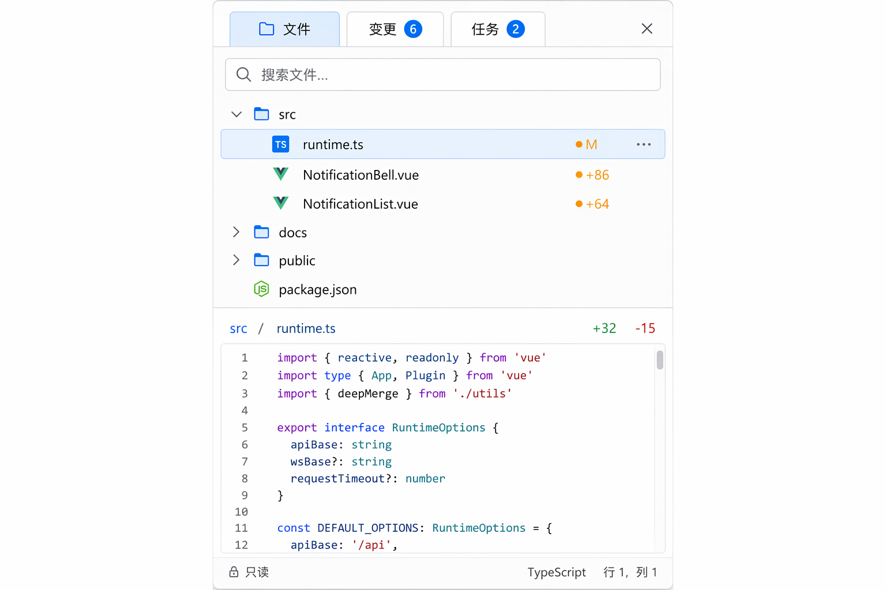
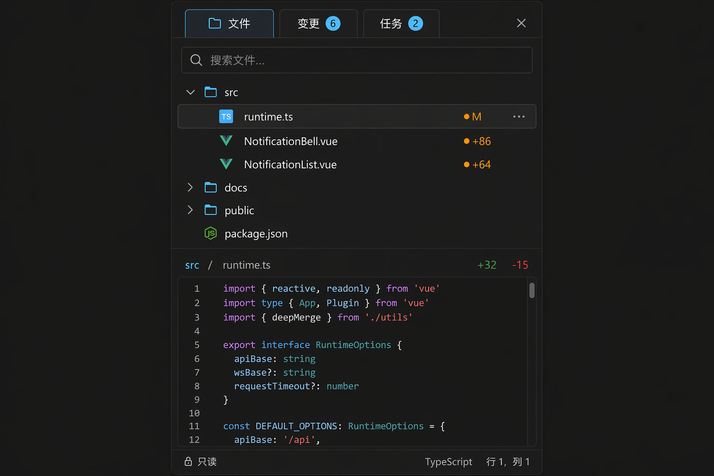

# File Explorer — 文件面板

> 右侧 Working Panel 的"文件"页签:工作区文件树 + 变更标记。组织方式借鉴 lobe-chat WorkingSidebar,文件图标与变更标记参考 Tokenicode。

## UI 构成

```
┌─ 文件 │ 变更 │ 任务 ──────────────── ✕ ─┐  ← 页签栏(36px)
│ 🔍 搜索文件…                       □▸ │  ← 搜索 + 在外部编辑器打开
│ ▾ 📁 src                             │
│   ▾ 📁 components                    │
│     📄 NotificationBell.vue    ●+86  │  ← 变更标记
│     📄 NotificationList.vue    ●+64  │
│   📄 runtime.ts               ●M     │
│ ▸ 📁 docs                            │
│ ▸ 📁 public                          │
│ 📄 package.json                      │
└──────────────────────────────────────┘
```

### 页签栏(36px)

- 页签:`文件 / 变更(N)/ 任务(N)`,f-sm,6px 圆角 chip 样式(lobe-chat WorkingSidebar);`变更`与`任务`带计数徽标。
- 右端:折叠面板按钮。

### 文件树

- 行高 28px;目录 chevron + 文件夹图标,文件用类型 SVG 图标(Tokenicode 的 20+ 类型配色方案:TS 蓝 / Vue 绿 / JSON 黄 / MD 灰…)。
- **变更标记**:被 Agent 改动的文件显示状态点 + 统计 — `●+86`(新增行)/ `●M`(修改)/ `●D`(删除),`warning` 色系小字;标记数据来自 ello 的变更事件,实时刷新。
- 未变更文件不显示任何标记 — 树默认安静。
- 虚拟滚动:大仓库(>2000 文件)只渲染可视区。

### 行交互

- 单击:预览 — 右栏切换为文件预览(只读,语法高亮,顶部路径面包屑 + `+N/-N` 统计)。
- 双击:在系统默认编辑器打开(Tokenicode:VS Code);`Cmd+O`。
- 右键/hover `⋯`:在 diff 中查看 / 复制相对路径 / 在 Finder 显示 / 添加到上下文(作为 composer `@` 引用)。
- Agent 正在写入的文件:行尾显示写入动画(三点呼吸),写入完成变变更标记。

### 搜索

- 文件名模糊匹配,结果显示相对路径上下文(Tokenicode),`Enter` 预览;`Esc` 清除回树。

## 交互

- **页签切换**:`Cmd+1/2/3` 对应 文件/变更/任务;变更页签即 [diff-viewer](../diff-viewer/README.md) 的文件列表模式。
- **与工具调用联动**:点击 Inspector 中某编辑步骤,树自动定位并预览该文件的对应 diff。
- **折叠状态持久化**:目录展开状态按工作区记忆。

## UX 决策与来源

1. **树与变更合一**:文件树叠加变更标记(Tokenicode),"哪些文件被动了"无需切换到独立视图;变更页签再提供按变更组织的第二视角。
2. **单击预览 / 双击外开**:应用内预览服务"快速确认",重型编辑交给系统编辑器 — ello-app 不做全功能编辑器,边界清晰。
3. **默认安静**:未变更文件零装饰,变更才发光;信息以事件驱动出现,不是常驻噪音。
4. **页签而非多面板**(lobe-chat WorkingSidebar):文件/变更/任务共享一栏,避免右栏再分栏的拥挤;计数徽标让"有变更/有任务"免切换可见。

## 效果图




