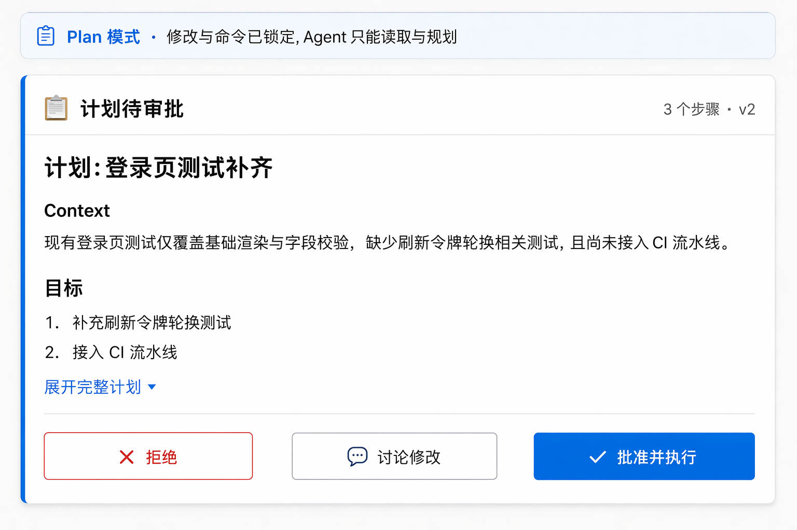
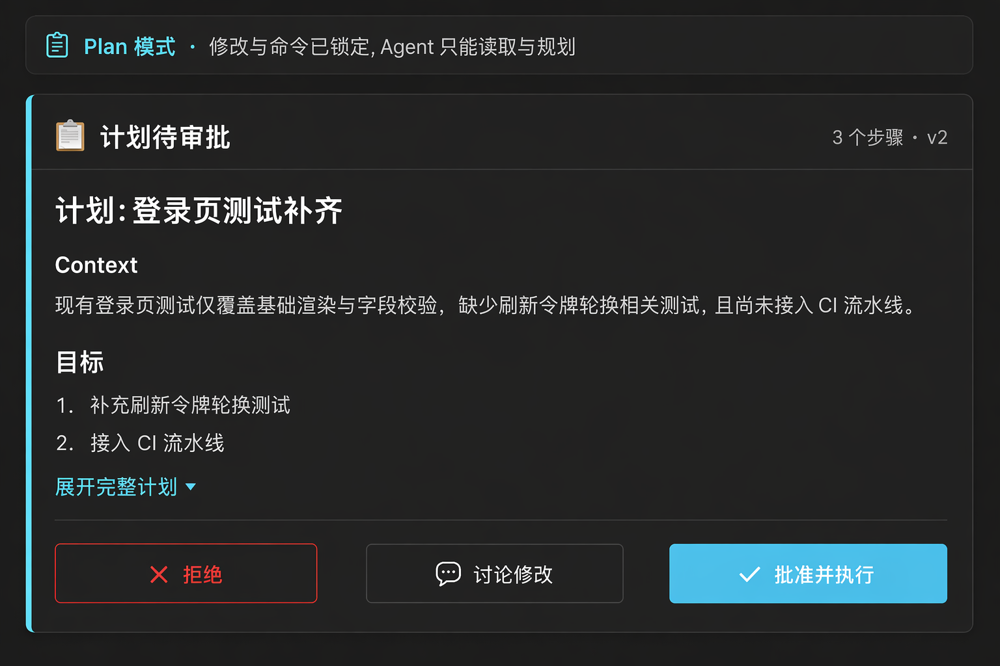

# Plan Mode — 计划模式与计划审批

> ello Plan 模式的 UI:Agent 受限调查 → 写出 Plan artifact → 用户 `Accept / Chat about this / Deny`。卡片结构参考 m1 初版与 Tokenicode 的 plan 审批卡。

## UI 构成

### 模式标识

- 顶栏模式 chip 显示 `plan`(图标 📋 + 紫灰中性色,不用品牌蓝 — plan 是"受限"而非"进行中")。
- composer 上方常驻一行模式条:`Plan 模式 · 修改与命令已锁定,Agent 只能读取与规划`,右侧"退出 Plan"链接。
- 输入 placeholder 变为:`描述需要调查与规划的任务…`。

### 计划审批卡(时间线内,全宽)

```
┌────────────────────────────────────────────────────┐
│ 📋 计划待审批                        3 个步骤 · v2 │
│ ──────────────────────────────────────────────────│
│ ## 计划:登录页测试补齐                             │
│                                                    │
│ **Context**                                        │
│ W09 登录页已有测试骨架,缺刷新令牌用例…             │
│                                                    │
│ **目标**                                           │
│ 1. 补充刷新令牌轮换测试                            │
│ 2. 接入 CI 流水线                                  │
│                                                    │
│ [展开完整计划 ▾]                    (Markdown 渲染) │
│ ──────────────────────────────────────────────────│
│ [✕ 拒绝]  [💬 讨论修改]            [✓ 批准并执行]  │
└────────────────────────────────────────────────────┘
```

- **卡片位置**:作为时间线内的一条特殊消息(全宽、`card-bg` + `card-border-accent` + `shadow-card`),同时镜像到审批队列区 — 时间线里可回溯,队列里可操作。
- **内容**:Plan artifact 的 Markdown 渲染,默认折叠到前 ~12 行,"展开完整计划"全量展示;版本号 `v2` 表示经讨论迭代过。
- **三操作**(与 ello 协议一一对应):
  - `批准并执行`(primary)→ 校验计划并切换 `ask-before-changes`,继续当前 turn;
  - `讨论修改`(secondary)→ 聚焦 composer,预填 `@plan `,用户意见作为新消息提交,Agent 更新计划后再次发起审批(版本 +1);
  - `拒绝`(danger 边框)→ 计划标记 rejected,Thread 留在 Plan 模式。

### 步骤摘要

卡片头部显示步骤数;展开后每个步骤可勾选(勾选仅作个人阅读进度,不回写 artifact — 计划是整体审批,不做部分批准)。

## 交互

- **进入 Plan**:composer 模式切换器 / `Cmd+Shift+P` / 顶栏 chip 菜单;进入时时间线插入系统事件行。
- **计划就绪**:Agent 调用 `request_plan_exit` 后卡片滑入,侧栏亮 warning 点,应用徽标 +1(不在前台时发系统通知)。
- **批准反馈**:卡片变成功态(`✓ 已批准,进入执行`)1.5s 后折叠为一行摘要留在时间线;模式 chip 切到 `ask-before-changes`。
- **讨论循环**:每次讨论生成新版本,卡片头版本号递增,可展开"版本历史"查看 diff(计划文件的 diff,复用 diff-viewer)。
- **拒绝**:卡片变灰标 `已拒绝`,保留在时间线作为事实记录。

## UX 决策与来源

1. **计划即文档**:计划审批卡直接渲染 artifact Markdown(m1 初版),而不是把计划拆成 UI 表单 — 计划的结构由 Agent 按任务组织,UI 不做二次抽象,审查体验接近读 PR description。
2. **三操作平铺**:Accept / Chat about this / Deny 与协议一一对应,不做合并或隐藏;"讨论修改"放中间位(次高频),拒绝用最左侧(danger 远离主操作,防误点)。
3. **版本可见**:计划是迭代产物,版本号与历史 diff 让"Agent 有没有听懂我的意见"可验证,建立信任。
4. **批准后留痕**:卡片折叠为摘要行而非消失 — 计划是会话的关键事实,回溯时需要看到"当时批准了什么"。

## 效果图




