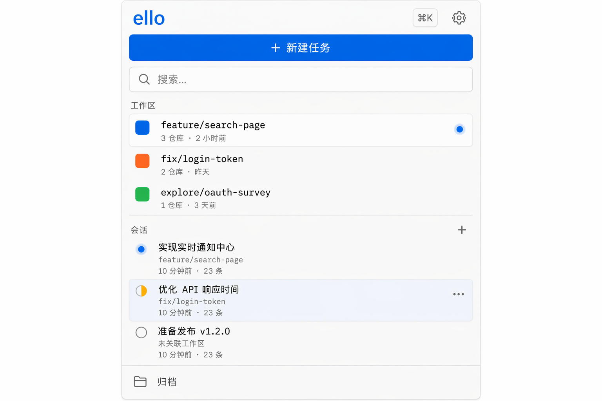
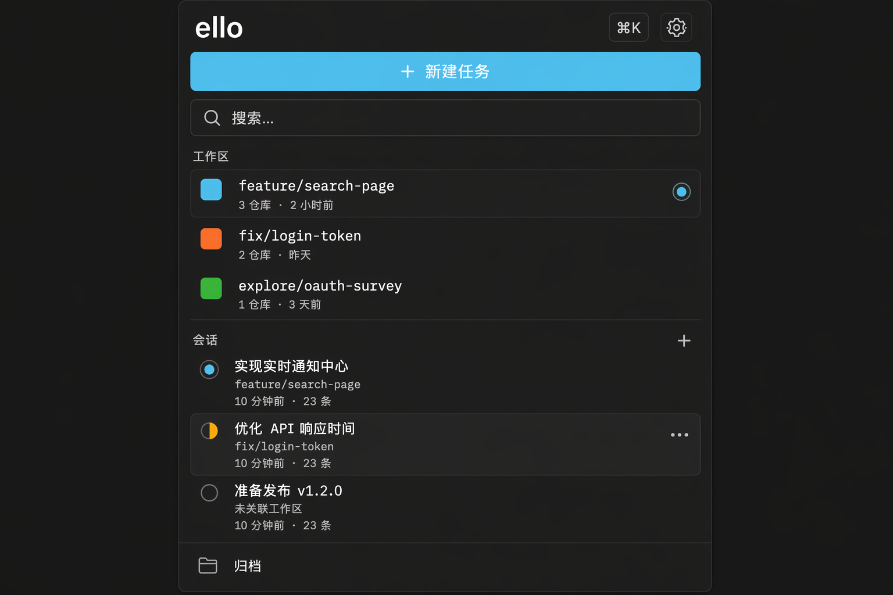

# Session Sidebar — 侧栏(工作区 / 会话双区)

> 侧栏拆为**工作区(Workspaces)**与**会话(Chats)**两个独立区块,均按最近活动时间倒序。信息模型对齐 ello 的 Workspace 域:`<kind>/<name>` 任务目录、四种类型、活动/归档生命周期。

## 为什么拆两区

ello 的 Workspace 不是会话的分组标签,而是一等实体:它持有 `repos/` 开发 checkout、`references/` 参考仓库、`docs/` 任务文档,有独立生命周期(活动 → 归档)。会话(Thread)是运行在某个 Workspace 上下文里的对话。两者的时间线不同——工作区按"任务最近活跃"排序,会话按"对话最近活跃"排序——合并进一个列表会互相干扰排序语义。拆开后:

- **工作区**回答:"我有哪些任务,哪个最近在动?"
- **会话**回答:"我最近在跟 Agent 聊什么,哪个在跑/等我批?"

## UI 构成

```
┌────────────────────────┐
│ ello            ⌘K  ⚙  │  ← 品牌 + 全局入口(36px)
│ [+ 新建任务]           │  ← Primary:创建 Workspace
│ 🔍 搜索…               │  ← 跨区搜索(32px)
│ ────────────────────── │
│ 工作区              ▾  │  ← 区块标题 f-sm/tertiary,可折叠
│ 🟦 feature/search-page │  ← kind 色块 + selector(mono)
│    3 仓库 · 2 小时前   │
│ 🟧 fix/login-token     │
│    2 仓库 · 昨天       │
│ 🟩 explore/oauth-survey│
│    1 仓库 · 3 天前     │
│ ────────────────────── │
│ 会话             +  ▾  │  ← + 在当前工作区新建会话
│ ● 实现实时通知中心     │  ← 状态点 + 标题
│   feature/search-page  │  ← 所属工作区 tag(f-sm/tertiary)
│   10 分钟前 · 23 条    │
│ ◐ 优化 API 响应时间    │  ← ◐ = 待审批(warning)
│   fix/login-token      │
│   昨天 · 8 条          │
│ ○ 准备发布 v1.2.0      │  ← ○ = 已完成/空闲
│   未关联工作区         │
│   3 天前 · 41 条       │
│ ────────────────────── │
│ 🗂 归档                │  ← 归档工作区入口(44px)
└────────────────────────┘
```

### 工作区行(48px,双行)

- 左:kind 色块(4px 圆角方块,16px)— `feature` 蓝 / `fix` 橙 / `refactor` 紫 / `explore` 绿,颜色仅作类型区分,配合 hover tooltip 文字(kind 名),不单独依赖颜色。
- 主行:selector `<kind>/<name>`,`f-sm` `font-mono`,单行省略。
- 副行 `f-sm`/`text-tertiary`:开发仓库数 + 相对时间(按该工作区最近活动排序:checkout 变更、会话活动、文档修改都算)。
- 行尾:该工作区内有运行中会话时显示呼吸蓝点;有待审批时显示 `warning` 点 — 工作区行的状态是其内会话状态的聚合。
- 选中态:`bg-sidebar-active` + 2px accent rail。选中工作区 = 切换当前上下文(文件面板、变更、任务板都切到该 Workspace)。

### 会话行(56px,三行)

- 左:状态点(呼吸蓝=运行中 / `◐` warning=待审批 / ○=空闲),与原设计一致。
- 主行:标题 `body-m` 单行省略。
- 副行一:所属工作区 selector(`f-sm`/tertiary,mono);未关联工作区的会话显示"未关联工作区"。
- 副行二:相对时间 + 消息数。
- hover 浮现 `⋯` 菜单(重命名 / 置顶 / 归档 / 导出 / 删除),删除仍走 5 秒撤销 toast。

### 排序规则

- 两个区块各自**按最近活动时间倒序**,扁平排列,不再使用时间桶分组(今天/昨天/过去 7 天)— 两区拆开后每个区块条目更少,扁平排序 + 行内相对时间已足够定位。
- 置顶仅存在于会话区:置顶会话固定在会话区顶部,内部仍按时间排序。
- 工作区不置顶——它的排序键是任务活跃度,归档才是它的"收起"方式。

## 交互

- **新建任务**(Primary,36px):弹出创建 Workspace 表单(popover,非模态)— selector(`kind ▾` + name 输入,实时预览 slug)+ 从 repository registry 勾选仓库 + "创建并打开"。
- **新建会话**(会话区标题栏 `+`):在当前选中工作区创建 Thread;未选工作区时创建未关联会话。
- **点击工作区行**:切换当前工作区上下文,会话区**不高亮过滤**(两区独立),但文件面板/任务板/变更全部切换;再次点击取消选中,回到"全部上下文"。
- **点击会话行**:打开 Thread;若其所属工作区不是当前上下文,顺带切换上下文。
- **搜索**:一个搜索框跨两区,结果分"工作区 / 会话"两组展示,各自保留时间序。
- **归档**:工作区的归档走 `🗂 归档` 入口的归档列表(可恢复);归档要求 checkout clean,不 clean 时入口内显示原因。会话归档仍在行内菜单。
- **折叠**:两区标题均可折叠,状态持久化;会话区长列表虚拟滚动。
- **键盘**:`↑/↓` 在当前区内移动,`Tab` 跨区,`Enter` 打开,`F2` 重命名(会话),`Delete` 删除(带撤销)。

## UX 决策与来源

1. **两区而非嵌套树**:工作区包含会话是 Domain 关系,但嵌套树(工作区 → 子会话)会让"按时间找会话"必须在各分组间跳跃。两区扁平各自排序,时间序在两个心智模型下都成立;归属关系用会话行的工作区 tag 表达。
2. **工作区即任务入口**:ello 的 Workspace 有类型、仓库、归档生命周期,它是"任务"的物理承载——新建任务的 Primary 按钮创建 Workspace 而不是空会话,与 `ello workspace create` 语义对齐。
3. **状态聚合上冒**:工作区行的状态点是其内会话状态的聚合(运行中 > 待审批 > 空闲),用户在折叠会话区时也能感知"哪个任务需要我"。
4. **kind 色块双编码**:四种类型用色块 + tooltip 文字,色板固定不随主题强调色变化,避免与"运行中蓝点"语义冲突(kind 色块的蓝是 #5B9BD5 系,区别于状态蓝 #0078D4)。

## 数据契约(后端配套)

侧栏双区对 store 层的要求(实现见 ello-agent storage):

- `thread.workspaceId: string | null` — Thread 与 Workspace 的多对一绑定;字符串必须是 active Workspace 的稳定 ID,`null` 即"纯聊天"会话。selector `<kind>/<name>` 只用于展示,不作为关系键。一个 Workspace 可绑定任意多个 Thread。
- `thread.updatedAt` 是会话区排序键;`thread/list.workspaceId` 省略表示全部、字符串表示指定 Workspace、`null` 只表示纯聊天。列表按 `updatedAt` 倒序并使用游标分页。
- 工作区区块的活动时间由 Workspace 自身 `updatedAt` 与其下 Thread 最新 `updatedAt` 聚合;不能由路径或 selector 猜测绑定关系。
- 状态聚合:工作区行状态 = 其内 Thread 状态按 `运行中 > 待审批 > 失败 > 空闲` 取最高(见 [interactions](../interactions/README.md) R2)。
- 列表接口需支持按活跃度倒序 + 游标分页;归档工作区不出现在主列表(走归档入口)。

## 效果图




