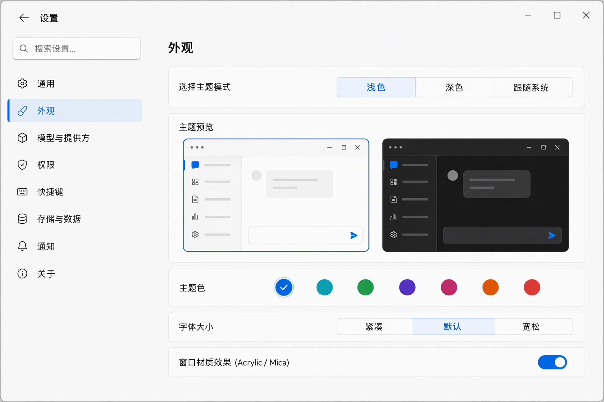
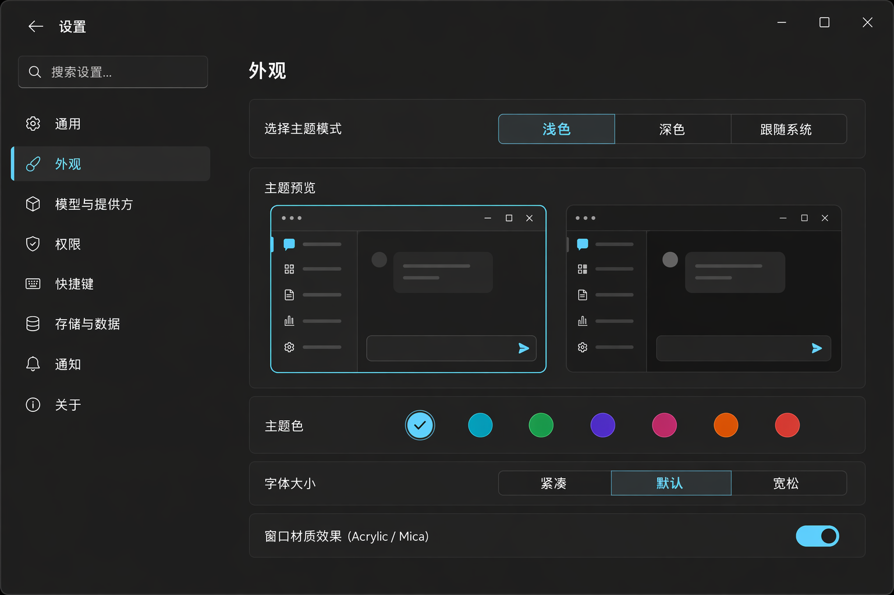

# Settings — 设置

> 整页路由而非模态(lobe-chat 的决策)。左侧分类导航 + 右侧内容区;主题预览卡参考 Tokenicode。

## UI 构成

```
┌───────────────────────────────────────────────┐
│ ← 设置                          🔍 搜索设置…  │
├────────────┬──────────────────────────────────┤
│ 通用        │                                  │
│ 外观        │   (右侧内容区,max-w-2xl)         │
│ 模型与提供方 │                                  │
│ 权限        │                                  │
│ 快捷键      │                                  │
│ 存储与数据  │                                  │
│ 通知        │                                  │
│ 关于        │                                  │
└────────────┴──────────────────────────────────┘
```

- **布局**:整页路由,左导航 200px(f-sm 分类,选中 `sidebar-active` + rail),右内容 `max-w-2xl`;返回箭头回上一视图。
- **全局搜索**:搜索设置项名与描述,结果直达并高亮目标项(lobe-chat)。

### 外观页(核心页)

- **主题模式**:三选段控件 `浅色 / 深色 / 跟随系统`。
- **主题预览卡**(Tokenicode):两张预览卡并排(浅色/深色微缩界面),当前主题带 accent 边框;点击卡片即切换,所见即所得。
- **强调色**:预设色板(默认 Fluent Blue #0078D4 + 6 备选);选中后全局 token `--fluent-blue` 系联动。
- **字号**:界面字号三档(紧凑/默认/宽松),作用于 f-* 基准。
- **材质开关**:`窗口材质效果(Acrylic/Mica)` 开关 — 低性能设备可关,关闭后顶栏/浮层退化为不透明 surface。

### 权限页(ello 特有)

- 默认会话模式四选(带每档行为表,与 composer 模式切换器同源)。
- `bypass_enabled` 开关:开启需键入确认文本(高危,唯一的强确认场景)。
- 持久规则列表:已保存的允许规则(命令/路径/域名),逐条可删。

### 其他页

- **模型与提供方**:provider 列表 + 连接状态 + 默认模型;不内嵌密钥明文编辑(编辑走系统密钥链)。
- **快捷键**:表格列出全部快捷键,点击重录(冲突红标)。
- **存储与数据**:会话数据位置、缓存大小、导出/清除(清除为 danger + 确认)。
- **通知**:审批到达、任务完成的系统通知开关与提示音。

## 交互

- **即时生效**:外观类设置即改即存,无"保存"按钮;危险操作(清数据、bypass)才有确认。
- **未保存指示**:仅表单类页(provider 添加)有 dirty 态,离开前提示。
- **键盘**:`Cmd+,` 打开,`Cmd+W` 关闭返回;导航 `↑/↓` 移动。
- **深链接**:每个设置项可 `Cmd+K` 搜到并直达(命令面板 → 设置项 drill)。

## UX 决策与来源

1. **整页而非模态**(lobe-chat):设置是低频但长停留的页面(尤其 provider 配置),模态的狭小与遮挡得不偿失;整页给足内容宽度与搜索。
2. **预览卡代替文字描述**(Tokenicode):主题是视觉决策,文字"浅色/深色"不如直接渲染两张微缩界面 — 决策成本最低。
3. **即改即存**:桌面应用惯例(System Settings),减少"改了没保存"的心智负担;只有不可逆操作保留确认。
4. **权限页是 ello 差异化**:权限规则的可见可删,让"为什么这条命令不再问我了"有处可查 — 信任来自可审计。

## 效果图




