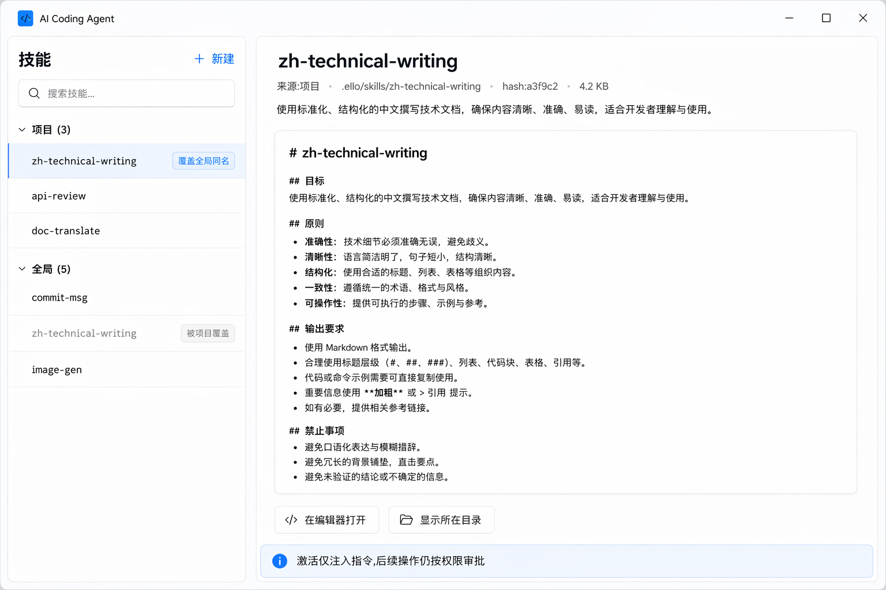
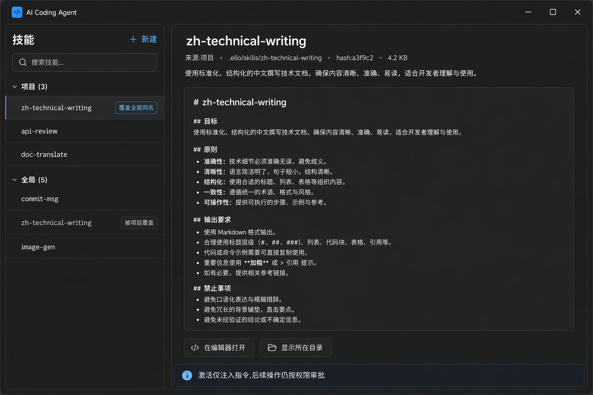

# Skills — 技能管理

> ello Skills 的管理界面:Global / Project 两层目录、项目覆盖全局、content hash 版本化。信息模型对齐 ello 的 SkillCatalog;交互形态参考设置页(整页 master-detail)。

## 域模型映射

| ello 概念 | UI 表达 |
| --- | --- |
| Global(`~/.ello/skills`)/ Project(`.ello/skills`)两层 | 列表按来源分组,来源徽标 |
| 项目同名覆盖全局 | 项目条目显示"覆盖全局同名";被覆盖的全局条目降透明度 + "被项目覆盖" |
| frontmatter(name kebab-case / description 1–1024B / 正文 ≤64KiB) | 新建/编辑表单的实时校验规则 |
| contentHash(SHA-256) | 详情页显示短 hash;正文变更后 hash 变化即"有新版本" |
| 构建、IO 或 schema 校验失败时 RPC 直接拒绝 | 整页进入明确错误态,显示原始路径与错误信息 |
| `activate_skill` / `$name` 触发 | 详情页显示"本会话已激活"状态;composer `$` 自动完成(见 composer) |
| Skill 不获得权限 | 详情页固定提示:"激活仅注入指令,后续操作仍按权限审批" |

## UI 构成(master-detail 整页)

```
┌────────────────────────────────────────────────────┐
│ 技能                          🔍 搜索技能…  + 新建 │
├──────────────────┬─────────────────────────────────┤
│ 项目 (3)          │  zh-technical-writing           │
│ ● zh-tech-writing │  ─────────────────────────────  │
│   覆盖全局同名     │  来源:项目 · .ello/skills/…     │
│ ● api-review      │  hash:a3f9c2 · 4.2 KB · 2 小时前│
│ ● doc-translate   │  ─────────────────────────────  │
│ 全局 (5)          │  中文技术文档写作规范。(desc)   │
│ ● commit-msg      │  ─────────────────────────────  │
│ ○ zh-tech-writing │  [SKILL.md 渲染预览]            │
│   被项目覆盖       │  正文 Markdown 只读渲染…        │
│ ● image-gen       │  ─────────────────────────────  │
│ ⚠ broken-skill    │  [在编辑器打开] [显示所在目录]  │
│   frontmatter 错误 │  ℹ 激活仅注入指令,不授予权限  │
└──────────────────┴─────────────────────────────────┘
```

### 列表区(280px)

- 分组:**项目 / 全局** 两组,组内按 name 排序(与 catalog 排序一致)。
- 行(48px):name(`f-sm` mono)+ description 首行截断;右侧状态:
  - ● 正常(无装饰,安静默认)
  - `覆盖全局同名` 徽标(项目条目,`fluent-subtle` 底)
  - 被覆盖的全局条目:整行 50% 透明度 + `被项目覆盖` 灰徽标,点击仍可查看(只读)
  - ⚠ 错误条目:`danger` 图标 + 错误简述(frontmatter 错误 / 重复 realpath / 正文超限),详情页给完整报错(含 skill path,与 `parseSkillMarkdown()` 异常格式一致)
- 顶部搜索:复用 SkillSearchIndex 语义(name 权重 > description),前端本地过滤即可。

### 详情区

- 头部:name(title-3,mono)+ 操作(在编辑器打开 / 显示所在目录)。
- 元信息行:来源(项目/全局 + 路径,`realPath` 与 `baseDir` 不同则都显示)、短 hash、大小、修改时间。
- description 完整展示。
- **正文预览**:SKILL.md 的 Markdown 只读渲染 — 不做应用内编辑器,编辑交给系统编辑器(与 file-explorer 的"单击预览/双击外开"一致)。
- 底部固定提示条:权限边界说明。
- 当前 Thread 已激活该 skill 时,头部显示 `本会话已激活` 徽标(数据来自 run 的激活记录)。

### 新建技能(popover 表单,非模态)

- 字段:`name`(kebab-case 实时校验)+ `description`(计数 1024B)+ 目标层(项目/全局单选)。
- 提交:创建目录 + 脚手架 SKILL.md,然后在系统编辑器打开正文;不在应用内写正文。
- 名称冲突:同层重名直接报错;项目与全局同名时明确提示"将覆盖全局同名技能",由用户确认 — 覆盖是 ello 的合法语义,不阻止,但必须显式知情。

## 交互

- **$ 触发联动**:详情页显示触发方式 `$name`;composer 输入 `$` 的自动完成列表与技能状态实时同步;catalog 失败时自动完成明确进入不可用状态。
- **reload 反馈**:skill 目录变化触发 catalog reload;成功后原子替换列表;失败时整页显示持久错误面板,保留 RPC 返回的路径与错误信息,不继续展示可操作列表。
- **键盘**:`↑/↓` 移动,`Enter` 查看,`Cmd+N` 新建,`Cmd+E` 在编辑器打开。

## UX 决策与来源

1. **管理页只做"看得见、改得动入口"**:技能正文是指令文本,编辑体验系统编辑器永远更好;应用内聚焦 catalog 特有信息——来源、覆盖关系、hash、错误,这些在文件管理器里看不见。
2. **覆盖关系显式化**:项目覆盖全局是 ello 的核心合并语义,但被覆盖方"静默消失"会让用户困惑"我的全局技能去哪了"——降透明度保留 + 双向徽标,让覆盖双向可追溯。
3. **错误直接阻断**:reload 失败即进入显式失败状态,不把此前数据、空数组或默认文案伪装成当前 catalog;修复源文件并重新加载成功后才恢复管理操作。
4. **权限边界常显**:技能指令可能包含写文件/命令指令但 skill 本身不获得权限——这条是 ello 的安全模型,详情页固定提示,避免用户把"激活技能"理解为"授权操作"。

## 效果图




