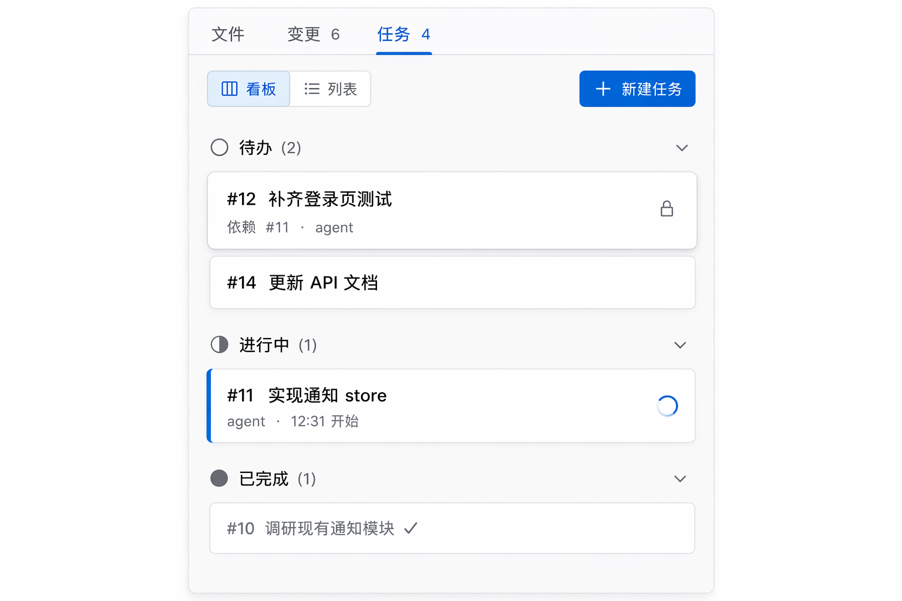
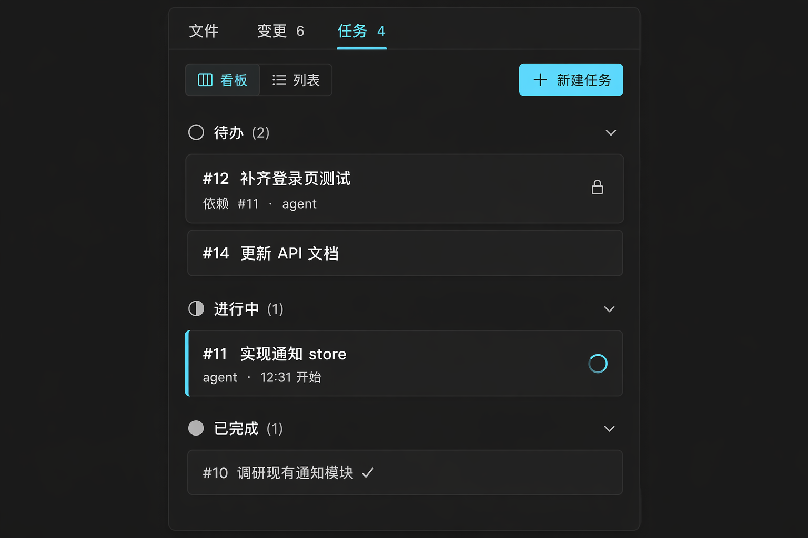

# Task Board — 任务板

> ello Task board 的可视化:工作项的状态、owner 与依赖。看板形态与状态灯借鉴 tura 的 Plan 看板,信息模型对齐 ello Task 协议。

## UI 构成

### 看板模式(右栏"任务"页签 / 宽屏独立视图)

```
┌─ 文件 │ 变更 │ 任务 4 ──────────── ✕ ─┐
│ [看板] [列表]              + 新建任务  │
│                                        │
│ ○ 待办 (2)                             │
│ ┌────────────────────────────┐        │
│ │ #12 补齐登录页测试          │        │
│ │ 依赖 #11 · agent           │        │
│ └────────────────────────────┘        │
│ ┌────────────────────────────┐        │
│ │ #14 更新 API 文档           │        │
│ └────────────────────────────┘        │
│ ◐ 进行中 (1)                           │
│ ┌────────────────────────────┐        │
│ │ #11 实现通知 store   ◐ 旋转 │        │
│ │ agent · 12:31 开始          │        │
│ └────────────────────────────┘        │
│ ● 已完成 (1)                           │
│ ┌────────────────────────────┐        │
│ │ #10 调研现有通知模块 ✓      │        │
│ └────────────────────────────┘        │
└────────────────────────────────────────┘
```

### 列(状态)

- 固定四列:`待办 / 进行中 / 已完成 / 已取消`,与 ello Task 状态机对齐;右栏窄态下列纵向堆叠(如图),宽屏独立视图时横向四列(tura 看板)。
- 列头:状态符号(`○ ◐ ● ✕`)+ 名称 + 计数;`进行中`列的状态符号旋转动画(tura 的 Doing 指示灯)。

### 任务卡

- 主行:短编号(`#12`,mono)+ 标题 `body-m`。
- 副行 f-sm/tertiary:依赖(`依赖 #11`)、owner(agent / 用户)、时间戳。
- 被依赖阻塞的卡:标题前显示 🔒,hover 说明"等待 #11 完成";可领取的卡 normal。
- Agent 提问中(任务卡在等用户输入):卡片 `warning` 边框 + 脉冲动画(tura 的 question 脉冲),点击跳到时间线对应追问。

### 列表模式

表格视图:编号 / 标题 / 状态 / owner / 依赖 / 更新时间;按状态分组排序;适合>10 个任务时扫读。

## 交互

- **状态流转**:Agent 侧由 Task 工具驱动自动更新,卡片以 `--duration-base` 在列间滑动;用户可拖拽卡片改状态(发起协议请求,非法流转被 Server 拒绝并弹回)。
- **点击卡片**:右侧展开详情(描述全文、依赖链、关联的回合消息链接)。
- **依赖可视化**:hover 卡片时,其依赖与后继卡片高亮,其余降透明度 50% — 窄栏不画连线,用高亮代替(tura Gantt 的依赖关系在宽屏视图才用连线)。
- **新建**:`+ 新建任务` 弹行内表单(标题必填,描述/依赖可选),创建即同步到 board。
- **实时性**:board 变更经事件流推送,多客户端(TUI + App)同时打开时状态一致。

## UX 决策与来源

1. **会话即 ticket,任务即步骤**(tura):任务板不是项目管理器的复刻,而是当前 Thread 工作项的实时投影 — 默认只看当前会话的 board,全局 board 进独立视图。
2. **状态符号动画**:旋转的 `◐` 让"Agent 正在干哪件事"成为板上一眼可见的活信号,比文字状态更直观。
3. **阻塞可读化**:🔒 + hover 原因,回答 open-webui/看板工具常答不好的问题:"这张卡为什么不能动"。
4. **窄栏高亮代替连线**:依赖连线在 360px 栏内只会缠成一团;hover 高亮以零视觉成本表达同一件事,宽屏 Gantt/看板再上线条。

## 效果图




