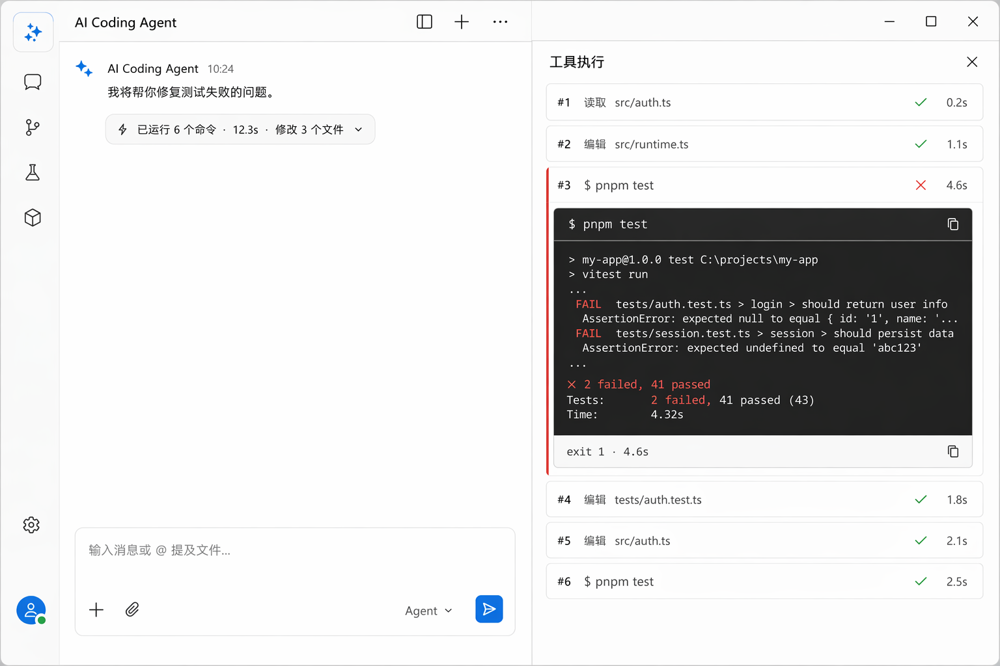
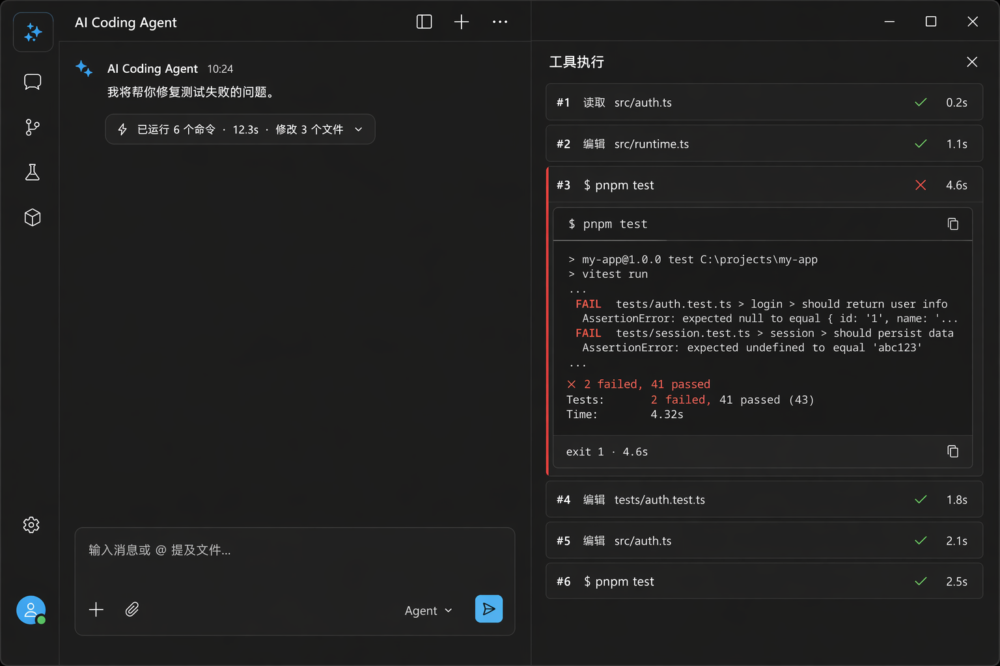

# Tool Call — 工具调用展示

> 二级信息架构:时间线里的 RunSummary 胶囊 + 右侧 Tool Inspector 检查器。核心方案来自 tura,三段式卡片结构参考 open-webui。

## UI 构成

### 一级:RunSummary 胶囊(时间线内)

```
┌──────────────────────────────────────────────┐
│ ⚡ 已运行 6 个命令 · 12.3s · 修改 3 个文件   ▾│
└──────────────────────────────────────────────┘
```

- 形态:pill 胶囊(`rounded-pill`、`bg-surface-2`、`border-subtle`,高 32px),图标 + 摘要 + chevron。
- 摘要三要素:命令数 / 累计耗时 / 变更文件数;运行中实时滚动更新,图标帧动画(◆◇◈ 旋转,参考 tura)。
- 状态着色:运行中蓝色图标动画 / 全绿勾(成功)/ 含失败(`danger` 图标 + 失败计数)。
- 点击 → 打开/聚焦右侧 Tool Inspector;chevron 展开 → 时间线内就地展开简表(不离开上下文)。

### 二级:Tool Inspector(右侧 panel,320–480px)

```
┌─ 工具执行 ──────────────────────── ✕ ─┐
│ #1  读取 src/auth.ts        ✓ 0.2s   │
│ #2  编辑 src/runtime.ts     ✓ 1.1s   │
│ #3  $ pnpm test             ✗ 4.6s   │ ← 展开态:
│     ┌──────────────────────────┐     │
│     │ $ pnpm test        (mono) │     │ 命令原文
│     ├──────────────────────────┤     │
│     │ ✗ 2 failed, 41 passed    │     │ 输出(截断)
│     │ ...                       │     │
│     ├──────────────────────────┤     │
│     │ exit 1          4.6s     │     │ 底栏:exit code + 耗时
│     └──────────────────────────┘     │
│ #4  编辑 tests/auth.spec.ts ✓ 0.8s   │
└───────────────────────────────────────┘
```

- 每步一行:`#序号` + 标题 + 状态符号 + 实时计时(tura 的 `#step` 语法)。
- 单步展开为三段卡(open-webui 代码块结构):sticky 顶栏(命令/文件,mono)→ 内容(输出,最多 20 行,超出"展开全部")→ 底栏(exit code / diff 统计)。
- 编辑类步骤的展开内容即 [diff-viewer](../diff-viewer/README.md) 的行内模式。
- 运行中的步骤行有呼吸点;失败步骤整行左侧 2px `danger` rail。

## 交互

- **就地展开 vs Inspector**:chevron 就地看简表(最多显示步骤行,不含输出);点胶囊体进 Inspector 看全部细节。两条路径服务"快速确认"与"深入排查"两种意图。
- **Inspector 宽度**:拖左缘 320–480px,拖窄于 260px 自动关闭(tura)。
- **自动滚动**:执行中 Inspector 跟随最新步骤;用户手动滚动后暂停跟随,到底部恢复。
- **复制**:每步 hover 出现 copy(命令/输出分开复制);整卡可"复制全部命令"。
- **键盘**:时间线内 `Alt+↑/↓` 在消息与工具卡间移动,`Enter` 就地展开,`Alt+Enter` 进 Inspector。

## UX 决策与来源

1. **默认折叠成胶囊**(tura 核心决策):工具输出是过程不是结论;时间线信噪比优先,一颗带计数的胶囊回答了"做了什么、花了多久、成没成"三个问题。
2. **双通道查看**:就地展开(轻)与 Inspector(重)并存,避免 tura 单通道"必须离开上下文"或 open-webui"全部内联刷屏"两个极端。
3. **#step 编号 + $ 前缀**(tura):命令序列一眼可读,编号让"第 3 步挂了"成为可引用的交流单位。
4. **失败不弹窗**:失败步骤在时间线胶囊上体现计数,详情在 Inspector;只有需要用户决策的(审批)才打断 — 错误是信息,审批才是请求。

## 效果图




