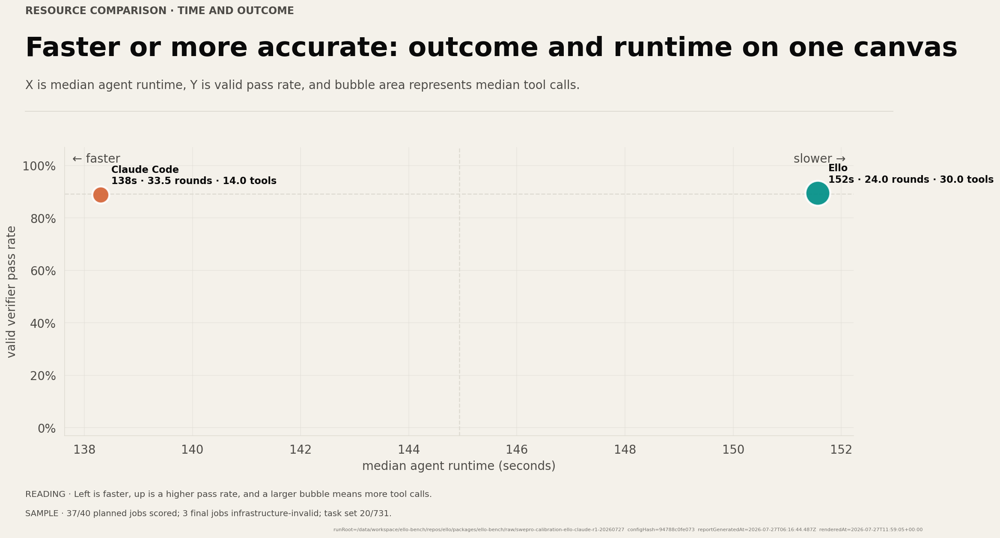
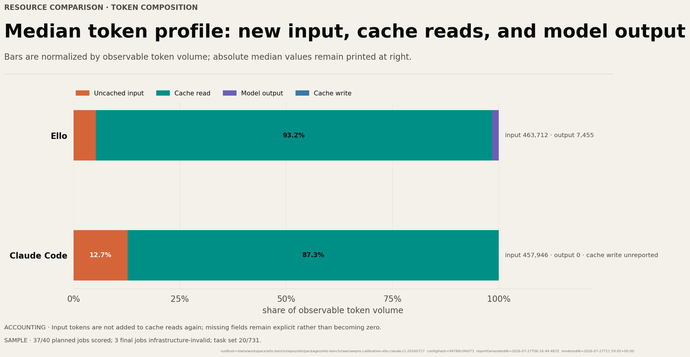
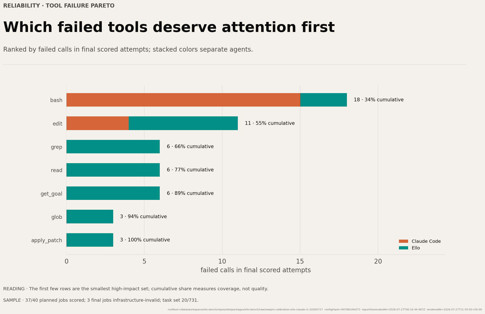

# 轮次更少，不等于工具更少：如何读编码 Agent 的资源图

编码 Agent 报告很容易落入一个直觉陷阱：round 少，看起来就应该更快、更省 token、工具调用也更少。但一次真实轨迹往往不是这样。

在 ello-bench 的 2026-07-27 SWE-bench Pro 早期校准运行中，两个 Agent 的有效最终 attempt 中位数是：

| Agent | rounds | tool calls | Agent 时间 | input tokens |
|---|---:|---:|---:|---:|
| Ello | 24.0 | 30.0 | 152 s | 463,712 |
| Claude Code | 33.5 | 14.0 | 138 s | 457,946 |

Ello 的 round 更少，却调用了更多工具；Claude Code 的 round 更多，却更快结束。单看任何一列都会讲出一个不完整的故事。

## Round 是模型交互边界，不是工作量单位

一个 round 可能只产生文本，也可能发起多个工具调用；不同 Agent 还可能用不同方式批处理工具。于是：

- round 少，可能表示每轮做更多事；
- round 多，可能表示更频繁地观察与修正；
- tool call 少，可能来自更粗粒度的 shell 命令；
- tool call 多，可能来自更细粒度、更易审计的 read/search/edit 操作。

因此 round 和 tool call 都是运行时协议中的单位，不是跨系统天然等价的“步骤”。

## 更快也不自动意味着更高效

耗时至少由四类因素共同决定：

1. 模型首 token 与生成延迟；
2. 工具执行时间；
3. 仓库准备、依赖和 verifier 时间；
4. Agent 是否并行或批处理操作。

资源散点图把通过率放在 Y 轴、Agent 时间放在 X 轴、工具调用放在气泡面积中，目的就是避免把“快”单独当成胜利。

这次运行中 Claude Code 的中位数更快，Ello 的气泡更大，但 18 个有效配对全部同分。正确表述是“当前共同有效任务上结果相同，资源轨迹不同”，而不是“某种轨迹造成了相同结果”。

## Token 也必须先统一口径

input token、cache read、cache write 和 output token 常常来自不同 provider 的不同事件。若把 cache read 再加到已经包含它的 input 中，会重复记账；若把未报告字段变成 0，又会制造虚假的精确性。

图中将“未缓存输入、cache read、model output、cache write”分开，并把未报告字段明确写在右侧。只有确认两个 Agent 的字段语义同构后，才适合继续估算费用或宣称 token 节省比例。

## 工具失败应该读成工程线索

工具失败 Pareto 回答的是“先修哪里最可能改善可靠性”，不是“哪个 Agent 更差”。例如大量 `bash` 失败可能来自命令复杂、环境差异或 parser 分类；大量 `edit` 失败可能来自补丁上下文漂移。需要回到具体 round 和原始输出，而不是只比较柱长。

## 一张资源图至少要带什么

一张可以独立传播的 Agent 资源图，至少应带上：

- 指标口径：中位数还是总量，包含哪些 attempt；
- 结果上下文：通过率或配对结果；
- 样本覆盖：有效、计划、无效数量；
- 缺失字段的处理方式；
- run、配置和生成时间的 provenance。

真正有用的资源分析不是寻找单一“越少越好”的数字，而是把结果、时间、轮次、工具和 token 放回同一条任务轨迹中解释。
