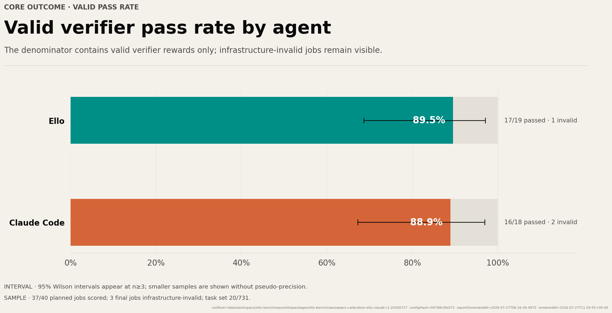
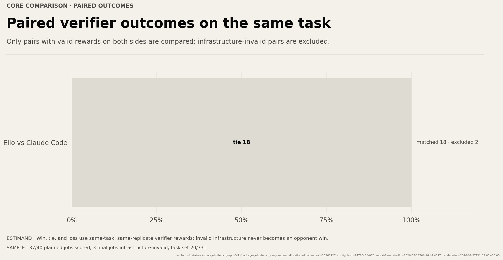

# 当前测试集记录：早期 SWE-bench Pro Ello / Claude Code 校准

## 一句话结论

这次 20 题单次重复运行不能发布为正式胜负报告：40 个计划 job 中只有 37 个获得有效评分，3 个最终基础设施无效；18 个有效配对全部同分，因此现有证据只说明两套配置在共同有效任务上没有产生胜负差异。

## 运行身份

| 字段 | 值 |
|---|---|
| 日期 | 2026-07-27 |
| 上游 revision | `ca10a60a5fcae51e6948ffe1485d4153d421e6c5` |
| 任务 | 20 / 731 |
| Replicate | 1 |
| 计划 job | 40 |
| 有效评分 | 37 |
| 最终无效 | 3 |
| config hash | `94788c0fe07304952b1a0c07c3980233999b805c78c655becee1e500e9659114` |
| plan hash | `76bdaecb4cac30406546fe68c5a34760f021bdfd4a840575ee2191a43873f4aa` |
| 可发布 | 否 |

原始本地 run root 为 `packages/ello-bench/raw/swepro-calibration-ello-claude-r1-20260727`。`raw/` 不进入版本控制；本文固定保存代表图，图中仍带有原 run provenance。

## 结果

| Agent | 有效 | 通过 | 有效通过率 | 95% Wilson 区间 | 无效 |
|---|---:|---:|---:|---:|---:|
| Ello | 19 | 17 | 89.5% | 68.6%–97.1% | 1 |
| Claude Code | 18 | 16 | 88.9% | 67.2%–96.9% | 2 |

89.5% 与 88.9% 的分母不同，不能据此声称 Ello 领先。共同有效的 18 个任务配对中：

- Ello win：0；
- tie：18；
- Ello loss：0；
- excluded pair：2。

配对差为 0.0%。这是本次运行最直接的结果，但仍受单 replicate、任务子集和两对排除影响。

## 为什么不可发布

最终无效 job 涉及：

| Agent | 任务 | 类型 | 摘要 |
|---|---|---|---|
| Ello | `swepro-element-27139ca6` | verifier | verifier 退出码 1，未产生可信评分 |
| Claude Code | `swepro-element-27139ca6` | verifier | verifier 退出码 1，未产生可信评分 |
| Claude Code | `swepro-qutebrowser-fea33d60` | agent tool audit | 文件路径被判定越出任务工作区 |

此外还有 6 个较早的无效 attempt 在重试后被替代。它们仍保留在诊断 ledger 中，不应从审计记录中删除。

完整矩阵是发布门槛的一部分。只要存在最终无效 job，就应将本次结果视为基础设施校准，而不是排行榜结论。

## 资源记录

以下为有效最终 attempt 的中位数：

| Agent | Agent 时间 | rounds | tool calls | input | cache read | output |
|---|---:|---:|---:|---:|---:|---:|
| Ello | 152 s | 24.0 | 30.0 | 463,712 | 439,168 | 7,455 |
| Claude Code | 138 s | 33.5 | 14.0 | 457,946 | 399,744 | 0* |

这组数据呈现出一个值得继续验证的形状：Ello 的 round 更少但 tool call 更多；Claude Code 的运行中位数更短，但两者有效通过率近似且配对全平。它不能证明“轮次越少越好”或“工具越多越好”。

`*` Claude Code 的 output token 记录为 0、cache write 未报告，这是当前 adapter 的可观测字段，不应解释为模型没有生成输出。跨 Agent token 成本比较必须先统一记账语义。

## 工具失败

最终有效 attempt 中，失败调用主要集中在 `bash`、`edit`，以及 Ello 的 `grep`、`read`、`get_goal` 等工具。这张图用于定位 parser、工具边界和重试策略，不直接衡量任务能力；不同 Agent 的工具粒度不同，绝对次数不能脱离协议解释。

## 下一轮

正式对比应使用完整 30 题的 `swe-bench-pro-calibration`，并完成以下条件：

1. 先修复 verifier 与 workspace tool-audit 的误判或不稳定点；
2. 完整运行 30 题 × 2 Agent；
3. 若预算允许，将 replicate 提高到至少 3；
4. 优先报告配对 win/tie/loss，再报告各自通过率；
5. 对 token 字段做 Agent 间语义对齐；
6. 只有完整矩阵通过发布门槛后，才生成对外结论。
