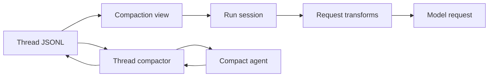

# Compact 模块

## 为什么需要两层压缩

Thread 会持续积累用户消息、模型回复和工具结果，而模型输入受 context
window 限制。ello 同时处理两个问题：单次模型请求需要落入输入预算，长期
Thread 需要保留早期目标、决策和验证结果。

这两个问题由两层机制分别处理。

| 机制              | 执行时机                      | 处理方式                                      | 持久化结果                |
| ----------------- | ----------------------------- | --------------------------------------------- | ------------------------- |
| 请求级消息裁剪    | 每次模型调用前                | 按条数和 token 预算裁剪 `ModelInput.messages` | 保持持久化状态原值        |
| Thread checkpoint | 自动阈值触发或手动 `/compact` | 调用 internal compact agent 生成滚动摘要      | `compaction` JSONL record |

## 两层机制如何配合

`compactionView()` 将最新 checkpoint 和近期 transcript 投影为会话历史。
`RunSession` 在每次模型调用前继续裁剪投影结果。checkpoint 保存旧历史中的
工作状态，请求级裁剪负责控制当前调用的输入大小。

两层机制使用同一种 `ceil(chars / 4)` token 估算，但预算和生命周期各自独立。
请求级裁剪保留完整 Thread 日志；checkpoint 通过日志投影替换后续运行读取到的
旧消息。

## 章节

- [请求级消息裁剪](request-message-trimming.md)
- [Thread checkpoint 压缩](thread-checkpoint-compaction.md)
