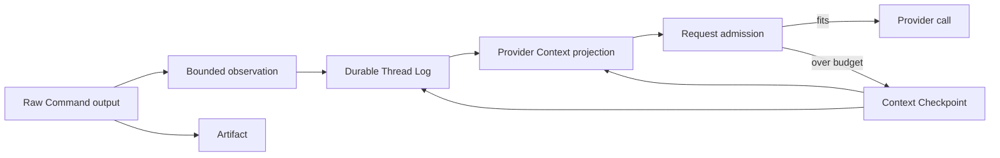

# Context Management

Ello 只保留一种历史压缩语义：持久 Context Checkpoint。请求级 Context Admission 负责判断一次
provider call 是否能容纳，不再通过内存 anchor 静默删除历史。

| Module | 职责 | 是否修改 durable state |
| --- | --- | --- |
| Command result projection | 把原始输出投影为 12,000-byte observation 和 65,536-byte batch result | 大输出写 artifact；Command audit 保留事实与路径 |
| Request admission | 计算总窗口减去输出保留，校验最终 provider input | 否 |
| Context Checkpoint | 用持久 checkpoint 投影替代旧 Provider Context，并追加 compaction record | 是 |
| Provider Adapter | 转换并 replay 合法 outer `command_run` call/result pair | 否 |

```mermaid
flowchart LR
  L[Durable Thread Log] --> V[Provider Context projection]
  V --> A[Request admission]
  A -->|fits| M[Provider call]
  A -->|over budget| C[Context Checkpoint]
  C --> L
  C --> V
  O[Raw Command output] --> P[Bounded observation]
  O --> R[Artifact]
  P --> L
```

## 章节

- [请求级 Context Admission](request-message-trimming.md)
- [Thread Context Checkpoint](thread-checkpoint-compaction.md)
- [Command 与 Context Management 架构讨论记录](command-context-architecture-decisions.md)
  （实现与验证进行中，不是 accepted ADR）
