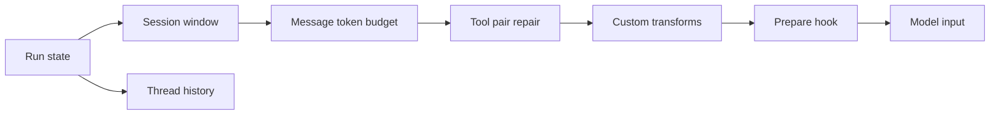

# 请求级消息裁剪

## 为什么需要这个？

`RunSession.state.messages` 包含载入的 Thread 投影和当前 run 新增的消息。模型与
工具继续交互时，这个数组会持续增长。provider 对输入长度有硬限制，工具调用和
工具结果还需要保持配对。

请求级消息裁剪在每次模型调用前生成一个受限的消息数组。完整 run state、Thread
JSONL 和 TUI 历史保持原值，下一次模型调用会基于当时的完整 run state 重新执行
裁剪。

## 裁剪范围

裁剪入口是 `buildModelInput()`，输入为当前会话消息，输出写入
`ModelInput.messages`。预算循环只统计消息正文；`system` 提示和工具定义位于循环
之外。诊断信息会额外统计 `system` 的字符估算值。



`modelInput.messageTransforms` 在内置配对修复后运行，`modelInput.prepare` 再对完整
`ModelInput` 做最终改写。自定义变换和 `prepare` 需要自行维护预算与工具配对约束。

## 内置变换顺序

生产执行器配置了以下参数：

```text
sessionWindow(maxMessages=200)
→ modelInputBudget(maxInputTokens=160000, reservedOutputTokens=8000)
→ preserveToolCallPairs
→ modelInput.messageTransforms
→ modelInput.prepare
```

`trimMessages()` 保留数组尾部最近 200 条消息。`compactMessages()` 再从数组头部
逐条删除消息，直到估算值落入可用预算。

```text
available = max_input_tokens - reserved_output_tokens
```

`max_input_tokens` 和 `reserved_output_tokens` 的默认值分别为 160000 和 8000。
配置 schema 要求预留量小于输入上限；`compactMessages()` 构造时也校验相同约束，
覆盖直接调用该函数的路径。

`trimMessages()` 和 `compactMessages()` 各自在返回前执行一次工具配对修复，默认
流水线末尾还会再执行一次。多次修复让每个内置裁剪阶段都能独立返回有效的消息
序列。

## Token 预算如何执行

`compactMessages()` 使用确定性的 O(n) 处理：复制消息数组，计算文本字符数，
超出预算时持续删除最旧消息。

```ts
const kept = [...messages];
while (kept.length > 0 && estimateMessagesTokens(kept) > available) {
  kept.shift();
}
return preserveToolCallPairs(kept);
```

单条消息的估算值为 `ceil(chars / 4)`。字符串内容直接计数，结构化 content 先经过
`JSON.stringify()`。该估算用于预算保护和稳定测试；账单与实际 token usage 取自
provider response。

Thread checkpoint 为早期目标和决策提供持久摘要。两层机制共同启用时，旧历史先
投影为 `<compact-checkpoint>`，请求级裁剪再处理 checkpoint 和近期消息。

## 工具调用如何配对

按条数或 token 删除消息可能留下孤立的 assistant tool-call 或 tool-result。部分
provider 会拒绝这种输入。

`preserveToolCallPairs()` 分两遍处理消息：

- 收集 assistant content 中的 tool-call id。
- 收集 tool message content 中的 tool-result id。
- 删除找不到对侧 id 的 assistant 或 tool message。
- 保留普通 user、assistant 和 tool 文本消息。

实现同时读取 `toolCallId` 和 `toolInvocationId`。过滤粒度是整条消息；一条
assistant message 包含多个 tool-call 时，只要其中一个 id 有对应结果，整条消息
都会保留。严格的逐 part 配对需要在后续实现中细化 content 重写。

## 诊断信息

`buildModelInput()` 记录以下信息：

- `messageCount` 和 `estimatedInputTokens`
- 已应用的 message transform 名称
- system、toolset 和 message prefix fingerprint
- `compactionBoundary`

`modelInput.prepare` 运行后，系统重新计算消息数、token 估算和 fingerprint。
`prepare` 需要保留 `diagnostics` 字段；字段缺失会抛出
`PrepareModelInput must preserve model input diagnostics.`。

`prepare` 之后只重新计算诊断，token 裁剪阶段已经结束。`prepare` 增加的大段
system 或消息可能使最终请求超出先前预算。

## 源码入口

- [`input-transforms.ts`](../../packages/ello-agent/src/agent/engine/core/input-transforms.ts)
- [`model-input.ts`](../../packages/ello-agent/src/agent/engine/core/model-input.ts)
- [`agent-turn-executor.ts`](../../packages/ello-agent/src/agent/execution/agent-turn-executor.ts)
