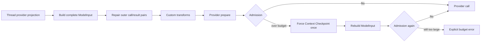

# 请求级 Context Admission

> 文件名保留历史名称。当前实现不再执行请求级历史裁剪；唯一历史缩减语义是持久
> Context Checkpoint。

## 目标

每次 provider call 前，Agent Engine 从当前 Thread 投影构造完整 `ModelInput`，修复 outer
tool call/result 配对，执行 provider prepare，然后做硬 admission。该阶段不会移动历史
锚点、删除旧消息或修改 durable Thread Log。

这样 provider 输入失败只有两个明确结果：先尝试一次 Context Checkpoint；checkpoint 后
仍无法容纳时返回 budget error。系统不会通过不可审计的前缀漂移掩盖超限。

## 输入预算

Model Catalog 提供总窗口和默认最大输出；产品配置可以进一步收紧输入：

```text
total = totalContextTokens
requestedOutput = request.maxOutputTokens ?? maxOutputTokens
inputFromTotal = max(0, total - requestedOutput)
availableInput = min(product.maxInputTokens, inputFromTotal)
```

最终估算覆盖 instructions、唯一 `command_run` schema 和 messages。`modelInput.prepare`
完成后会重新计算诊断，因此 provider Adapter 添加的内容也必须落入同一预算。

DeepSeek 一类 provider 的约束是 `input + output <= total context`。例如总窗口
1,048,576、请求输出 393,216 时，输入最多只有 655,360 tokens；还未计入估算误差。

## 执行顺序


```mermaid
flowchart LR
  T[Thread provider projection] --> B[Build complete ModelInput]
  B --> P[Repair outer call/result pairs]
  P --> U[Custom transforms]
  U --> A[Provider prepare]
  A --> C{Admission}
  C -->|fits| M[Provider call]
  C -->|over budget| K[Force Context Checkpoint once]
  K --> R[Rebuild ModelInput]
  R --> C2{Admission again}
  C2 -->|fits| M
  C2 -->|still too large| E[Explicit budget error]
```

Agent loop 首次构建时可以跳过 assertion，以便正常阈值 compaction 先运行。如果没有触发
checkpoint，再执行 admission；budget error 会强制尝试一次 checkpoint。checkpoint 改写
messages 后才重新构建 tools、instructions 和 provider options，普通回合不会无意义地构建
两次输入。

## 单条消息

系统单独检查 newest message，用于区分“历史总量超限”和“单个不可分割输入超限”。

- 用户输入不会被静默转换成 artifact；过大时明确失败。
- Command 原始输出不会直接进入 provider context。Command Module 把每条 observation
  限制为 12,000 UTF-8 bytes，并把整个 `command_run` result 限制为 65,536 bytes。
- 大 Command 输出的完整内容写入 Environment 可定位的 artifact；observation 只保留
  头尾、截断标记和路径。

因此 benchmark 中数 MB tool result 的主因应在 Command projection 处消除，而不是依赖
Context Checkpoint 拆分一条已经过大的消息。

## Outer replay 配对

`preserveToolCallPairs()` 只处理 provider-visible outer call/result。内部 Command 永远不会
伪造成 provider tool call。

- assistant `command_run` call 与 tool result 使用同一 `toolCallId`。
- 孤立 call 或 result 不进入 provider request。
- Context Checkpoint 的近期尾部必须保留合法 pair。
- replay result 使用模型 observation，不包含 `inputDigest`、timestamps 或 runtime metadata。

## 已删除机制

当前实现已经删除：

- `compactMessages()`；
- `MessageBudgetAnchor`；
- 60% suffix 水位推进；
- budget 超限时静默删除 provider history 前缀。

这些语义不会在 provider Adapter、Engine caller 或自定义 transform 中重新实现。

## 诊断

`ModelInput.diagnostics` 记录 message 数、估算输入 tokens、已应用 transforms、system/toolset/
message-prefix fingerprint 和是否存在 compaction boundary。硬 admission 使用 prepare 后的最终
diagnostics；provider response 的真实 usage 仍是账单和 benchmark 的事实来源。

## 源码入口

- [`model-input.ts`](../../packages/ello-agent/src/features/agent/engine/model-input.ts)
- [`agent.ts`](../../packages/ello-agent/src/features/agent/engine/agent.ts)
- [`run-state.ts`](../../packages/ello-agent/src/features/agent/engine/run-state.ts)
- [`result-projector.ts`](../../packages/ello-agent/src/features/command/result-projector.ts)
- [`transforms.ts`](../../packages/ello-agent/src/features/model/providers/catalog/transforms.ts)
