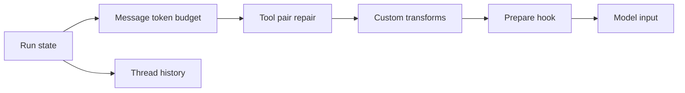

# 请求级消息裁剪

## 为什么需要这个？

`RunSession.state.messages` 包含载入的 Thread 投影和当前 run 新增的消息。模型与
工具继续交互时，这个数组会持续增长。provider 对输入长度有硬限制，工具调用和
工具结果还需要保持配对。

请求级消息裁剪在每次模型调用前生成一个受限的消息数组。完整 run state、Thread
JSONL 和 TUI 历史保持原值，下一次模型调用会基于当时的完整 run state 重新执行
裁剪。

## 裁剪范围

裁剪入口是 `buildModelInput()`，输入为当前会话消息，输出写入
`ModelInput.messages`。系统先估算 `system` 提示和工具定义的固定开销，再把剩余预算
交给消息裁剪；最终诊断和预算断言覆盖三者。


```mermaid
flowchart LR
  S[Run state] --> B[Message token budget]
  B --> P[Tool pair repair]
  P --> U[Custom transforms]
  U --> R[Prepare hook]
  R --> M[Model input]
  S --> H[Thread history]
```

`modelInput.messageTransforms` 在内置配对修复后运行，`modelInput.prepare` 再对完整
`ModelInput` 做最终改写。自定义变换和 `prepare` 需要自行维护预算与工具配对约束。

## 内置变换顺序

生产执行器配置了以下参数：

```text
modelInputBudget(
  availableInputTokens=min(
    model.context_window - model.max_output_tokens,
    context.max_input_tokens - context.reserved_output_tokens
  ),
  reservedOutputTokens=context.reserved_output_tokens
)
→ preserveToolCallPairs
→ modelInput.messageTransforms
→ modelInput.prepare
```

`compactMessages()` 使用跨回合共享的前缀锚点。只有当前后缀超预算时才前移锚点，
并一次推进到可用消息预算的 60%，为随后多个回合留下余量，避免 provider cache
断点每轮漂移。

```text
configured_available = context.max_input_tokens - context.reserved_output_tokens
model_available = model.context_window - model.max_output_tokens
fixed = estimated(system instructions) + estimated(tool definitions)
available_messages = min(configured_available, model_available) - fixed
```

`max_input_tokens` 和 `reserved_output_tokens` 的默认值分别为 1000000 和 64000。
配置 schema 要求预留量小于输入上限；`compactMessages()` 构造时也校验相同约束，
覆盖直接调用该函数的路径。

`compactMessages()` 返回前和默认流水线末尾都会执行工具配对修复，保证裁剪不会留下
孤立的 tool call/result。

## Token 预算如何执行

`compactMessages()` 使用确定性的 O(n) suffix cost。未超预算时保持锚点不动；超预算
时推进到 60% 水位：

```ts
if (suffixCost(anchor.index) > available) {
  const target = available * 0.6;
  while (suffixCost(anchor.index) > target) anchor.index += 1;
}
return preserveToolCallPairs(messages.slice(anchor.index));
```

单条消息的估算值为 `ceil(chars / 4)`。字符串内容直接计数，结构化 content 先经过
`JSON.stringify()`。system 和工具定义也按相同口径计入固定开销。若最新单条消息本身
无法放入窗口，或者 `prepare` 后最终输入再次超预算，系统会在调用 provider 前明确
失败，不会发送空消息或已知超限请求。账单与实际 token usage 仍取自 provider response。

Thread checkpoint 为早期目标和决策提供持久摘要。两层机制共同启用时，旧历史先
投影为 `<compact-checkpoint>`，请求级裁剪再处理 checkpoint 和近期消息。

## 工具调用如何配对

按条数或 token 删除消息可能留下孤立的 assistant tool-call 或 tool-result。部分
provider 会拒绝这种输入。

`preserveToolCallPairs()` 分两遍处理消息：

- 收集 assistant content 中的 tool-call id。
- 收集 tool message content 中的 tool-result id。
- 删除找不到对侧 id 的 assistant 或 tool message。
- 保留普通 user、assistant 和 tool 文本消息。

实现同时读取 `toolCallId` 和 `toolInvocationId`。过滤粒度是整条消息；一条
assistant message 包含多个 tool-call 时，只要其中一个 id 有对应结果，整条消息
都会保留。严格的逐 part 配对需要在后续实现中细化 content 重写。

## 诊断信息

`buildModelInput()` 记录以下信息：

- `messageCount` 和 `estimatedInputTokens`
- 已应用的 message transform 名称
- system、toolset 和 message prefix fingerprint
- `compactionBoundary`

`modelInput.prepare` 运行后，系统重新计算消息数、token 估算和 fingerprint。
`prepare` 需要保留 `diagnostics` 字段；字段缺失会抛出
`PrepareModelInput must preserve model input diagnostics.`。

`prepare` 之后会重新计算诊断并执行最终预算断言。`prepare` 增加的大段 system、消息
或工具定义若导致超预算，请求会在 provider 调用前失败。

## 源码入口

- [`model-input.ts`](../../packages/ello-agent/src/features/agent/engine/model-input.ts)
- [`build.ts`](../../packages/ello-agent/src/features/agent/build.ts)
- [`transforms.ts`](../../packages/ello-agent/src/features/model/providers/catalog/transforms.ts)
