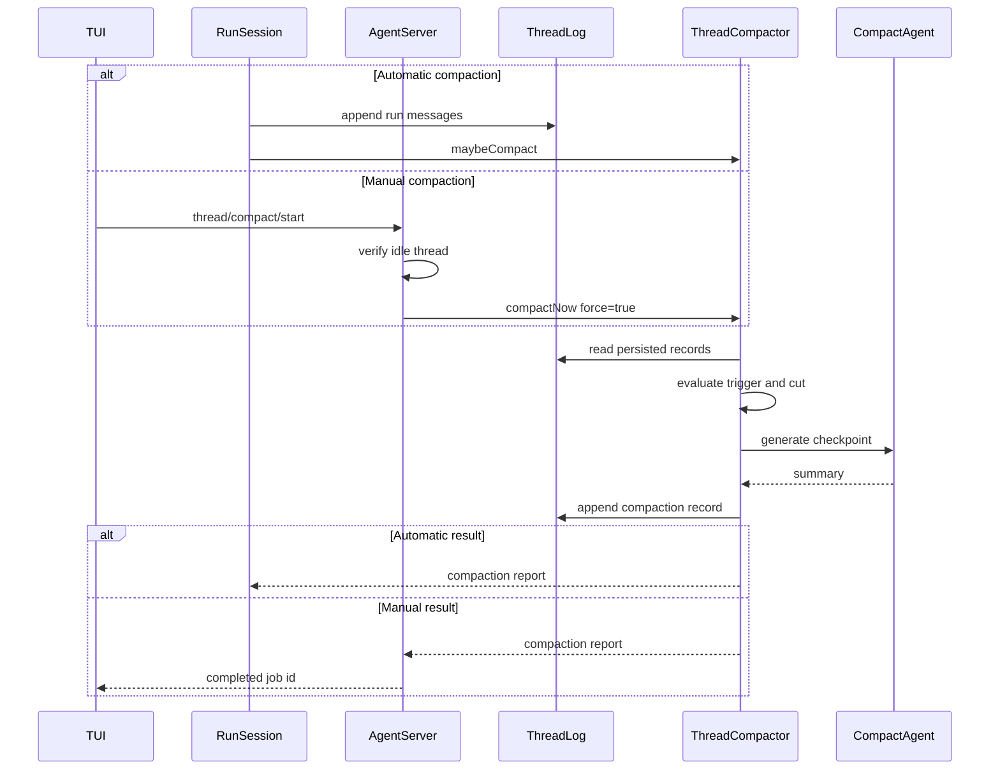
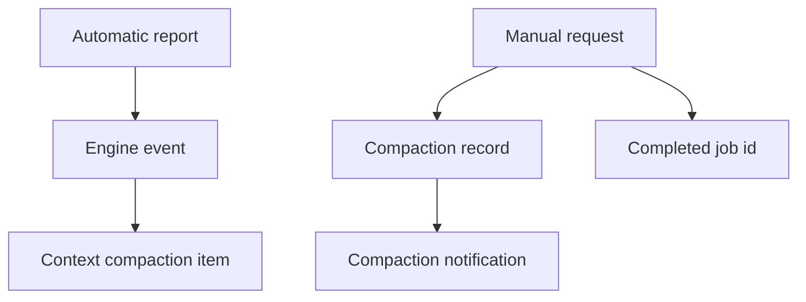

# Thread checkpoint 压缩

## 为什么需要 checkpoint？

请求级裁剪会从当前模型请求中删除最旧消息。长时间运行后，早期目标、设计决策和
验证结果可能离开输入窗口。Thread checkpoint 将旧历史归纳为一条摘要消息，同时
保留近期 transcript 供模型继续工作。

Thread JSONL 还承担审计和状态重建职责。ello 通过追加 `compaction` record 建立
逻辑边界，原始 transcript record 继续保存在日志中。后续 run 读取 checkpoint 和
边界后的近期消息，archive 与 export 仍可访问完整历史。

## 压缩生命周期

Thread checkpoint 有自动和手动两个入口，共用 `ThreadCompactor` 的读取、切分、
摘要生成和 record 写入流程。

| 入口            | 前置条件                        | 阈值              | 近期消息策略                          | 返回路径                 |
| --------------- | ------------------------------- | ----------------- | ------------------------------------- | ------------------------ |
| 自动 compact    | run 完成并已写入新增 transcript | 检查 context 水位 | 按 token 搜索切点                     | Engine compaction report |
| 手动 `/compact` | Thread 处于空闲状态             | 跳过              | 优先保留 `tail_turns` 条 user message | 同步 RPC response        |



自动 compact 位于 `RunSession.finish()`。系统先计算本次 run 相对于已载入历史的新增
消息并写入 transcript，再调用 `compactSession()`。阈值判断覆盖本轮用户输入、模型
回复和工具结果，生成的 checkpoint 供下一次 Thread 读取使用。模型调用期间由请求
级裁剪保护 provider 输入。

手动 `/compact` 调用 `thread/compact/start`。Server 读取完整 snapshot；Thread 状态
为 `running` 时返回 `threadBusy`，空闲时通过 production compactor 调用
`compactNow({ force: true })`。RPC 会同步等待摘要和日志写入完成，响应中的 `jobId`
标识这次已完成的操作。

## 自动触发条件

生产执行器将当前模型的 context limit 与 `context.max_input_tokens` 的较小值传给
compactor。`compactionView()` 计算当前投影的 token 估算值，满足以下条件时启动
compact agent：

```text
context.compaction.auto = true
且
projectedTokens > max(1, contextWindow - reserved_tokens)
```

`projectedTokens` 包含最新 checkpoint message 和当前保留的 transcript entries，
每条消息按 `ceil(chars / 4)` 估算。

| 配置                     |  默认值 | 用途                                        |
| ------------------------ | ------: | ------------------------------------------- |
| `auto`                   |  `true` | 控制自动触发                                |
| `reserved_tokens`        | `16384` | 设置触发水位的预留空间                      |
| `preserve_recent_tokens` | `20000` | 设置自动切点附近的近期消息量                |
| `tail_turns`             |     `2` | 设置 force 模式优先保留的 user message 数量 |
| `split_turns`            |  `true` | 允许在 assistant 边界切分 Turn              |

`reserved_tokens` 参与触发判断，`preserve_recent_tokens` 参与切点搜索。手动 force
模式跳过 `auto` 和触发水位，但在 user 边界不足时仍会使用 token 切点算法。

## Checkpoint 投影

`compactionView(records)` 查找最后一条 `compaction` record，并执行两项投影：

- 保留 `seq >= firstKeptSeq` 的 transcript entries。
- 在保留项之前加入一条 checkpoint user message。

```ts
{
  role: 'user',
  content: `<compact-checkpoint>\n${summary}\n</compact-checkpoint>`,
}
```

`ThreadTranscriptStore.load()` 直接返回 `projectedMessages`。Agent 接收普通消息数组，
日志 record 的解析集中在 `compactionView()`。


多次压缩时，读取投影只使用最新 record。生成新摘要时，最新 summary 进入
`<previous-compact>`，本次切点之前的 entries 进入 `<conversation>`。compact agent
据此更新滚动 checkpoint。

## 切点策略

切点把 `entries` 分成摘要侧和近期侧。切点至少为 1，保证摘要输入包含旧消息；
切点角色避开 tool message，使近期侧从 user 或 assistant 开始。

### 自动模式

算法从尾部向前累加消息 token，达到 `preserve_recent_tokens` 后得到 `tokenCut`，
再从该位置向更早的方向搜索合法边界：

1. 选择 user message。
2. `split_turns=true` 时选择 assistant message。
3. 选择任意非 tool message。
4. 搜索到数组第 1 项为止。

user 边界保留完整的近期对话。单个 Turn 超过保留预算时，assistant 边界允许在
Turn 内切分。非 tool fallback 处理缺少常规 user/assistant 结构的 transcript。

### Force 模式

force 模式收集所有 user entry 下标，优先选择倒数第 `tail_turns` 条 user message
作为切点。可用 user 边界数量不足时，算法继续执行 token 切点搜索。

`tail_turns` 的计数来源是 user transcript message，独立于 `turn.started` record。
常规协议提交会生成一条 user message；自定义 transcript 写入多条 user message 时，
这些消息会分别计数。

entries 少于两条、摘要侧为空或找不到合法边界时，compactor 返回 `null`。手动 RPC
将 `null` 映射为 `Thread has no compactable history.`。

## Compact agent 如何生成摘要

内置 `compact` agent 绑定当前 profile 的 `compact` role。`runInternalAgent()` 为它
注册唯一的 `internal_complete` 工具，默认最多运行 4 个模型回合。执行器只装配该
完成工具；文件、Shell 和业务工具位于这个执行环境之外。

待摘要消息按 role 分节：

```text
<previous-compact>
上一版 checkpoint
</previous-compact>
<conversation>
### user
...
### assistant
...
### tool
...
</conversation>
```

系统提示要求输出以下章节：

- Goal
- Constraints & Preferences
- Progress
- Key Decisions
- Next Steps
- Critical Context
- Relevant Files
- Validation
- Risks or Blockers

摘要保留用户目标和范围变更、明确约束、路径、symbol、命令、配置键、环境变量、
精确错误、设计决策、文件改动、验证结果和 blocker。原始命令输出、重复状态、临时
计划和未经确认的推测会被省略。

### Tool output 裁剪

`prune_tool_output=false` 是默认配置，tool message 会完整进入 compact conversation。
启用后，`serializeForCompact()` 只保留每条 tool message 的前
`tool_output_max_chars` 个字符，默认上限为 2000。

```ts
if (message.role !== 'tool') return message;
return {
  ...message,
  content: messageText(message).slice(0, maxChars),
};
```

裁剪作用于 compact agent 的消息副本。Thread JSONL、切点后 transcript 和 artifact
内容保持完整。前缀裁剪可以降低 compact 调用的输入量，日志尾部的错误也可能离开
摘要输入。需要保存精确失败信息的工具可以返回结构化 error 和短 preview，或者
保持 `prune_tool_output=false`。

当前实现只保留单一前缀；头尾拼接和 error marker 提取尚待实现。

## Record 与事件投影

compact agent 返回非空摘要后，compactor 追加一条 record：

```ts
await logs.append(threadId, {
  kind: 'compaction',
  turnId: effectiveTurnId,
  summary: summary.trim(),
  firstKeptSeq: firstKept.seq,
  tokensBefore: view.projectedTokens,
});
```

| 字段           | 含义                                                    |
| -------------- | ------------------------------------------------------- |
| `summary`      | 去除首尾空白后的滚动 checkpoint                         |
| `firstKeptSeq` | 第一条保留 transcript entry 的全局 Thread seq           |
| `tokensBefore` | 压缩前投影消息的字符启发式 token 估算                   |
| `turnId`       | 调用方提供的 Turn id，缺省时取最后一条 entry 的 Turn id |

report 中的 `afterMessageCount` 等于一条 checkpoint 加保留 entries 的数量。
`firstKeptSeq` 使用全局 Thread seq，因此 transcript entry 可以与其他 record 交错，
投影无需维护额外的消息序号。

自动和手动路径都会追加 `compaction` record。ThreadRuntime 的 log listener 将它
投影为 `thread/compaction/updated` notification，内容包括 `summary`、
`firstKeptSeq` 和真实的 `tokensBefore`。

自动路径还会产生 Engine report 和 `context.compaction` 事件。Turn executor 将该
事件转换为 `contextCompaction` Item。手动 RPC 在 Engine 外执行，只产生 record
notification 和 RPC response。



当前 `contextCompaction` Item 的 `tokensBefore` 固定为 0，summary 只记录压缩前后的
消息数。精确 token 数位于 compaction record 和
`thread/compaction/updated` notification 中。

## 工具与失败边界

Compactor 依赖切点角色策略维护工具消息边界：

- user 切点将更早的 assistant tool-call 和 tool-result 一起放入摘要侧。
- assistant 切点将该 assistant message 及其后的 tool-result 一起留在近期侧。
- fallback 跳过 tool message，近期侧不会以 tool-result 开头。

`preserveToolCallPairs()` 在后续请求级裁剪阶段按消息粒度修复配对。异常 transcript
若包含顺序倒置的 tool-result，或在单条 assistant message 中放置跨越切点的多个
调用，角色切点无法拆分 message content，近期投影可能触发 provider 配对错误。

工具执行失败会生成 error tool-result，并作为 transcript entry 参与摘要。模型调用
失败进入 Thread Item；写入 transcript entry 的内容才会进入 compact 输入。
checkpoint 面向模型续跑所需的状态，Thread Item 与原始 JSONL 提供运行诊断和审计
信息。

Compactor 在追加 record 前执行 `summary.trim()` 校验。空字符串会抛出：

```text
Compaction model returned an empty checkpoint.
```

模型调用错误和空摘要错误都会阻止 `compaction` record 写入，原有 checkpoint 投影
继续生效。自动路径中，本轮 transcript 已经先行持久化；手动路径会把错误返回给
`thread/compact/start` 调用方。

## 存储边界

Compaction 追加投影边界，原始 transcript 和旧 compaction record 均留在 JSONL。
JSONL 文件会随 Thread 持续增长。当前存储层采用追加式日志；磁盘回收需要带校验
的日志重写或冷存储流程。

## 源码入口

- [`thread-compactor.ts`](../../packages/ello-agent/src/agent/context/thread-compactor.ts)
- [`compact.md`](../../packages/ello-agent/src/agent/context/prompts/compact.md)
- [`internal-runner.ts`](../../packages/ello-agent/src/agent/subagents/internal-runner.ts)
- [`run-session.ts`](../../packages/ello-agent/src/agent/engine/core/run-session.ts)
- [`transcript-store.ts`](../../packages/ello-agent/src/storage/threads/transcript-store.ts)
- [`bootstrap.ts`](../../packages/ello-agent/src/server/bootstrap.ts)
- [`agent-turn-executor.ts`](../../packages/ello-agent/src/agent/execution/agent-turn-executor.ts)
