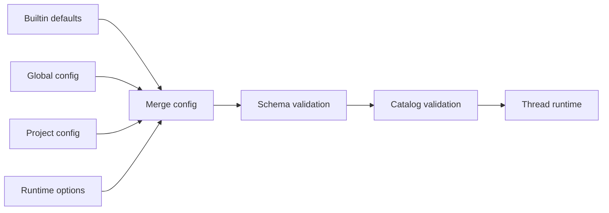

# 配置 ello

ello 同时使用个人凭证、模型目录和项目行为配置。个人凭证适合保存在用户目录，
工具与上下文策略可以随项目共享，临时运行参数只影响本次启动。配置系统把这些来源
合并成一份运行配置，并在创建 thread 前检查字段和模型引用。

## 为什么需要配置作用域？

同一位用户会在多个项目中使用 ello。API key、默认模型和默认 Agent 属于个人环境，
项目允许访问的路径、工具策略和上下文来源属于仓库环境。两类配置分别保存后，项目
可以共享协作约定，同时保留每位用户自己的模型服务和凭证。

## 快速开始

ello 首次启动时创建 `~/.ello/config.yaml` 和 `~/.ello/mcp.json`。已有文件会原样保留。
默认配置包含 OpenAI 和 Anthropic 的连接、模型目录及两个 profile。

在启动 ello 的 Shell 中设置凭证：

```bash
export OPENAI_API_KEY="..."
export ANTHROPIC_API_KEY="..."
ello
```

默认的 `main` profile 使用以下模型：

| Role      | 模型                          | 用途                      |
| --------- | ----------------------------- | ------------------------- |
| `primary` | `openai/gpt-5.5`              | 主 Agent                  |
| `small`   | `openai/gpt-5.4`              | 轻量后台任务与 Subagent   |
| `compact` | `openai/gpt-5.4`              | 上下文压缩与摘要          |
| `title`   | `openai/gpt-5.4`              | Thread 标题生成           |
| `review`  | `anthropic/claude-sonnet-4.6` | 绑定 review role 的 Agent |

只使用 Anthropic 时，可以为当前 thread 选择内置的 `anthropic` profile：

```text
/profiles anthropic
```

非交互运行使用同一个 profile 名：

```bash
ello run --profile anthropic "检查这个仓库的测试失败"
```

TUI 提供三个配置入口：

| 命令        | 用途                                                   |
| ----------- | ------------------------------------------------------ |
| `/models`   | 查看当前可用的模型目录                                 |
| `/profiles` | 创建、删除和编辑 profile，设置新 thread 的默认 profile |
| `/settings` | 查看配置来源、生效时机，并写入全局或项目配置           |

`/profiles <name>` 修改当前 thread。打开 `/profiles` 列表后，`f` 把选中的 profile 写入
全局 `active_profile`，供后续新 thread 使用。

## 配置文件

**全局配置**位于 `~/.ello/config.yaml`，适合保存以下内容：

- Provider 连接和凭证来源；
- `profile`、`active_profile` 和 `default_agent`；
- 所有项目共用的会话模式、工具和上下文默认值。

**项目配置**位于 `<project>/.ello/config.yaml`，适合保存以下内容：

- 项目所需的工具和上下文策略；
- `allowed_paths`、`permission_rules` 和项目行为；
- 仅供当前项目使用的 Provider 与 Model 声明。

项目配置中的相对路径以当前项目目录为基准。`profile`、`active_profile` 和
`default_agent` 只接受全局定义；把这些字段写入项目配置会产生校验错误。

`ELLO_HOME` 可以把全局目录迁移到其他位置，适合隔离测试环境：

```bash
ELLO_HOME=/tmp/ello-home ello
```

### 合并顺序

配置按以下优先级合并，右侧来源覆盖左侧来源：

```text
内置默认值 < ~/.ello/config.yaml < <project>/.ello/config.yaml < 本次运行参数
```



普通对象按字段递归合并，数组和标量由高优先级来源整体替换。`profile` map 在某一层
出现时整体替换低优先级的 profile map。手工添加 profile 时，应在同一个 `profile:`
节点中保留仍需使用的其他 profile。TUI 的 `/profiles` 会精确修改选中的 profile 或 role。

### 生效时机

`/settings` 在每个设置旁显示当前来源和生效时机：

| 标记        | 生效范围                           |
| ----------- | ---------------------------------- |
| `immediate` | 当前界面或当前运行立即应用         |
| `nextTurn`  | 当前 thread 的下一个 turn          |
| `newThread` | 新建 thread 后应用                 |
| `restart`   | 重启对应的 Client 或 Server 后应用 |

选择设置后可以写入 `global` 或 `project`，也可以删除某一层的值，让低优先级配置重新
生效。Provider 的 key、header 和 options 只接受盲写，配置读取响应不会返回这些值。

## 常用项目配置

初次使用建议保留 `ask-before-changes`，让文件修改、Shell 和网络操作进入审批。项目级
配置可以按团队需求调整工具和上下文：

```yaml
initial_mode: ask-before-changes

tools:
  disabled:
    - web_fetch
  need_approval:
    - bash
  routing_enabled: false

context:
  instructions:
    project:
      - AGENTS.md
      - .ello/ELLO.md
      - .ello/instructions.md
    nearby: true
```

常用字段按用途分组：

| 配置路径                         | 默认值               | 用途                          |
| -------------------------------- | -------------------- | ----------------------------- |
| `initial_mode`                   | `ask-before-changes` | 新 thread 的权限模式          |
| `bypass_enabled`                 | `false`              | 允许新 thread 进入 `bypass`   |
| `tools.disabled`                 | `[]`                 | 从运行时移除指定工具          |
| `tools.need_approval`            | `[]`                 | 让指定工具固定进入审批        |
| `context.max_input_tokens`       | `160000`             | 单次模型输入预算              |
| `context.reserved_output_tokens` | `8000`               | 为模型输出预留的 token        |
| `context.memory.enabled`         | `false`              | 启用跨 thread Memory          |
| `goal.max_continuations`         | `20`                 | Goal 自动续跑的 host 次数上限 |
| `workspace.mount`                | `~/.ello`            | Workspace 与归档目录的挂载根  |

`initial_mode: bypass` 需要同时设置 `bypass_enabled: true`。权限模式与持久规则见
[权限与审批](../permission/README.md)，Memory 的目录和使用方式见
[Memory](../memory/README.md)。

## Provider、Model 与 Profile

模型配置分成三层，让连接信息、模型能力和任务用途可以独立调整：

- **Provider** 描述服务类型、URL、凭证、HTTP header 和 SDK options；
- **Model** 描述 API model id、endpoint、上下文限制和能力；
- **Profile** 把五个 role 绑定到明确的 `provider/model`。


### 管理 Profile

一个 profile 需要声明全部五个 role：

| Role      | 典型用途                           |
| --------- | ---------------------------------- |
| `primary` | 主 Agent 的编码与问答              |
| `small`   | 探索、审查和轻量内部任务           |
| `compact` | 上下文压缩、会话摘要和 Memory 整理 |
| `title`   | Thread 标题                        |
| `review`  | 自定义审查 Agent                   |

ello 按 role 直接选择模型。每个 role 都可以附带 `reasoning_effort`、`temperature`、
`top_p`、`top_k` 和 `provider_options`。模型能力不支持的参数会在调用前移除。

使用 `/profiles` 可以复制现有 profile、修改单个 role 的模型并设置全局默认值。CLI 的
`--profile <name>` 选择本次 thread 使用的套件，`--model <provider/model>` 临时指定
当前 thread 的模型。

### 接入 OpenAI-compatible 服务

自定义服务需要同时添加 Provider、Model 和 Profile。以下配置可以作为独立的全局
配置使用；`endpoint` 应根据网关协议选择 `responses` 或 `chat`。

```yaml
active_profile: gateway
initial_mode: ask-before-changes

provider:
  gateway:
    name: Team Gateway
    enabled: true
    kind: openai-compatible
    api_key_env: GATEWAY_API_KEY
    base_url: https://gateway.example.com/v1

models:
  gateway:
    coding:
      provider: gateway
      api_id: coding-model
      endpoint: responses
      context: 128000
      output: 16000
      reasoning: true
      temperature: false
      tool_call: true

profile:
  gateway:
    label: Team Gateway
    description: 团队网关的默认模型套件。
    models:
      primary: gateway/coding
      small: gateway/coding
      compact: gateway/coding
      title: gateway/coding
      review: gateway/coding
    settings:
      primary:
        reasoning_effort: medium
      small:
        reasoning_effort: low
      compact:
        reasoning_effort: low
      title:
        reasoning_effort: low
      review:
        reasoning_effort: high
```

```bash
export GATEWAY_API_KEY="..."
ello
```

Model ref 使用单个 `/` 分隔 Provider id 和 Model id，例如 `gateway/coding`。Model 所在
的 `models.gateway` 路径、其 `provider: gateway` 字段和 Profile 引用需要一致。

### 凭证来源

Provider 按以下顺序读取凭证，找到有效值后停止：

| 顺序 | 字段           | 用法                                     |
| ---- | -------------- | ---------------------------------------- |
| 1    | `api_key`      | 直接值或 `${ENV_NAME}`                   |
| 2    | `api_key_file` | 包含 key 的文件，路径支持 `~` 和环境变量 |
| 3    | `api_key_env`  | 环境变量名称                             |

个人环境优先使用 `api_key_env` 或权限受控的 `api_key_file`。`api_key`、Provider headers
和 options 会在 RPC 响应中脱敏。环境变量需要传入运行 App Server 的进程；远程模式下，
凭证配置位于远程 Server。

## 加载与校验

配置加载包含两类检查：

- Schema 检查 YAML 字段、类型、默认值和跨字段约束；
- Catalog 检查 Provider、Model、Profile 与 active profile 的引用关系。

TUI 通过 Config RPC 写入设置。Server 先构造候选配置并完成两类检查，再把内容写入
同目录临时文件并原子替换目标文件。校验或写盘失败时，原文件保持可用。新文件权限为
`0600`，已有文件沿用原权限。

手工编辑 YAML 时，Server 会在下次加载配置时执行相同检查。YAML 使用 snake_case，
根节点中的未知字段会触发校验错误。

## 常见问题

| 现象或错误                               | 检查项                                                         |
| ---------------------------------------- | -------------------------------------------------------------- |
| 启动时提示未知字段                       | 字段使用 snake_case；删除旧版或拼写错误的字段                  |
| `Project config must not define ...`     | 把 `profile`、`active_profile` 或 `default_agent` 移到全局配置 |
| `Unknown active profile`                 | `active_profile` 与 `profile` map 中的名称一致                 |
| `references unknown model`               | 五个 role 都引用已启用且已声明的 `provider/model`              |
| 模型请求返回认证错误                     | key 存在于 App Server 进程环境，变量名与 `api_key_env` 一致    |
| `reserved_output_tokens` 校验失败        | 该值小于 `context.max_input_tokens`                            |
| `bypass_enabled must be true`            | 为 `bypass` 开启安全开关，或把 `initial_mode` 改为其他模式     |
| `/settings` 修改后当前 thread 仍使用旧值 | 查看设置旁的 `nextTurn`、`newThread` 或 `restart` 标记         |

`~/.ello/mcp.json` 单独保存 MCP Server 配置。Agent 定义既可以写入 `config.yaml`，也可以
使用 Markdown 文件；格式和覆盖顺序见[Subagents](../subagents/README.md)。
