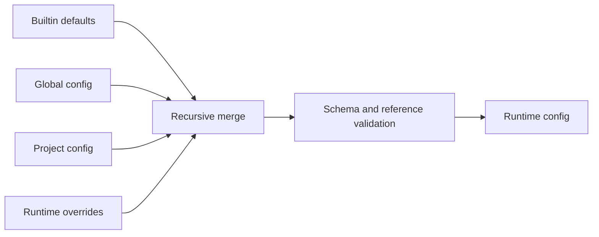

# 配置 ello

ello 使用一个命名 `models` 目录管理模型。每个 model 条目同时包含协议、连接地址、
凭证环境变量、上下文窗口和输出限制；`primary_model` 与 `auxiliary_model` 决定 Agent
实际选择哪个条目。当前配置系统没有 profile，也没有独立的 provider 配置层。

## 快速开始

ello 首次启动时创建：

- `~/.ello/config.yaml`：全局模型与运行配置；
- `~/.ello/mcp.json`：MCP Server 配置。

默认模型目录包含两个 OpenAI model：

| 引用              | 默认 model       | 用途                                         |
| ----------------- | ---------------- | -------------------------------------------- |
| `primary_model`   | `openai-gpt-5.5` | 主 Agent                                     |
| `auxiliary_model` | `openai-gpt-5.4` | compact、title、summary、memory 等内部 Agent |

启动前把 model 声明的 `api_key_env` 注入 App Server 进程：

```bash
export OPENAI_API_KEY="..."
ello
```

TUI 提供三个相关入口：

| 命令              | 用途                                         |
| ----------------- | -------------------------------------------- |
| `/models`         | 查看模型目录，并修改两个全局 model 引用      |
| `/effort <level>` | 修改当前 Agent 所用 model 的 thinking effort |
| `/settings`       | 查看普通运行设置的来源和生效时机             |

模型目录不通过 `/settings` 编辑。`/models` 会先选择 `primary_model` 或
`auxiliary_model`，再把选中的 model 名写入全局配置。新增 model 或修改其连接字段时，
直接编辑全局 `~/.ello/config.yaml`，或通过 Config RPC 写入全局配置。

`/effort` 支持 `low`、`medium`、`high`、`xhigh`、`max`。Agent Server 根据当前
Thread 的 agent 定义解析实际 model，并把结果写入全局 `config.yaml`；从下一个 Turn
开始生效。

## 完整模型配置

最小的 OpenAI Responses 配置如下：

```yaml
models:
  openai-gpt-5.5:
    protocol: openai
    endpoint: responses
    api_model: gpt-5.5
    base_url: https://api.openai.com/v1
    api_key_env: OPENAI_API_KEY
    context_window: 400000
    max_output_tokens: 32000
    reasoning_effort: high

  openai-gpt-5.4:
    protocol: openai
    endpoint: responses
    api_model: gpt-5.4
    base_url: https://api.openai.com/v1
    api_key_env: OPENAI_API_KEY
    context_window: 400000
    max_output_tokens: 16000
    reasoning_effort: low

primary_model: openai-gpt-5.5
auxiliary_model: openai-gpt-5.4
initial_mode: ask-before-changes
```

`primary_model` 和 `auxiliary_model` 必须引用 `models` 中已经声明的名称。Agent 定义不
直接绑定 model 名，而是选择这两个引用之一：

```yaml
agent:
  reviewer:
    mode: subagent
    model: auxiliary_model
    description: Review the current implementation.
    max_turns: 20
```

### Model 字段

所有协议共用以下字段：

| 字段                | 含义                                         |
| ------------------- | -------------------------------------------- |
| `protocol`          | `openai`、`anthropic` 或 `openai-compatible` |
| `api_model`         | 发送给远端 API 的模型标识                    |
| `base_url`          | API 根地址，必须是合法 URL                   |
| `api_key_env`       | App Server 读取凭证的环境变量名              |
| `http_headers`      | 可选的额外 HTTP headers                      |
| `context_window`    | 模型总上下文窗口                             |
| `max_output_tokens` | 单次调用允许的最大输出                       |
| `reasoning_effort`  | thinking/reasoning 档位，默认 `medium`       |

`reasoning_effort` 可选值为：

```text
none | minimal | low | medium | high | xhigh | max
```

该字段统一传给 AI SDK 的 reasoning 设置。OpenAI、Anthropic 和 OpenAI-compatible
协议会由各自 provider 转换为对应的 thinking/reasoning 参数；设为 `none` 可显式关闭。
`max` 表示当前 SDK 可表达的最高档位；运行时会映射为 provider 的最高 reasoning 设置。

运行时还会对每次模型调用施加安全上限：实际发送给 provider 的
`maxOutputTokens` 不超过 `65,536`，单次流式 reasoning 超过 `262,144` 个字符时会中断
该调用并在下一回合继续。配置值可以低于这些上限；更高的值不会放大单次调用的占用。

协议专属字段：

| 协议                | 必需字段                                        |
| ------------------- | ----------------------------------------------- |
| `openai`            | `endpoint: responses` 或 `endpoint: chat`       |
| `openai-compatible` | `endpoint: responses` 或 `endpoint: chat`       |
| `anthropic`         | `auth_scheme: api-key` 或 `auth_scheme: bearer` |

`http_headers` 不能覆盖当前协议使用的认证 header：Anthropic `api-key` 模式保留
`x-api-key`，其他模式保留 `authorization`。Header 名称按大小写不敏感规则检查重复。

## 接入自定义服务

### OpenAI-compatible

自定义网关只需要新增一个完整 model 条目，不需要额外声明 provider 或 profile：

```yaml
models:
  gateway-coding:
    protocol: openai-compatible
    endpoint: responses
    api_model: coding-model
    base_url: https://gateway.example.com/v1
    api_key_env: GATEWAY_API_KEY
    context_window: 128000
    max_output_tokens: 16000
    reasoning_effort: medium
    http_headers:
      X-Team-Route: coding

primary_model: gateway-coding
auxiliary_model: gateway-coding
```

```bash
export GATEWAY_API_KEY="..."
ello
```

### Anthropic 协议

```yaml
models:
  team-anthropic:
    protocol: anthropic
    auth_scheme: bearer
    api_model: team-sonnet
    base_url: https://gateway.example.com/anthropic/v1
    api_key_env: ANTHROPIC_API_KEY
    context_window: 200000
    max_output_tokens: 32000
    reasoning_effort: medium

primary_model: team-anthropic
auxiliary_model: team-anthropic
```

`api_key_env` 是唯一的 model 凭证来源。配置文件保存环境变量名称，不保存 key 本身；
远程 App Server 模式下，环境变量必须存在于远程 Server 进程中。

## Context 预算

默认值：

| 配置路径                                    | 默认值    | 用途                    |
| ------------------------------------------- | --------- | ----------------------- |
| `context.max_input_tokens`                  | `1000000` | 配置侧输入窗口上限      |
| `context.compaction.threshold_percent`      | `90`      | checkpoint 自动压缩水位 |
| `context.compaction.preserve_recent_tokens` | `20000`   | 压缩后近期消息目标量    |

运行时可用输入容量同时受 model 和 context 配置限制：

```text
available_input = min(context.max_input_tokens, model.context_window)
```

system prompt、工具定义和消息历史共同消耗 `available_input`。消息历史估算达到
`available_input * threshold_percent / 100` 时自动生成 checkpoint。
`max_output_tokens` 只控制生成输出，不参与输入容量或压缩水位计算。详细裁剪和 checkpoint 行为见
[Compact](../compact/README.md)。

## 配置文件与作用域

### 全局配置

路径：`~/.ello/config.yaml`

适合保存：

- `models`、`primary_model`、`auxiliary_model`；
- `default_agent` 和全局 Agent 定义；
- 默认权限模式、工具、上下文、Memory 和观测设置。

### 项目配置

路径：`<project>/.ello/config.yaml`

适合保存项目共享的工具、上下文、Memory、权限和行为配置。项目配置禁止声明：

- `models`
- `primary_model`
- `auxiliary_model`
- `default_agent`

这些字段只能位于全局配置或本次运行 override 中。项目配置里的相对路径以项目目录
为基准。

`ELLO_HOME` 可以迁移全局目录，适合测试隔离：

```bash
ELLO_HOME=/tmp/ello-home ello
```

### 合并顺序

配置按以下顺序递归合并，右侧覆盖左侧：

```text
内置默认值 < ~/.ello/config.yaml < <project>/.ello/config.yaml < 本次运行参数
```


```mermaid
flowchart LR
  Defaults[Builtin defaults] --> Merge[Recursive merge]
  Global[Global config] --> Merge
  Project[Project config] --> Merge
  Runtime[Runtime overrides] --> Merge
  Merge --> Schema[Schema and reference validation]
  Schema --> RuntimeConfig[Runtime config]
```

普通对象按字段递归合并；数组和标量由高优先级来源整体替换。`models` 也是普通命名
map，因此全局配置可以覆盖内置 model 的单个字段或添加新 model。项目层在合并前会
拒绝整个 model 目录及两个 model 引用。

## 常用运行配置

```yaml
initial_mode: ask-before-changes
title_generation: false

tools:
  disabled:
    - web_fetch
  need_approval:
    - bash

context:
  max_input_tokens: 1000000
  instructions:
    project:
      - AGENTS.md
      - .ello/ELLO.md
      - .ello/instructions.md
    nearby: true
```

常用字段：

| 配置路径                 | 默认值               | 用途                         |
| ------------------------ | -------------------- | ---------------------------- |
| `default_agent`          | `build`              | 新 thread 默认主 Agent       |
| `initial_mode`           | `ask-before-changes` | 新 thread 的权限模式         |
| `bypass_enabled`         | `false`              | 允许进入 `bypass`            |
| `title_generation`       | `false`              | 使用辅助模型生成 Thread 标题 |
| `tools.disabled`         | `[]`                 | 从运行时移除指定工具         |
| `tools.need_approval`    | `[]`                 | 让指定工具固定进入审批       |
| `context.memory.enabled` | `false`              | 启用跨 thread Memory         |
| `goal.max_continuations` | `20`                 | Goal 自动续跑上限            |
| `workspace.mount`        | `~/.ello`            | Workspace 与归档目录挂载根   |

`initial_mode: bypass` 必须同时设置 `bypass_enabled: true`。`title_generation: true`
使用 `auxiliary_model` 生成标题；关闭时直接使用第一条用户消息。

## 加载、写入与脱敏

配置在加载时执行以下检查：

- YAML 字段、类型与未知字段检查；
- `primary_model`、`auxiliary_model` 引用检查；
- model 协议字段和跨字段约束；
- context、输出和 compaction 预算检查；
- project scope 禁止字段检查。

Config RPC 会先构造候选配置并完成校验，再通过同目录临时文件原子替换目标文件。
校验或写盘失败时原文件保持不变。读取配置的 RPC 会递归移除认证 header、key、token
和 credential 字段；`api_key_env` 等凭证相关字段不会返回给 Client。

`/settings` 为普通运行字段显示来源和生效时机：

| 标记        | 生效范围                         |
| ----------- | -------------------------------- |
| `immediate` | 当前界面或当前运行立即应用       |
| `nextTurn`  | 当前 thread 的下一个 turn        |
| `newThread` | 新建 thread 后应用               |
| `restart`   | 重启对应 Client 或 Server 后应用 |

## 常见问题

| 现象或错误                                      | 检查项                                                  |
| ----------------------------------------------- | ------------------------------------------------------- |
| 启动时提示未知字段                              | 删除旧版 `provider`、`profile`、`active_profile` 等字段 |
| `Project config must not define models`         | 把模型目录移到全局 `~/.ello/config.yaml`                |
| `references unknown model`                      | 两个 model 引用必须匹配 `models` 下的名称               |
| `Required model credential is missing or empty` | App Server 环境中存在 `api_key_env` 指定的变量          |
| `max_output_tokens` 校验失败                    | 该值不能超过 `context_window`                           |
| compaction `threshold_percent` 校验失败         | 该值必须大于 `0` 且不超过 `100`                         |
| `bypass_enabled must be true`                   | 开启安全闸门，或改用其他 `initial_mode`                 |

`~/.ello/mcp.json` 单独保存 MCP Server 配置。配置格式、工具命名、资源读取和连接生命周期见
[MCP 工具接入](../tools/mcp.md)；权限规则见[Permission](../permission/README.md)。
