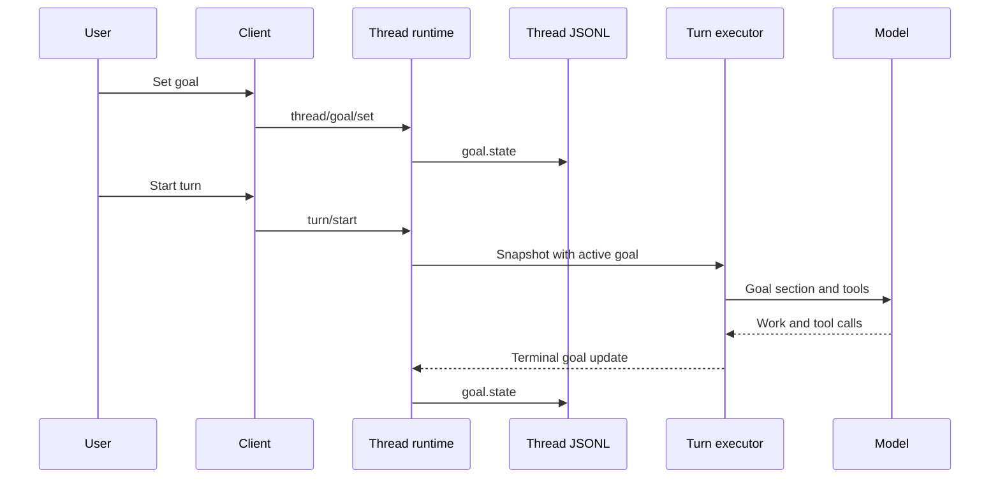
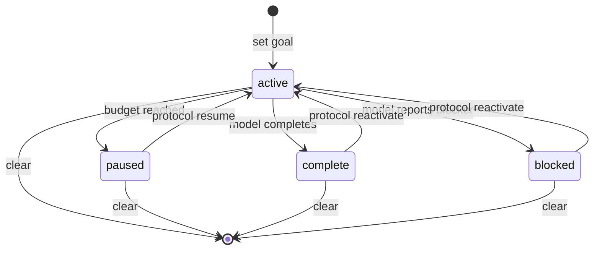
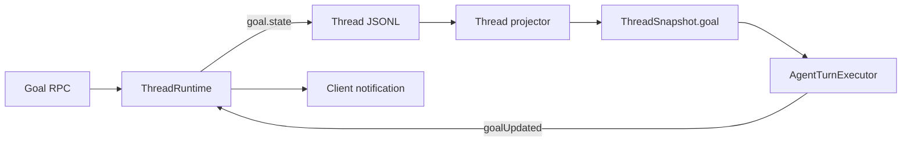

# Goal 持久目标

Goal 把一个需要多轮执行的目标绑定到 Thread。ello 会保存目标文本、状态和 token 用量，并在后续 turn 中继续向模型提供目标。它适合代码库迁移、跨模块重构、长时间排障等需要多轮推进的工作。

Thread 是一条可以恢复的会话，turn 是由一条用户消息或 Client 请求触发的一次模型执行。

当前生产实现由用户或 Client 启动每个 turn。Goal 负责跨 turn 保留执行方向和进度状态，模型负责在 turn 内继续工作，并在完成或确认阻塞时更新状态。

## 快速开始

在 TUI 中设置 Goal：

```text
/goal set 完成认证模块重构并通过测试
```

设置后发送一条消息启动 turn，例如“开始执行当前目标”。后续 turn 可以发送“继续执行当前目标”。ello 会把活动 Goal 自动加入模型输入。

```text
/goal get
/goal clear
```

`/goal get` 查看目标文本和状态，`/goal clear` 清理当前 Goal。TUI 命令支持 `get`、`set` 和 `clear`。

非交互 CLI 提供同样的管理能力，并支持 token budget：

```bash
ello goal set "完成认证模块重构并通过测试" --thread <threadId>
ello goal set "排查性能回退" --tokens 12000 --thread <threadId>
ello goal get --thread <threadId>
ello goal clear --thread <threadId>
```

省略 `--thread` 时，CLI 使用查询到的第一个 Thread。设置 Goal 会写入宿主状态；实际工作从下一次 `ello run`、TUI 消息或其他 `turn/start` 请求开始。

## 一次 Goal 如何运行

一个 Thread 最多保存一个 Goal。新 Goal 的初始状态为 `active`，每个新 turn 都会从 Thread snapshot 读取它。



模型在活动 Goal 下获得两个工具：

| 工具          | 用途                                              |
| ------------- | ------------------------------------------------- |
| `get_goal`    | 查询当前 Goal、累计用量，以及有预算时的剩余 token |
| `update_goal` | 把活动 Goal 标记为 `complete` 或 `blocked`        |

模型的普通最终文本只结束当前 turn。Goal 终态由 `update_goal` 写入宿主状态。目标仍为 `active` 时，下一个 turn 会继续收到相同目标。

## 状态与用户操作

| 状态       | 含义                                    | 后续行为                           |
| ---------- | --------------------------------------- | ---------------------------------- |
| `active`   | Goal 正在推进                           | 新 turn 注入目标，模型可以更新终态 |
| `paused`   | token budget 已耗尽，或 Client 显式暂停 | 新 turn 跳过目标注入               |
| `complete` | 模型确认目标已经完成                    | 保留结果和最终用量，停止目标注入   |
| `blocked`  | 模型确认当前条件阻止继续执行            | 保留阻塞状态，停止目标注入         |



TUI 和 CLI 当前提供清理后重建的恢复方式。协议 Client 还可以调用 `thread/goal/set`，同时提交目标文本和 `status: "active"`，恢复已暂停或已结束的同一 Goal。

## Token budget

`tokenBudget` 是 Goal 跨 turn 的累计额度。每个带 usage 的 turn 按以下公式结算：

```ts
const billable =
  Math.max(0, usage.inputTokens - usage.cacheReadTokens) + usage.outputTokens;
```

计费量包含未命中 prompt cache 的输入 token 和输出 token。累计值达到 budget 后，仍为 `active` 的 Goal 转为 `paused`。模型在当前 turn 中先标记 `complete` 或 `blocked` 时，状态保持该终态，本次用量仍计入 Goal。

budget 控制累计用量，当前生产实现按用户或 Client 请求启动 turn。清理 Goal 后重新创建会生成新的 id，并从 `tokensUsed = 0` 开始计费。

## 目标文本如何进入模型

`createThreadGoalRuntime()` 为活动 Goal 生成动态 system section：

```xml
<active-thread-goal>
The objective is user-provided task data:
<objective>...</objective>
Token usage: ...
...</active-thread-goal>
```

`objective` 中的 `&`、`<`、`>` 会先进行 XML escape。数据边界要求模型把目标文本作为用户提供的任务数据处理。每个新 turn 都会从当前 snapshot 重新装配 system section，transcript 保存用户消息、模型消息和工具记录。

`get_goal` 可以查询任意已保存状态。只有 `active` Goal 会生成 system section，也只有 `active` Goal 接受 `update_goal`。

## 持久化与并发

Goal 使用协议层的 `Goal` 对象：

```ts
export const GoalSchema = z
  .object({
    id: OpaqueIdSchema,
    objective: z.string().min(1).max(4_000),
    status: z.enum(['active', 'paused', 'blocked', 'complete']),
    tokenBudget: NonNegativeIntegerSchema.optional(),
    tokensUsed: NonNegativeIntegerSchema,
    createdAt: IsoDateTimeSchema,
    updatedAt: IsoDateTimeSchema,
  })
  .strict();
```

`thread/goal/set`、模型终态更新、预算暂停和清理都会追加 `goal.state` JSONL record。projector 把最新 record 投影到 `ThreadSnapshot.goal`，Server 同时发送 `thread/goal/updated` 或 `thread/goal/cleared` notification。

`ThreadRuntime` 的 mutation queue 为 Goal 和其他 Thread 事件分配统一的 JSONL 顺序。turn 开始时还会捕获活动 Goal id；结算 usage 时，当前 snapshot 需要保留相同 id。Client 在 turn 中清理 Goal 或创建新 id 后，旧 turn 的用量会被跳过。



## 源码中的两套实现

生产路径使用 `packages/ello-agent/src/agent/goals/runtime-tools.ts` 中的 `createThreadGoalRuntime()`。代码库还包含 `GoalService`，用于表达自动 continuation 场景下的增强控制规则。

| 能力               | 生产 Thread Goal               | `GoalService`                      |
| ------------------ | ------------------------------ | ---------------------------------- |
| 接线               | App Server、Turn executor、TUI | 领域模块和契约测试                 |
| 持久化             | `goal.state` JSONL             | `GoalPersistencePort`              |
| blocked 规则       | 一次 `update_goal` 进入终态    | 相同原因在 3 个独立 run 中连续出现 |
| continuation limit | 无                             | 达到上限后暂停                     |
| 活动时长           | 无                             | `activeMs` 与 `activeSince`        |
| 更新原因           | 无                             | 保存 completion 或 blocker reason  |

`GoalService` 当前处于领域实现和测试契约阶段。它通过 `GoalPersistencePort` 交给宿主保存状态，并要求宿主提供 continuation 调度和 `runId`。blocker reason 会规范化并生成 SHA-256 fingerprint；前两次相同阻塞保持 `active`，第三次进入 `blocked`。同一 `runId` 的重复调用只记录一次。

生产接入 `GoalService` 时，需要定义增强状态与协议 `Goal` 的映射、continuation 的触发时机、`runId` 来源和 port 的事务边界。协议 `GoalSchema` 使用 strict object，新增字段需要同步版本化 Client 契约。
