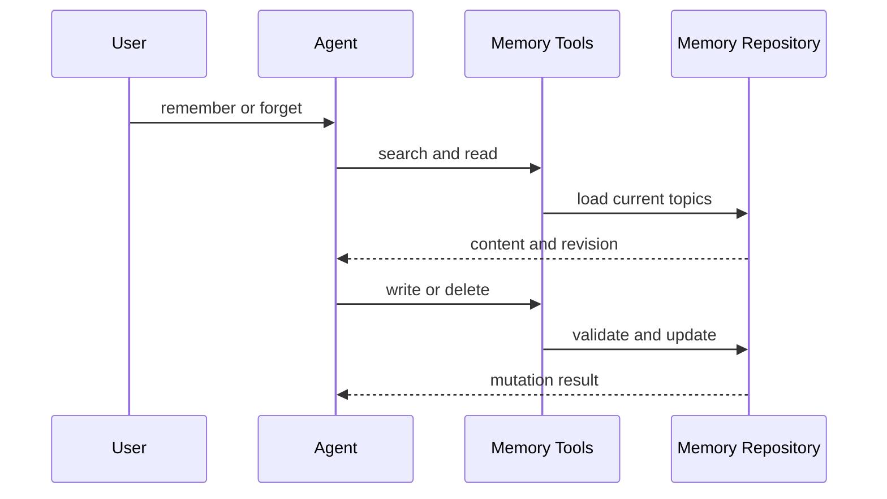
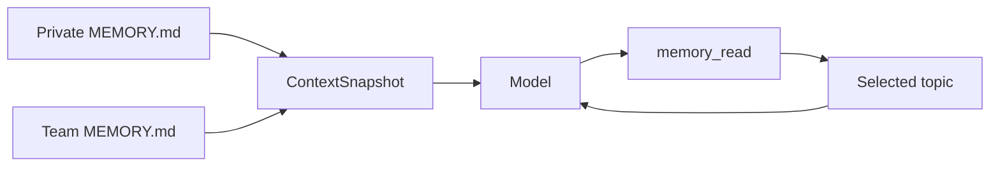

# Memory

Memory 保存跨对话仍有用的信息，让后续对话可以继续沿用用户偏好、协作反馈和项目背景。每条 Memory 都是一个可审阅的 Markdown topic，private 与 team 两个 scope 分别承担个人信息和项目共享信息。

## 为什么需要 Memory？

Thread 历史记录当前对话，Plan 和 Task 跟踪当前工作。用户偏好、团队反馈和外部系统入口通常需要跨越多次对话，Memory 为这些信息提供独立的长期存储。

| 信息                                     | 保存位置                              |
| ---------------------------------------- | ------------------------------------- |
| 当前用户的角色、偏好和知识背景           | private Memory                        |
| 用户对协作方式的长期反馈                 | private Memory；项目级约定可使用 team |
| 代码中无法推导的项目目标、期限和协调信息 | project Memory，通常使用 team         |
| Linear、Grafana、Slack 等外部信息入口    | reference Memory，通常使用 team       |
| 当前任务步骤和进度                       | Plan 或 Task                          |
| 可从源码、Git 历史或项目指令读取的事实   | 对应的事实源                          |

## 启用 Memory

Memory 默认关闭。在全局 `~/.ello/config.yaml` 或项目 `.ello/config.yaml` 中启用：

```yaml
context:
  memory:
    enabled: true
```

启用后使用以下默认目录：

| Scope   | 默认目录                  | 可见范围             |
| ------- | ------------------------- | -------------------- |
| private | `~/.ello/memory/private`  | 当前用户的后续对话   |
| team    | `<cwd>/.ello/memory/team` | 当前项目目录中的用户 |

`private_dir` 和 `team_dir` 可以在同一配置段中覆盖。ello 在首次初始化时创建目录和空的 `MEMORY.md` 索引。

CLI 和 TUI 提供状态与磁盘校验入口：

```bash
ello memory status
ello memory reload
```

- `/memory`：在 TUI 中查看状态。
- `/memory reload`：校验目录、topic 和索引的一致性，然后显示状态。

`reload` 的作用范围是磁盘初始化与一致性校验。已经开始的 user run 会继续使用创建时的 Memory 快照。

## 与 Memory 交互

用户通过自然语言要求 ello 保存或删除信息。启用 Memory 后，模型可以调用五个工具完成 list、read、search、write 和 delete。

```text
记住我偏好简短、直接的技术说明。
记住这个项目的集成测试使用真实数据库，原因是 mock 曾经掩盖迁移错误。
忘记我之前关于前端框架的偏好。
```

保存一条 Memory 时，Agent 会搜索已有 topic，选择 private 或 team，读取现有 revision，再创建或更新 topic。更新和删除使用 revision 检查，避免基于旧内容覆盖较新的版本。



`memory_write` 和 `memory_delete` 属于 workspace write。`ask-before-changes` 模式会按 permission policy 处理审批，Plan 模式会拒绝这两个 mutation 工具。

## Scope 与类型

topic 的 `type` 决定内容结构，scope 决定共享范围。

| Type        | 内容                            | Scope                           |
| ----------- | ------------------------------- | ------------------------------- |
| `user`      | 用户角色、目标、职责和知识背景  | private                         |
| `feedback`  | 用户对工作方式的纠正或确认      | 默认 private；项目约定可用 team |
| `project`   | 代码和 Git 历史中缺少的项目背景 | 通常 team                       |
| `reference` | 外部系统及其用途                | 通常 team                       |

`feedback` 和 `project` 的正文包含 `**Why:**` 与 `**How to apply:**`，让后续对话获得原因和适用范围。过时或错误的 topic 应更新或删除。

## 文件与索引

每个 topic 使用一个顶层 kebab-case Markdown 文件：

```markdown
---
name: TypeScript preference
description: Prefer strict typing
type: user
---

Use strict TypeScript for application code.
```

Repository 根据 topic frontmatter 维护同一 scope 的 `MEMORY.md`：

```markdown
- [TypeScript preference](typescript-preference.md) — Prefer strict typing
```

索引只包含 name、文件名和 description。模型在每个 user run 开始时获得 private 与 team 索引，再通过 `memory_read` 按需加载 topic 正文。topic 数量和正文长度增加时，system context 仍保持由索引上限控制的固定规模。



同一个 user run 的 ContextSnapshot 保持冻结。run 内保存的新 topic 会立即返回 mutation 结果，新索引从后续 user run 开始进入 system context。

## 当前能力

| 能力                              | 状态                                     |
| --------------------------------- | ---------------------------------------- |
| private/team topic 的 CRUD 与搜索 | 已接入 production tools                  |
| `MEMORY.md` 自动维护与上下文注入  | 已接入 production runtime                |
| revision、路径和索引一致性校验    | 已实现                                   |
| 自动 Extraction                   | 领域结构已定义，production runner 待装配 |
| `/dream` 跨会话整理               | 领域结构已定义，production runner 待装配 |

当前调用 `/dream` 或 `ello memory dream` 会返回 runner unavailable 错误。`memory/status` 返回 `state: idle` 和 `pendingJobs: 0`。

存储格式、并发边界、缓存和后台任务结构见[设计与实现](implementation.md)。
