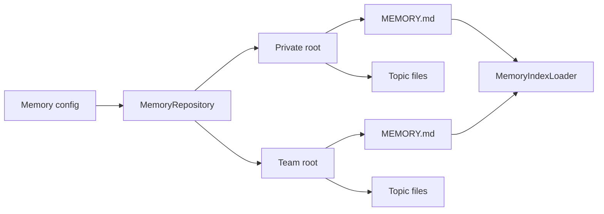
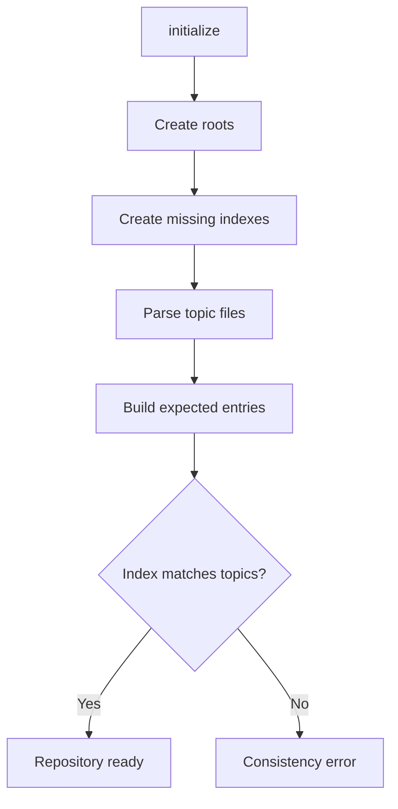
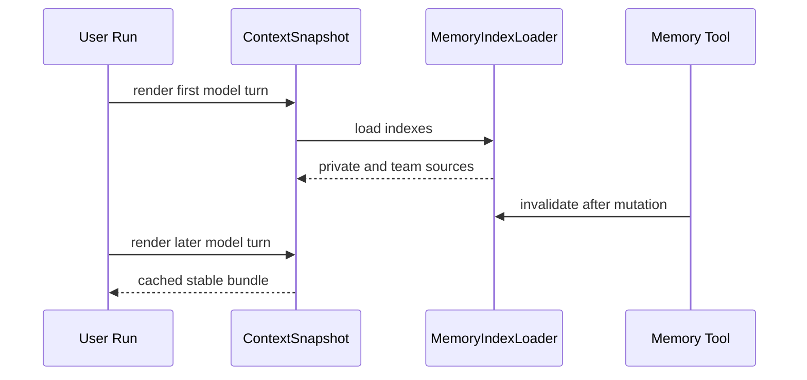
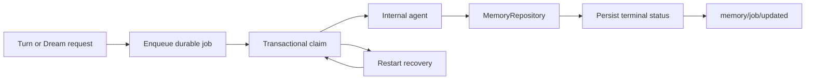

# Memory 设计与实现

本文说明 Memory 的文件契约、仓储提交、上下文加载和后台任务边界。使用配置和交互方式见 [Memory](README.md)。

## 约束与方案

Memory 同时承担长期存储和模型上下文来源，需要处理四类约束：

- 用户信息与项目共享信息具有不同的可见范围。
- topic 正文会持续增长，system context 需要固定的输入预算。
- Markdown 文件支持人工审阅和编辑，parser 与 renderer 需要稳定格式。
- 一次 mutation 同时修改 topic 和共享索引，需要检测版本冲突和中间失败。

实现将内容分成 private/team 两个 root，每个 root 使用 `MEMORY.md` 作为轻量索引，topic 正文存放在同级 Markdown 文件中。`MemoryRepository` 统一执行格式校验、revision 检查、索引重建和路径检查。



## 文件契约

topic 文件名只接受以下格式：

```text
^[a-z0-9][a-z0-9-]*\.md$
```

目录保持单层结构。`MEMORY.md`、子目录、路径分隔符、大写字符和 symlink 会触发校验错误。

frontmatter 只接受 `name`、`description`、`type`。`parseMemoryTopic()` 还会检查：

- body 去除首尾空白后至少包含一个字符。
- `description` 保持单行。
- `user` topic 使用 private scope。
- `feedback` 和 `project` body 包含 `**Why:**` 与 `**How to apply:**`。
- `name` 在同一 scope 内保持唯一。

`renderMemoryTopic()` 生成字段顺序和文件结尾稳定的规范文本。

`MEMORY.md` 每行保存一个 topic：

```markdown
- [TypeScript preference](typescript-preference.md) — Prefer strict typing
```

| 索引约束 |     上限 |
| -------- | -------: |
| 条目数   |   200 行 |
| 文件大小 |   25 KiB |
| 单行长度 | 200 字符 |

`renderMemoryIndex()` 渲染后再次调用 `parseMemoryIndex()`。`MemoryRepository.initialize()` 创建缺少的目录和空索引，然后枚举 topic、生成期望条目并比较索引结构。



手工添加 topic 后遗漏索引更新、索引指向缺失文件、条目顺序变化都会触发一致性错误。Repository 保留磁盘内容，由用户确认应保留的版本。

## Revision 与 mutation queue

每次 read 返回读取内容的 SHA-256 revision。调用方创建文件时传 `expectedRevision: null`，更新和删除时传最近一次 read 的 revision。

```ts
if (actual !== expected) {
  throw new Error(
    `Memory revision conflict for ${file}: expected ..., actual ...`,
  );
}
```

revision 检查处理同一文件的旧版本更新。不同 topic 仍会争用同一份 `MEMORY.md`，production tool runtime 使用 Promise queue 串行执行 write/delete。

```ts
const result = mutationQueue.then(operation);
mutationQueue = result.then(
  () => undefined,
  () => undefined,
);
```

| 层次           | 覆盖范围                                     |
| -------------- | -------------------------------------------- |
| revision       | 单次仓储调用中的文件版本检查                 |
| mutation queue | 同一个 production tool runtime 内的 mutation |
| `initialize()` | topic 集合与索引的事后一致性校验             |

Server RPC 会创建独立 Repository，外部编辑器也绕过 production tool runtime。当前实现尚未提供跨 runtime、跨进程的目录锁；两个调用可能在 revision 检查和 rename 之间并发提交。

## 跨文件提交

write 生成规范 topic 和完整新索引，分别写入临时文件，再依次 rename topic 和 index。


同一文件系统中的单次 rename 通常具备原子替换语义，两个 rename 之间仍有失败窗口。

| Mutation | 提交顺序                                        | index 失败后的状态            |
| -------- | ----------------------------------------------- | ----------------------------- |
| write    | topic temp → topic；index temp → index          | 新 topic 保留，索引仍为旧版本 |
| delete   | topic → backup；index temp → index；删除 backup | backup 恢复为原 topic         |

write 在 topic rename 成功、index rename 失败时会留下不一致目录，下一次 `initialize()` 会报告错误。目录级 journal、transaction marker 或 write 回滚可以收紧该故障边界。

## 路径与搜索

Memory root 只接受普通目录，并要求 `realpath(root) === path.resolve(root)`。topic 读取通过 `lstat` 检查普通文件和 symlink，再验证 resolved 文件仍位于 real root。文件名 regex 与 realpath 分别覆盖字符串路径和文件系统链接逃逸。

`memory_search` 对 name、description 和 body 执行小写 substring 匹配。body 命中时，snippet 从命中位置前最多 80 字符开始，总长度最多 240 字符。结果按 private、team 和 topic 文件名排序。分词、模糊匹配与相关度排名当前尚未实现。

## 上下文与工具

`MemoryIndexLoader` 并行读取两个 `MEMORY.md`，生成 priority 为 180 和 181 的 ContextSource。`memory.md` prompt 提供 roots、类型和操作规则，ContextSource 提供当前索引。

加载过程包含两层缓存：

| 缓存                           | 生命周期      | 失效方式                                      |
| ------------------------------ | ------------- | --------------------------------------------- |
| `MemoryIndexLoader.cached`     | loader 实例   | production mutation 成功后调用 `invalidate()` |
| `ContextSnapshot.stableBundle` | 单个 user run | 后续 user run 创建新 snapshot                 |



| 工具            | 操作                         | Production risk   |
| --------------- | ---------------------------- | ----------------- |
| `memory_list`   | 列 topic 元数据和 revision   | `readonly`        |
| `memory_read`   | 读索引或 topic               | `readonly`        |
| `memory_search` | 搜 name、description 和 body | `readonly`        |
| `memory_write`  | 创建或更新 topic，并重建索引 | `workspace-write` |
| `memory_delete` | 删除 topic，并重建索引       | `workspace-write` |

`shouldIgnoreMemory()` 识别字符串、`prompt` 字段和 user role 消息中的有限英语表达，例如 `ignore memory` 和 `do not use memory`。命中后，当前 run 跳过 Memory prompt 与索引 source。中文表达“不要使用记忆”当前不会命中正则。

`memory/reload` 通过新建 Repository 执行初始化和一致性校验。它当前无法访问 active Turn 持有的 MemoryIndexLoader 与 ContextSnapshot，已创建的 run 保持原快照。

## Extraction 与 Dream

后台能力当前处于“领域结构已定义，production runner 待装配”的状态。

| 层次                                               | 当前状态 |
| -------------------------------------------------- | -------- |
| `memory-extraction.md`、`dream.md` prompt          | 已定义   |
| builtin `memory-extractor`、`dream` internal agent | 已注册   |
| `MemoryEvent` started/completed/failed variants    | 已定义   |
| SQLite `memory_jobs` schema                        | 已定义   |
| scheduler、worker、状态通知                        | 待装配   |

`memory_jobs` 支持 queued、running、completed、failed 状态。extract 行包含 `sessionId` 与 `sourceLeafId`，dream 行的两个字段为 null。唯一索引约束相同 source 的 extract，并将同一 cwd 的 active dream 数量限制为一个。

当前 `memory/dream/start` 在检查 Memory 已启用后返回 runner unavailable，不会创建 job 或发送 `memory/job/updated`。`context.memory.extraction.enabled` 默认值为 `true`，生产 Turn 结束路径尚未使用该配置进行自动调度。

production runner 还需要补充以下边界：

- 在事务中 claim queued job，并定义进程重启后的恢复规则。
- 从 Thread log 选择边界明确的 transcript 窗口。
- 为后台 mutation 提供跨 runtime 并发协议。
- 持久化 attempts、errorMessage、时间字段和 terminal status。
- 发布 `memory/job/updated` 状态通知。
- 为 internal agent 配置独立的工具与 permission policy。
- 处理 extraction 与用户显式 mutation 的 revision 冲突。


