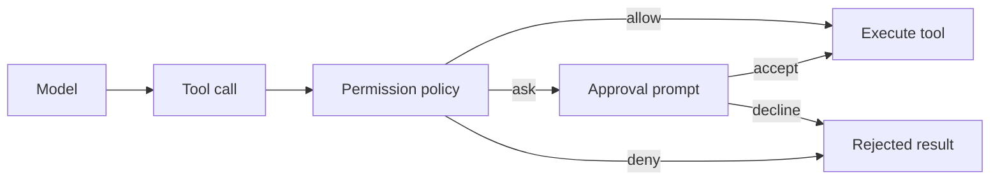
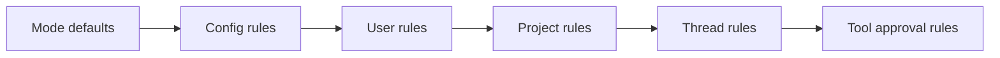
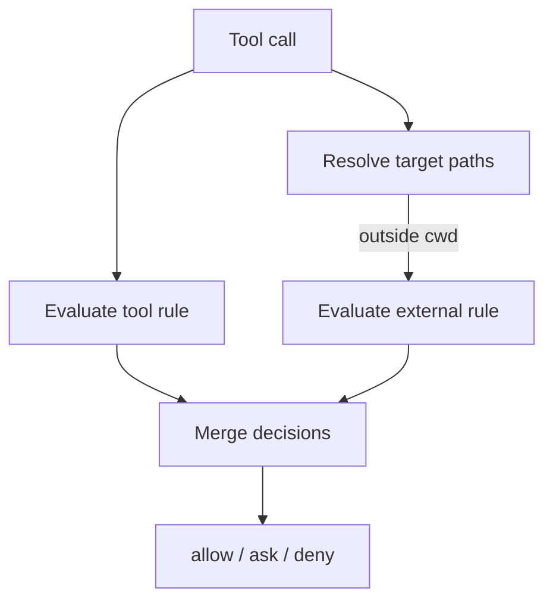

# 权限与审批

ello 可以读取和修改文件、运行 Shell 命令、访问网络并启动任务。这些操作由模型提出，
由 App Server 在执行前检查。**权限检查**结合当前会话模式、权限规则和目标路径，生成
自动执行、请求审批或拒绝三种结果。

初次使用建议保留默认的 `ask-before-changes`。读取与搜索可以直接进行，修改文件、
运行命令和访问工作区外路径时由用户逐次确认。

## 为什么需要权限控制？

一次开发任务通常包含多次工具调用。读取源码、修改配置、运行测试和访问外部目录的
影响范围不同，授权也需要分开处理。ello 按每次工具调用评估权限，用户可以查看具体
操作后再决定是否执行。

权限决策位于 Server。TUI 负责展示请求和提交用户选择，所有放行决定都由 Server 产生。



## 选择会话模式

**会话模式**提供一组基础规则。表中的行为以工作区内路径为前提；工作区外路径还要
经过单独检查。

| 模式                 | 读取与搜索 | 工作区内编辑 | Shell 与网络 | 任务 | 工作区外路径 | 适用场景                   |
| -------------------- | ---------- | ------------ | ------------ | ---- | ------------ | -------------------------- |
| `ask-before-changes` | 自动       | 审批         | 审批         | 审批 | 审批         | 日常开发与初次使用         |
| `accept-edits`       | 自动       | 自动         | 审批         | 审批 | 审批         | 连续修改已确认的项目       |
| `plan`               | 自动       | 拒绝         | 拒绝         | 审批 | 拒绝         | 先检查代码并提交计划       |
| `bypass`             | 自动       | 自动         | 自动         | 自动 | 自动         | 已隔离环境中的无人值守任务 |

启动新 thread 时可以指定模式：

```bash
ello run --mode ask-before-changes "检查并修复测试"
```

TUI 中使用 `/mode` 或 `Shift+Tab` 切换当前 thread：

```text
/mode accept-edits
```

新 thread 的默认模式来自全局或项目配置中的 `initial_mode`：

```yaml
initial_mode: ask-before-changes
bypass_enabled: false
```

`bypass` 会跳过权限规则和审批。启用它需要把 `bypass_enabled` 设为 `true`，然后创建或
切换到 `bypass` 模式。该模式适合已经通过容器、临时工作区或操作系统权限限制影响范围
的环境。

## 处理审批请求

**审批请求**会暂停当前工具调用。批准后 Server 执行原调用并恢复 Agent；拒绝结果会
返回给 Agent，Agent 可以调整后续操作。

| 选项                    | 行为                                   | 有效范围                  |
| ----------------------- | -------------------------------------- | ------------------------- |
| `Allow once`            | 执行当前工具调用                       | 当前调用                  |
| `Allow for this thread` | 执行当前调用，并添加工具提供的匹配规则 | 当前加载的 thread runtime |
| `Deny`                  | 返回拒绝结果                           | 当前调用                  |
| `Cancel`                | 以取消状态结束审批                     | 当前调用                  |

`Allow for this thread` 保存的是内存规则。Server 重启或 thread runtime 重新加载后，
相同操作会再次进入审批。规则通常匹配当前命令、文件路径或域名；命令参数或目标路径
变化后也可能再次进入审批。

批准前核对浮层中的命令、工作目录、文件路径或权限类别。Shell 请求中的危险命令会带有
风险提示。`Allow for this thread` 适合范围稳定、需要重复执行的操作，例如同一条测试
命令或同一文件的连续修改。

## 配置跨 thread 规则

跨 thread 使用的**持久规则**保存在 YAML 文件中。项目规则适合当前仓库，用户规则会
应用到本机用户启动的所有项目。

| 文件                               | 配置键             | 用途                     |
| ---------------------------------- | ------------------ | ------------------------ |
| `<project>/.ello/permissions.yaml` | `rules`            | 当前项目的权限规则       |
| `~/.ello/permissions.yaml`         | `rules`            | 当前用户的权限规则       |
| `<project>/.ello/config.yaml`      | `permission_rules` | 随项目配置加载的预设规则 |
| `~/.ello/config.yaml`              | `permission_rules` | 随全局配置加载的预设规则 |

项目权限文件可以写成：

```yaml
rules:
  - permission: edit
    pattern: docs/**
    action: allow
    scope: project
  - permission: edit
    pattern: docs/private/**
    action: deny
    scope: project
  - permission: bash
    pattern: pnpm test
    action: allow
    scope: project
```

保存文件后创建新 thread，使 Server 重新加载规则。将项目权限文件纳入版本控制时，团队
成员会共享其中的授权边界，代码审查应覆盖规则变更。

每条规则包含四个字段：

| 字段         | 可选值或格式                                                                   | 作用                               |
| ------------ | ------------------------------------------------------------------------------ | ---------------------------------- |
| `permission` | `read`、`search`、`edit`、`bash`、`web_fetch`、`task`、`external_directory` 等 | 指定能力类别                       |
| `pattern`    | 字面值、`*` 或 `**`                                                            | 匹配文件路径、命令、域名或工具目标 |
| `action`     | `allow`、`ask`、`deny`                                                         | 指定命中后的结果                   |
| `scope`      | `session`、`project`、`user`、`default`                                        | 记录规则作用域                     |

`pattern` 使用精简的 wildcard 语法：

| Pattern     | 匹配范围                 |
| ----------- | ------------------------ |
| `src/*`     | `src/` 下的一个路径段    |
| `src/**`    | `src/` 下的任意层级      |
| `pnpm test` | 完整匹配这一条命令       |
| `**`        | 当前权限类别下的所有目标 |

`*` 匹配单个路径段，`**` 可以跨路径段。匹配覆盖整个目标字符串，语法包含字面值和
这两种 wildcard。

## 规则如何生效

普通模式按以下顺序合并规则，靠后的匹配项优先：



同一来源内也采用最后匹配规则。前面的项目示例先允许 `docs/**`，随后拒绝
`docs/private/**`，所以私有目录保持拒绝。任何规则都未匹配时，结果为 `ask`。

`tools.need_approval` 可以让指定工具在普通模式下固定进入审批：

```yaml
tools:
  need_approval:
    - bash
    - web_fetch
```

各模式还会调整规则合并方式：

- `accept-edits` 把 `edit` 类的 `ask` 提升为 `allow`，显式 `deny` 和工作区外路径规则继续生效。
- `plan` 使用固定的封闭规则集，配置规则和历史授权不参与判定。
- `bypass` 在规则求值前直接返回自动执行。

一次工具调用可能包含多个目标，例如一个 patch 同时修改多个文件。任一目标命中
`deny`，整次调用都会拒绝；其余目标为 `allow` 或 `ask` 且存在 `ask` 时，整次调用进入
审批。

## 工作区外路径

thread 的 `cwd` 是默认文件边界。绝对路径以及通过 `../` 指向 `cwd` 之外的路径会增加
一次 `external_directory` 检查。工具类别与路径位置是两个独立条件：



例如，`accept-edits` 可以自动允许 `edit`，但写入 `../shared/config.yaml` 仍会请求工作区
外路径审批。持久放行外部目标时，可以添加单独的规则：

```yaml
rules:
  - permission: external_directory
    pattern: /home/me/shared/config.yaml
    action: allow
    scope: project
```

外部路径规则使用审批中显示的目标格式，精确路径适合单个外部文件或 Shell 工作目录。
边界判断会先把路径转成绝对路径并归一化 `../`。已验证的 Skill 根目录可供 `read` 和
`search` 读取；写入仍按外部目录规则处理。

## 常见情况

| 现象                                      | 检查项                                                                              |
| ----------------------------------------- | ----------------------------------------------------------------------------------- |
| 选择 `Allow for this thread` 后又出现审批 | 命令或路径发生变化；thread runtime 已重新加载；`tools.need_approval` 固定要求审批   |
| 配置了 `allow` 后仍出现审批               | 后面存在 `ask` 规则；调用同时触发了 `external_directory`                            |
| 工具直接返回拒绝                          | 当前处于 `plan`；目标命中 `deny`；多目标调用中有一个目标被拒绝                      |
| `Shift+Tab` 中找不到 `bypass`             | `bypass_enabled` 仍为 `false`                                                       |
| 项目规则未应用                            | 当前 thread 在保存规则前已加载；YAML 使用了错误的顶层键；pattern 与工具目标格式不同 |

## 实现入口

工具在审批阶段生成 `PermissionDescriptor`，其中包含权限类别、匹配目标、可保存目标、
展示信息和涉及的路径。[`policy.ts`](../../packages/ello-agent/src/agent/permissions/policy.ts)
把 descriptor、会话模式和规则合并成决策，
[`engine.ts`](../../packages/ello-agent/src/agent/permissions/engine.ts) 负责 wildcard、最后匹配
和路径判断。

[`rules-store.ts`](../../packages/ello-agent/src/agent/permissions/rules-store.ts) 加载用户、项目
和 thread 规则，并用原子替换写入持久文件。审批等待与恢复位于
[`agent-turn-executor.ts`](../../packages/ello-agent/src/agent/execution/agent-turn-executor.ts)，
TUI 通过 Server Request 提交 `Allow once`、`Allow for this thread`、`Deny` 或 `Cancel`。

RPC capability 位于另一层。它约束 Client 可以调用哪些 Server 方法；本章的权限规则约束
模型提出的具体工具调用。
