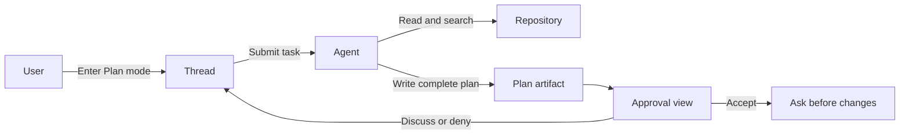
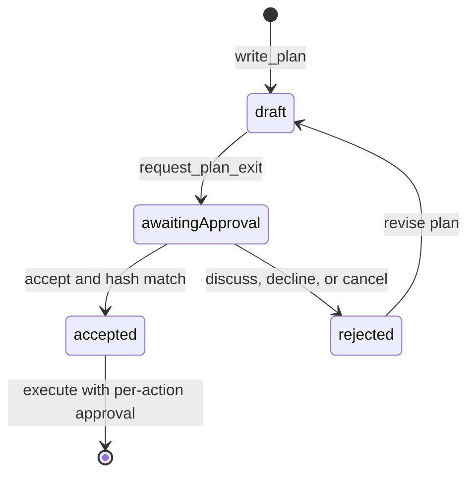
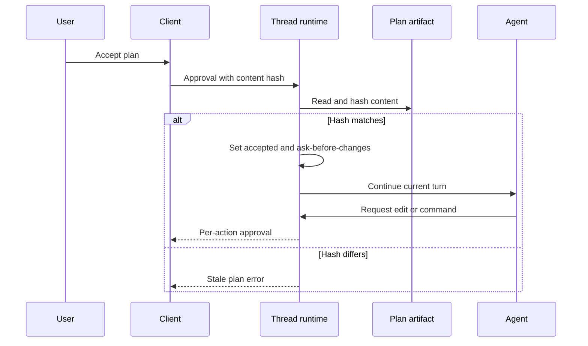

# Plan 模式

Plan 模式用于在修改代码前完成仓库调查和方案审阅。Agent 可以读取与搜索项目，业务文件保持原状；计划完成后，ello 会等待用户接受、讨论或拒绝。用户接受计划后，当前 turn 切换到 `ask-before-changes` 模式继续执行，每次文件修改和命令执行仍需单独审批。

## 为什么需要这个？

跨模块修改、迁移和故障修复通常需要先确认现有实现、依赖关系、测试范围与风险。用户需要先审阅完整方案，再决定执行范围。

Plan 模式为当前 Thread 建立一个审阅阶段。Agent 在受限权限下调查项目，把完整计划写入专用 Markdown 文件，然后发起独立的 Plan 审批。接受计划会开启执行阶段，讨论和拒绝会让 Thread 保持在 Plan 模式。



## 快速开始

在 TUI 中单独输入 `/plan`：

```text
/plan
```

底部模式标识变为 `plan` 后，发送需要调查和规划的任务：

```text
请调查登录流程，为刷新令牌轮换制定实现计划，包含测试和回滚方式。
```

Agent 完成调查后，TUI 打开 `Plan ready for approval` 面板。面板提供三个操作：

| 操作              | 结果                                                     |
| ----------------- | -------------------------------------------------------- |
| `Accept`          | 校验当前计划并切换到 `ask-before-changes`，继续当前 turn |
| `Chat about this` | 提交修改意见，Agent 更新计划后再次发起审批               |
| `Deny`            | 将当前计划标记为 `rejected`，Thread 保持在 Plan 模式     |

`/mode plan` 也可以进入 Plan 模式。`Shift+Tab` 会在可用的会话模式之间循环，底部状态栏显示当前模式。

## Plan 模式可以执行哪些操作

Plan 使用封闭权限集。项目配置、历史审批和 session allow 规则均不参与该模式的权限判定。

| 操作                                      | Plan 模式行为 |
| ----------------------------------------- | ------------- |
| 读取文件、列出目录、搜索代码              | 允许          |
| 写入当前 Thread 的 Plan artifact          | 允许          |
| 提出影响架构、范围或偏好的简短问题        | 允许          |
| 启动 task 或 subagent                     | 请求用户审批  |
| 修改业务文件                              | 拒绝          |
| 执行 Shell 命令，包括 TUI 中的 `!command` | 拒绝          |
| 访问网络或未列为只读来源的工作目录外路径  | 拒绝          |

Agent 通过 `write_plan` 写入完整计划，通过 `request_plan_exit` 发起 Plan 审批。这两个工具由 Plan 模式提供。用户问题由 `request_user_input` 处理，Plan 审批使用单独的审批面板。

## 计划如何进入执行阶段

Plan 在 Thread snapshot 中有四种状态：

| 状态               | 含义                                     |
| ------------------ | ---------------------------------------- |
| `draft`            | Agent 已写入一份完整计划                 |
| `awaitingApproval` | ello 正在等待用户处理审批                |
| `accepted`         | 计划内容通过 hash 校验，执行阶段已经开始 |
| `rejected`         | 用户选择讨论、拒绝或通过协议取消本次审批 |



接受计划时，Server 重新读取 Plan 文件并计算 SHA-256。文件 hash、Thread snapshot 中的 `contentHash` 和审批请求携带的 hash 需要一致。校验通过后，Plan 状态变为 `accepted`，会话模式变为 `ask-before-changes`，当前 turn 继续运行。



计划接受后仍采用逐项审批。执行器提交文件修改或命令时，TUI 会继续显示对应的权限请求。

审批等待期间若 Plan 文件被外部进程修改，Server 返回 stale plan 错误，Plan 保持 `awaitingApproval`，当前 turn 失败。重新提交任务或反馈后，Agent 可以生成新计划并发起新的审批。

## Plan 文件与 Thread 状态

每个 Thread 使用一个 Plan 文件：

```text
<cwd>/.ello/plans/<threadId>.md
```

`write_plan` 每次写入完整 Markdown 内容，写入前会去除首尾空白。内容长度为 1 至 256000 bytes。写入完成后，ello 计算 SHA-256，并把计划内容、文件路径、hash、状态和更新时间保存到 Thread 事件流。Client 断线重连后可以从 Thread snapshot 恢复计划及待处理审批。

`thread/plan/preview` 会重新读取文件，并比较请求 hash、snapshot hash 与文件 hash。Client 使用该 RPC 获取通过一致性校验的完整计划。

## 实现位置

| 文件                                                                                             | 职责                                    |
| ------------------------------------------------------------------------------------------------ | --------------------------------------- |
| [`artifact.ts`](../../packages/ello-agent/src/agent/plans/artifact.ts)                           | Plan 文件路径、大小限制、读写与 SHA-256 |
| [`agent-turn-executor.ts`](../../packages/ello-agent/src/agent/execution/agent-turn-executor.ts) | Plan 工具、审批请求、状态更新与模式切换 |
| [`engine.ts`](../../packages/ello-agent/src/agent/permissions/engine.ts)                         | 各会话模式的基础权限表                  |
| [`policy.ts`](../../packages/ello-agent/src/agent/permissions/policy.ts)                         | 封闭权限集与工具权限判定                |
| [`thread-runtime.ts`](../../packages/ello-agent/src/server/runtime/thread-runtime.ts)            | Plan 事件持久化、snapshot 投影与通知    |
| [`slash-commands.ts`](../../packages/ello-tui/src/cli/slash-commands.ts)                         | `/plan` 与 `/mode` 命令                 |
| [`OverlayHost.tsx`](../../packages/ello-tui/src/tui/component/OverlayHost.tsx)                   | Plan 预览、接受、讨论和拒绝界面         |
