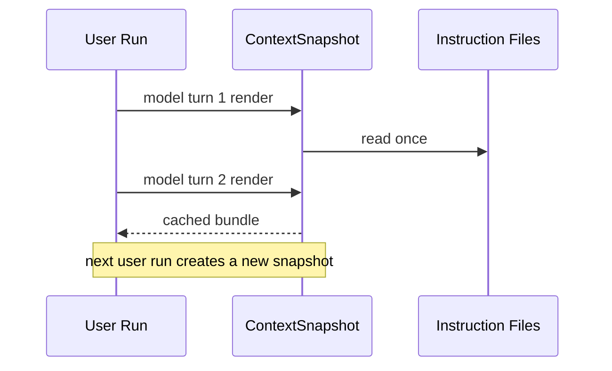

# 上下文来源与快照

## Source 的统一数据结构

每个 ContextSource 包含 `id`、`type`、`title`、`priority`、`content`、可选 `origin`、token 估算和 stale 标记。当前类型包括 instruction、memory、skill、reference、mcp、environment。

`loadContextBundle()` 串行调用 loader，随后按 id 去重。相同 id 保留 priority 更小的 source，再按 priority 和 id 稳定排序。

```ts
const current = seen.get(source.id);
if (current === undefined || source.priority < current.priority) {
  seen.set(source.id, source);
}
```

priority 数字越小，越早进入 system。Runtime environment 使用 60，global instruction 为 100，project 为 120，extra 为 140，private/team Memory index 为 180/181。

## 同一 run 为什么冻结文件内容

`ContextSnapshot` 的 `stableBundle` 是一个缓存 Promise。一个 run 内第一次 render 会读取环境、指令和 Memory index；同一 run 后续模型回合复用相同结果。下一次用户 run 创建新的 ContextSnapshot，才读取文件变化。



冻结避免一个 Agent run 内不同回合使用不同仓库规则。代价是模型在运行中修改 `AGENTS.md` 后，当前 run 不会读取新版本。

## 文件、Glob 与 URL

global 相对路径以用户 home 为基准，project 和 extra 以 cwd 为基准。带 `*?[]{} ` 特征的值交给 tinyglobby，结果转成绝对路径并排序。

来源去重使用解析后的绝对 origin。一个文件同时被 `rules/*.md` 和 `rules/a.md` 命中，只注入一次。

URL 指令使用 5 秒超时、5 分钟内存缓存和 120000 字符上限。刷新失败时：

- 有旧缓存：返回旧正文，source 标记 `stale=true`，附加 warn diagnostic。
- 无旧缓存：加载失败，run 不能继续装配 Context。

这种策略让暂时网络故障不抹掉已知规则，同时把过期状态暴露给诊断层。

## Fingerprint 记录什么

Context fingerprint 对以下字段做 SHA-256：

- prompt profile。
- base prompt 文件 hash。
- 每个 source 的 id、type、priority、origin、stale。
- source content hash。

它不把 source 正文直接写入 usage 数据。fingerprint 可用于判断两次 run 是否使用相同 Context，但不能还原内容。

## Source 事件当前如何使用

`loadContextBundle()` 可以发布 `context.source.loaded` 和 `context.source.failed`。`ContextSnapshot` 支持接收 `onContextEvent`，但生产 `composeAgent()` 创建 coding prompt 时没有传入该回调。

Context source 的数据结构和事件类型已存在，生产 Thread 事件流目前不会完整展示每个 source。`show_sources_in_tui` 配置也没有形成对应的 TUI panel。文章只把它列为已定义的诊断接口。
