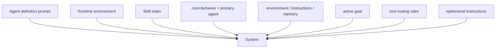

# 系统提示词如何装配

## buildModelInput 的段落顺序

`buildSystem()` 按以下顺序拼接非空段落：

1. Agent definition 的 `instructions`。
2. Runtime environment 的 `getInstructions()`。
3. `modelInput.systemSections`。
4. 单次 run 的 `ephemeralInstructions`。

段落之间用两个换行分隔。`composeAgent()` 注册的 systemSections 顺序是 Skill index、coding system prompt、Goal 动态段和工具路由动态段。



Agent definition 和 product base prompt 是两套来源。前者允许项目 agent 覆盖角色指令，后者提供全局的安全、工具和仓库工作流规则。

## Prompt profile 如何解析

`coding` profile 不是单文件。它由两个模板拼接：

```ts
if (profile === 'coding') {
  return [
    readPromptFile('core-behavior.md'),
    readPromptFile('primary-agent.md'),
  ].join('\n\n');
}
```

`subagent` 使用 `core-behavior.md + subagent.md`。`compact`、`title`、`summary`、`memory-extraction` 等 internal profile 各自读取单文件。

profile 优先级为 runtime 显式 profile → `context.system_prompt_profile` → 兼容字段 `system_prompt_profile`。模板通过 Nunjucks 渲染，统一注入 `agent_name=ello` 和调用方变量。

## 模板为什么进程内缓存

`promptFileCache` 在第一次读取后保存模板文本。运行中的 Server 不会因为 dist 目录被并发构建替换而读到一半新、一半旧的 Prompt。

缓存是进程级快照。修改 Prompt 文件后，需要重启 Server 才能稳定生效。当前没有 Prompt reload RPC。

## Context 为什么嵌入同一个 system section

`createCodingSystemPromptSection()` 先创建 `ContextSnapshot`，再把 base prompt、Memory 操作说明和稳定 context 合并。Context source 使用 XML 风格标签保留来源：

```xml
<instruction-context
  id="instruction:/repo/AGENTS.md"
  title="Project instructions: AGENTS.md"
  origin="/repo/AGENTS.md">
...
</instruction-context>
```

标签同时提供类型、id、标题、origin 和 stale 状态。模型可以区分产品规则与仓库指令，诊断层也能在不解析正文的情况下列出来源。

## Memory 的显式忽略

Memory 启用时，系统先检查当前用户输入。以下英语表达会关闭本次 run 的 Memory 注入：

```text
ignore memory
do not use the memory
don't use the memories
```

检查只读取字符串、prompt 字段或 user role 消息。assistant 历史中的“ignore memory”不会单独触发。关闭只影响当前 `ContextSnapshot`，不会修改配置或 Memory 文件。

## 当前装配的一个限制

配置中存在 `context.instructions.nearby`，但 `instructionSpecs()` 当前只构造 global、project 和 extra 三类来源。nearby 没有进入加载流程。

文档和配置界面不能把 nearby 描述成已生效能力。后续实现需要定义“从 cwd 向上还是从目标文件向上查找”、作用域优先级和重复文件处理，再接入 ContextSnapshot。
