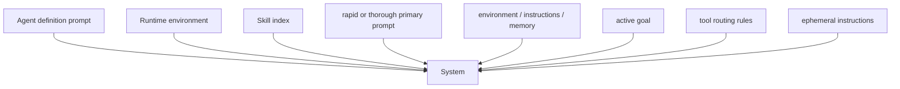

# 系统提示词如何装配

## buildModelInput 的段落顺序

`buildSystem()` 按以下顺序拼接非空段落：

1. Agent definition 的 `instructions`。
2. Runtime environment 的 `getInstructions()`。
3. `modelInput.systemSections`。
4. 单次 run 的 `ephemeralInstructions`。

段落之间用两个换行分隔。`composeAgent()` 注册的 systemSections 顺序是 Skill index、coding system prompt、Goal 动态段和工具路由动态段。


```mermaid
flowchart TD
  Def[Agent definition prompt] --> S[System]
  Env[Runtime environment] --> S
  Skill[Skill index] --> S
  Base[rapid or thorough primary prompt] --> S
  Ctx[environment / instructions / memory] --> S
  Goal[active goal] --> S
  Route[tool routing rules] --> S
  Eph[ephemeral instructions] --> S
```

Agent definition 和 product base prompt 是两套来源。前者允许项目 agent 覆盖角色指令，后者提供全局的安全、工具和仓库工作流规则。

## Prompt mode 如何解析

配置只暴露 `context.prompt_mode: rapid | thorough`，默认 `rapid`。`rapid` 使用
`primary/rapid.md`，保留 Tura Direct 的快速 one-shot 行为；`thorough` 使用
`primary/thorough.md`，要求调查、实现、针对性验证、失败修复重跑和 completion audit。
两者统一 include Ello 的 Command Run、Skill 和可选 Delegation 协议。

```ts
['rapid', 'thorough'].includes(profile)
  ? `primary/${profile}.md`
  : `${profile}.md`;
```

`subagent` 使用 `core-behavior.md + subagent.md`。`compact`、`title`、`summary`、`memory-extraction` 等 internal profile 各自读取单文件。

旧 `system_prompt_profile`、`coding`、`direct` 和 `balanced` 配置入口已删除。Tura 专属的
`task_status`、Operation Manual、`.tura/script`、Command 字段和 commit trailer 不进入 Ello；
对应位置使用 Ello 的精确 Command Frame、共享工作树、Skill、Delegation 和安全契约。

primary 使用 `context.prompt_mode`；internal/subagent role 可通过 runtime 显式 profile 选择内部模板。模板通过 Nunjucks 渲染，统一注入 `agent_name=ello` 和调用方变量。

## 模板为什么进程内缓存

`promptFileCache` 在第一次读取后保存模板文本。运行中的 Server 不会因为 dist 目录被并发构建替换而读到一半新、一半旧的 Prompt。

缓存是进程级快照。修改 Prompt 文件后，需要重启 Server 才能稳定生效。当前没有 Prompt reload RPC。

## Context 为什么嵌入同一个 system section

`createCodingSystemPromptSection()` 先创建 `ContextSnapshot`，再把 base prompt、Memory 操作说明和稳定 context 合并。Context source 使用 XML 风格标签保留来源：

```xml
<instruction-context
  id="instruction:/repo/AGENTS.md"
  title="Project instructions: AGENTS.md"
  origin="/repo/AGENTS.md">
...
</instruction-context>
```

标签同时提供类型、id、标题、origin 和 stale 状态。模型可以区分产品规则与仓库指令，诊断层也能在不解析正文的情况下列出来源。

## Memory 的显式忽略

Memory 启用时，系统先检查当前用户输入。以下英语表达会关闭本次 run 的 Memory 注入：

```text
ignore memory
do not use the memory
don't use the memories
```

检查只读取字符串、prompt 字段或 user role 消息。assistant 历史中的“ignore memory”不会单独触发。关闭只影响当前 `ContextSnapshot`，不会修改配置或 Memory 文件。

## 当前装配的一个限制

配置中存在 `context.instructions.nearby`，但 `instructionSpecs()` 当前只构造 global、project 和 extra 三类来源。nearby 没有进入加载流程。

文档和配置界面不能把 nearby 描述成已生效能力。后续实现需要定义“从 cwd 向上还是从目标文件向上查找”、作用域优先级和重复文件处理，再接入 ContextSnapshot。
