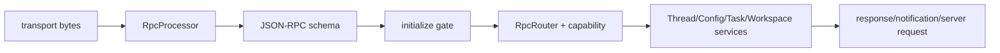

# Protocol 协议层

ello 使用 JSON-RPC 2.0 作为 envelope，自定义协议版本为 `1`。协议层定义 Client method、Server notification、Server Request、资源 schema 和错误类型；transport 只负责消息边界和字节搬运。

- [JSON-RPC schema 与握手](json-rpc-schema-and-handshake.md)：初始化状态机、能力表、schema 验证和错误映射。
- [Transport 与 Server Request](transport-and-server-request.md)：stdio/WebSocket/Unix、队列、barrier 和审批 callback。

Protocol schema 同时被 Agent Server 和 TUI package 导入。TUI 不复制资源类型，响应和 Server Request 会在客户端再次解析，防止 UI 使用未验证的字段。
