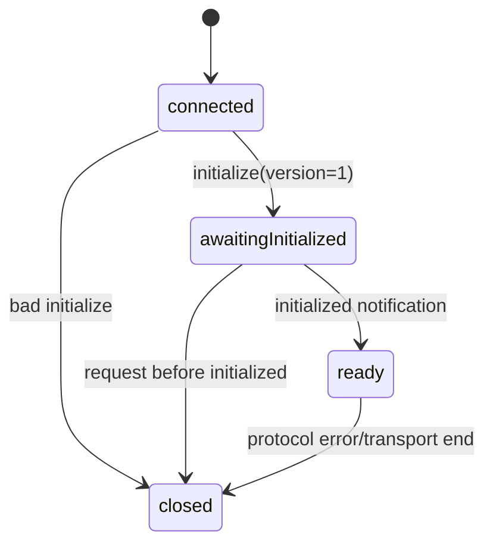

# JSON-RPC schema、框架 runtime 与握手

## Envelope 约束

`RpcRequestSchema` 要求 `jsonrpc: '2.0'`、非空 method、对象 params 和 string/number request ID。Notification 没有 ID；response 必须是 result 或 error；error data 必须符合 `AppServerErrorTypeSchema`、retryable 和 details。

```ts
export const RpcMessageSchema = z.union([
  RpcRequestSchema,
  RpcNotificationSchema,
  RpcResponseSchema,
]);
```

Server 与 TUI 的自定义 `MessageReader` 先按 transport 消息边界读取 UTF-8 字节，再执行 `JSON.parse` 和严格 envelope schema。只有通过解析的 `Message` 才交给 `vscode-jsonrpc/node`。Malformed JSON、unknown field、非法 ID 或错误 error data 不会进入产品 handler。

`vscode-jsonrpc` 负责：

- Request ID 分配与 response 关联。
- 并发 request、notification 和双向 Server Request。
- Cancellation、标准 method-not-found 和连接事件。
- 连接关闭时清理普通 pending response。

Ello 负责：

- 产品 params/result Zod schema。
- initialize 状态与 protocol version。
- capability 声明与 route 检查。
- response-before-notification、有界队列与稳定 `srvreq_*` ID。

## 握手状态机



Server 在 `initialize` route 中校验 protocolVersion、Client 信息和 capabilities，返回 method、notification、Server Request、transport 和 granted capability。只有收到 `initialized` notification 后才进入 ready；乱序 initialized、重复 initialize 或协议版本不匹配直接失败。

普通 request 在 ready 前得到 `notInitialized`。ready 后，`dispatchRoute()` 先验证 route capability，再调用对应 feature handler，并在结果交给框架生成 response 前执行 `parseClientResult(method, result)`。

## capability 与业务 permission 分离

`thread/read` 是 RPC `read` capability，`turn/start` 是 `submit`，`server/shutdown` 是 `admin`。它只描述当前 connection 是否有权调用接口，不描述模型是否能运行 shell 或改文件；后者由 Agent tool permission policy 独立判定。

## Client 再次验证结果

TUI 调用 `MessageConnection.sendRequest()` 后，不直接把框架返回值交给 UI。`AppServerClient` 使用同一 method 的 result schema 再次解析；失败抛 `ResponseValidationError`。框架 `ResponseError` 也必须重新通过 `RpcErrorSchema`，再转换成 typed `ServerResponseError`。

因此 Server handler 和 TUI consumer 共享同一份 Zod schema，但不共享内存对象或实现类型；协议边界仍然是唯一事实源。
