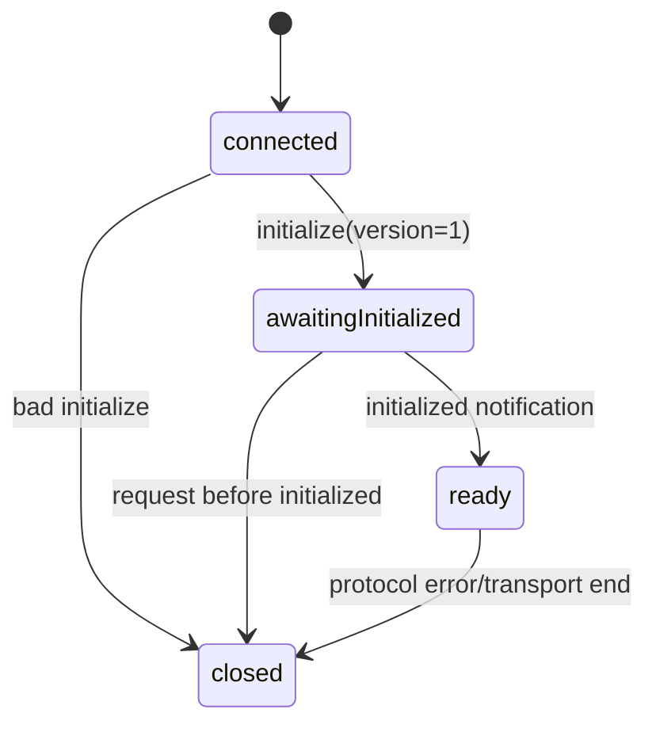

# JSON-RPC schema 与握手

## Envelope 约束

`RpcRequestSchema` 要求 `jsonrpc: '2.0'`、非空 method、字符串参数对象和 string/number request id。通知没有 id，response 可以是 result 或 error；response error 的 data 必须符合 `AppServerErrorTypeSchema`、retryable 和 details。

```ts
export const RpcMessageSchema = z.union([
  RpcRequestSchema,
  RpcNotificationSchema,
  RpcResponseSchema,
]);
```

`RpcProcessor.process()` 先 JSON.parse，再依次尝试 response、request、notification。所有 schema 失败会发送 `invalidRequest`；解析失败使用 null id 的 parseError response。

## 握手状态机



Server 在 `initialize` 时校验 protocolVersion、Client 信息和 capabilities，返回 Server capabilities，包括 method、notification、Server Request 和 transport 列表。只有收到 `initialized` 通知后才进入 ready；乱序 initialized 或重复 initialize 会关闭连接。

普通 request 在 ready 前得到 `notInitialized`。ready 后由 `RpcRouter` 逐项查询 `CLIENT_METHOD_CAPABILITIES`，未知方法和未获 capability 的调用不会进入业务 service。

## capability 与业务 permission 分离

`thread/read` 是 RPC `read` capability，`turn/start` 是 `submit`，`server/shutdown` 是 `admin`。这只描述 Client 是否有权请求接口，不描述模型是否能运行 bash 或 edit。后者由 Agent tool Permission policy 判定。

## 结果 schema 也要验证

Router 返回业务对象后，Processor 调用 `parseClientResult(method, result)`。如果 Server service 返回了不符合协议的对象，Processor 发送 `responseValidationFailed`，而不是把坏数据交给 TUI。TUI 的 `AppServerClient.handleResponse()` 还会按 pending method 再解析一次。
