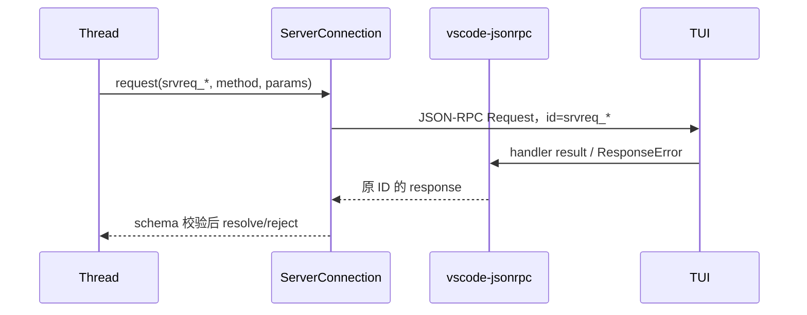

# Transport、顺序屏障与 Server Request

## Transport 只负责 framing

```ts
export interface AppServerTransport {
  readonly kind: 'stdio' | 'websocket' | 'unix';
  readonly connectionId: string;
  messages(): AsyncIterable<Uint8Array>;
  send(message: Uint8Array): Promise<void>;
  close(reason?: string, force?: boolean): Promise<void>;
}
```

stdio 使用 newline-delimited JSON，单行上限 8 MiB，stdout 只能写 JSON-RPC；WebSocket 一帧对应一个完整消息；Unix endpoint 复用 WebSocket framing。三者都不解析 method、params 或业务错误。

Fastify 与 `@fastify/websocket` 只负责 health/readiness、upgrade、bearer auth、Origin、连接限额和 listener 生命周期。WebSocket 建立后，消息直接进入 `ServerConnection` 的 `vscode-jsonrpc` `MessageConnection`。

Server 和 TUI 的 WebSocket queue 都同时限制消息数量与已排队 UTF-8 字节数。超过限制立即 fail queue 并终止 socket，不能等待内存继续增长。发送端等待 `ws.send()` callback，并在 `bufferedAmount` 超过高水位时暂停消费 Writer 队列。

## `ProtocolMessageWriter` 的统一预算

Server 的 Writer 同时拥有发送串行化、response barrier 和完整 outbound 预算：

- 最多 256 条消息。
- 最多 8 MiB UTF-8 JSON。
- 为 response 保留 32 条和 1 MiB，notification 与 Server Request 不能占满该容量。
- 单条消息最多 8 MiB。
- transport 或容量背压超过 1 秒后强制关闭连接。
- 等待容量的 producer 最多 256 个；更多并发写入立即按过载关闭，等待队列本身也不能无限增长。

Response、错误响应和生命周期消息不静默丢弃。队列超限或 transport 失败时，Writer 触发连接级失败，连接关闭并 reject 当前连接的所有 Server Request callback；其他连接继续独立运行。

## response-before-notification

Feature handler 只能通过 `RpcPeer.notify()` 和 `RpcPeer.request()` 产生主动消息。`MessageStrategy` 在处理 Client Request 前建立单连接 response barrier；Writer 把 handler 内产生的 notification 与 Server Request 放入已计入容量预算的 outbox。

```text
Client Request 42
  → beginResponseBarrier(42)
  → Feature notify A / Server Request B 进入 outbox
  → handler return
  → vscode-jsonrpc 生成 Response 42
  → Writer 先发送 Response 42
  → Writer 按原顺序发送 A、B
```

连接使用 `maxParallelism: 1`，所以同一时刻只有一个 Client Request barrier。这个约束保留原本的单连接串行语义，也让 outbox 无需维护另一张 request-id map。

## 持久化 Server Request

普通 JSON-RPC Client Request 的 ID 和 pending response 完全由 `vscode-jsonrpc` 管理。审批与用户输入不同：`PendingServerRequest.id` 是 Thread JSONL 中持久化的 `srvreq_*` 领域 ID，断线重连后必须使用同一 ID 重新派发，因此不能替换成框架临时自增 ID。

`PersistentServerRequests` 只管理这类稳定 string ID：



Client response 必须携带已知 string ID；未知、重复或已解决 ID 直接抛 `requestResolved`。连接关闭时 `disconnect()` reject 全部 callback。Thread 会从持久化 record 恢复尚未解决的请求，不依赖已经丢失的旧连接 Promise。

## TUI Client 的延迟交互

TUI 也使用 `vscode-jsonrpc/node`。框架拥有 Client Request ID、pending response、乱序关联、Cancellation 和关闭清理。`AsyncLocalStorage` 只在 Server Request handler 内读取框架正在处理的原始 wire ID，并把它暴露给 `ThreadClient` 的审批 UI。

`ThreadClient.pendingRequests` 保存的是用户尚未决策的产品交互，不是 RPC response map。用户调用 `respond()` 或 `reject()` 后，handler Promise 完成，框架使用原 Server Request ID 写回 response。请求超时会发送 Cancellation 并关闭整个 Client 连接，确保框架 pending 统一释放。
