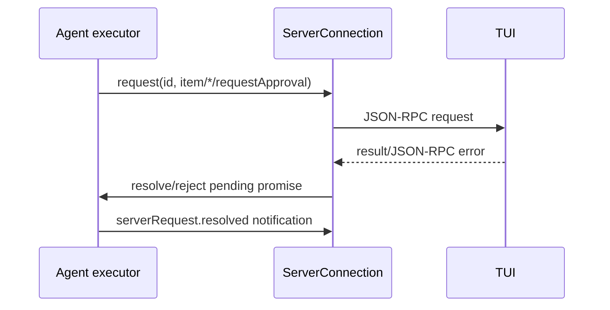

# Transport 与 Server Request

## Transport 只负责 framing

```ts
export interface AppServerTransport {
  readonly kind: 'stdio' | 'websocket' | 'unix';
  readonly connectionId: string;
  messages(): AsyncIterable<Uint8Array>;
  send(message: Uint8Array): Promise<void>;
  close(reason?: string): Promise<void>;
}
```

stdio 使用 newline-delimited JSON，单行上限 8 MiB，stdout 只能写 JSON-RPC；WebSocket 一帧对应一个完整消息；Unix endpoint 复用 WebSocket framing。三者都不解析 method、params 或业务错误。

`AsyncByteQueue` 的 inbound 默认上限 256 条。WebSocket 消息超过队列上限会 fail queue，连接随后关闭，防止慢消费者让内存无限增长。

## ServerConnection 的 outbound queue

ServerConnection 按发送顺序串行化 response、notification 和 Server Request，默认最多排队 256 条。队列溢出会关闭连接，并 reject 所有 pending Server Request。慢 Client 不会拖住其他连接。

## response barrier

处理 `thread/resume`、`thread/read` 等请求时，Processor 调用 `holdUnsolicited()` 暂存 notification 和 Server Request，先写 response，再 flush 暂存消息：

```ts
const release = connection.holdUnsolicited();
try {
  await dispatch();
  await connection.sendResult(id, result);
} finally {
  await release();
}
```

这样 Client 收到完整 snapshot 后才收到 live event，不会用旧 snapshot 覆盖刚到达的增量。

## Server Request callback

`PendingServerRequests` 以 string id 保存 method、resolve、reject。Client response 必须是 string id；未知、重复或已解决 id 会抛 `requestResolved`。结果按对应 Server Request schema 解析，再恢复 deferred tool。



连接关闭时 `disconnect()` reject 全部 callback。ThreadRuntime 会把 request resolution 写入 JSONL，重连 Client 读取 pending request，而不是等待已经丢失的 callback。
