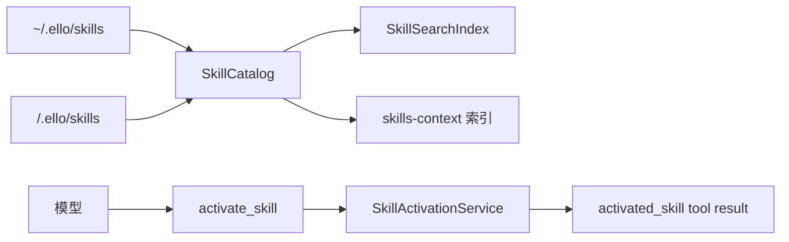

# Skills 技能目录

Skill 是一个带名称、描述和 `SKILL.md` 正文的指令包。ello 把“发现”与“加载”拆开：系统提示只放轻量索引，模型需要时调用 `activate_skill`，完整正文作为 tool result 注入当前 run。

- [加载、目录与预算](loader-catalog-and-budget.md)：frontmatter、symlink 安全、覆盖和 1% context budget。
- [激活与去重](activation-and-deduplication.md)：`$name` 触发、XML 序列化、content hash 和 run 生命周期。

Skill catalog 的生产来源只有 global 与 project 两层；项目同名覆盖 global。`SkillCatalog.reload()` 在构建、IO、schema 校验全部成功后替换 immutable snapshot，失败时保留上一份可用目录。
